# 中国传统配色

一个用于展示、学习和复用中华传统色的开放图片项目。当前仓库收录 738 张传统色色卡图片，每张色卡包含色名、HEX、RGB、CMYK、配色推荐和气质关键词；README 使用轻量缩略图完整展示，点击任意缩略图可打开高清 PNG 原图。

## 快速入口

- [下载全部高清图片 ZIP](https://github.com/nevertoday/zhongguo-traditional-colors/releases/latest/download/zhongguo-traditional-colors-images.zip)
- [在线浏览色卡](https://nevertoday.github.io/zhongguo-traditional-colors/)
- [完整图片包 Release 下载](https://github.com/nevertoday/zhongguo-traditional-colors/releases/tag/v0.1.0)
- [原始 742 色清单](docs/chinese-color-master-list.md)
- [缺失颜色报告](docs/missing-colors.md)
- [作者 X 主页](https://x.com/xiaoxiaodong01)

> 原图约 993MB，ZIP 文件作为 GitHub Release 附件提供，不直接提交进仓库。单张高清图可点击下方任意缩略图打开。

## 预览

<!-- gallery:start -->
<p align="center">
  <a href="images/001-乳白.png"></a>
  <a href="images/002-杏仁黄.png"></a>
  <a href="images/003-茉莉黄.png"></a>
  <a href="images/004-麦秆黄.png"></a>
</p>

<p align="center">
  <a href="images/005-油菜花黄.png"></a>
  <a href="images/006-佛手黄.png"></a>
  <a href="images/007-篾黄.png"></a>
  <a href="images/008-葵扇黄.png"></a>
</p>

<p align="center">
  <a href="images/009-柠檬黄.png"></a>
  <a href="images/010-金瓜黄.png"></a>
  <a href="images/011-藤黄.png"></a>
  <a href="images/012-酪黄.png"></a>
</p>

<p align="center">
  <a href="images/013-香水玫瑰黄.png"></a>
  <a href="images/014-淡密黄.png"></a>
  <a href="images/015-大豆黄.png"></a>
  <a href="images/016-素馨黄.png"></a>
</p>

<p align="center">
  <a href="images/017-向日葵黄.png"></a>
  <a href="images/018-雅梨黄.png"></a>
  <a href="images/019-黄连黄.png"></a>
  <a href="images/020-金盏黄.png"></a>
</p>

<p align="center">
  <a href="images/021-蛋壳黄.png"></a>
  <a href="images/022-肉色.png"></a>
  <a href="images/023-鹅掌黄.png"></a>
  <a href="images/024-鸡蛋黄.png"></a>
</p>

<p align="center">
  <a href="images/025-鼬黄.png"></a>
  <a href="images/026-榴萼黄.png"></a>
  <a href="images/027-淡橘橙.png"></a>
  <a href="images/028-枇杷黄.png"></a>
</p>

<p align="center">
  <a href="images/029-橙皮黄.png"></a>
  <a href="images/030-北瓜黄.png"></a>
  <a href="images/031-杏黄.png"></a>
  <a href="images/032-雄黄.png"></a>
</p>

<p align="center">
  <a href="images/033-万寿菊黄.png"></a>
  <a href="images/034-菊蕾白.png"></a>
  <a href="images/035-秋葵黄.png"></a>
  <a href="images/036-硫华黄.png"></a>
</p>

<p align="center">
  <a href="images/037-柚黄.png"></a>
  <a href="images/038-芒果黄.png"></a>
  <a href="images/039-蒿黄.png"></a>
  <a href="images/040-姜黄.png"></a>
</p>

<p align="center">
  <a href="images/041-香蕉黄.png"></a>
  <a href="images/042-草黄.png"></a>
  <a href="images/043-新禾绿.png"></a>
  <a href="images/044-月灰.png"></a>
</p>

<p align="center">
  <a href="images/045-淡灰绿.png"></a>
  <a href="images/046-草灰绿.png"></a>
  <a href="images/047-苔绿.png"></a>
  <a href="images/048-碧螺春绿.png"></a>
</p>

<p align="center">
  <a href="images/049-燕羽灰.png"></a>
  <a href="images/050-蟹壳灰.png"></a>
  <a href="images/051-潭水绿.png"></a>
  <a href="images/052-橄榄绿.png"></a>
</p>

<p align="center">
  <a href="images/053-蚌肉白.png"></a>
  <a href="images/054-豆汁黄.png"></a>
  <a href="images/055-淡茧黄.png"></a>
  <a href="images/056-乳鸭黄.png"></a>
</p>

<p align="center">
  <a href="images/057-荔肉白.png"></a>
  <a href="images/058-象牙黄.png"></a>
  <a href="images/059-炒米黄.png"></a>
  <a href="images/060-鹦鹉冠黄.png"></a>
</p>

<p align="center">
  <a href="images/061-木瓜黄.png"></a>
  <a href="images/062-浅烙黄.png"></a>
  <a href="images/063-莲子白.png"></a>
  <a href="images/064-谷黄.png"></a>
</p>

<p align="center">
  <a href="images/065-栀子黄.png"></a>
  <a href="images/066-芥黄.png"></a>
  <a href="images/067-银鼠灰.png"></a>
  <a href="images/068-尘灰.png"></a>
</p>

<p align="center">
  <a href="images/069-枯绿.png"></a>
  <a href="images/070-鲛青.png"></a>
  <a href="images/071-粽叶绿.png"></a>
  <a href="images/072-灰绿.png"></a>
</p>

<p align="center">
  <a href="images/073-鹤灰.png"></a>
  <a href="images/074-淡松烟.png"></a>
  <a href="images/075-暗海水绿.png"></a>
  <a href="images/076-棕榈绿.png"></a>
</p>

<p align="center">
  <a href="images/077-米色.png"></a>
  <a href="images/078-淡肉色.png"></a>
  <a href="images/079-麦芽糖黄.png"></a>
  <a href="images/080-琥珀黄.png"></a>
</p>

<p align="center">
  <a href="images/081-甘草黄.png"></a>
  <a href="images/082-初熟杏黄.png"></a>
  <a href="images/083-浅驼色.png"></a>
  <a href="images/084-沙石黄.png"></a>
</p>

<p align="center">
  <a href="images/085-虎皮黄.png"></a>
  <a href="images/086-土黄.png"></a>
  <a href="images/087-百灵鸟灰.png"></a>
  <a href="images/088-山鸡黄.png"></a>
</p>

<p align="center">
  <a href="images/089-龟背黄.png"></a>
  <a href="images/090-苍黄.png"></a>
  <a href="images/091-莱阳梨黄.png"></a>
  <a href="images/092-蜴蜊绿.png"></a>
</p>

<p align="center">
  <a href="images/093-松鼠灰.png"></a>
  <a href="images/094-橄榄灰.png"></a>
  <a href="images/095-蟹壳绿.png"></a>
  <a href="images/096-古铜绿.png"></a>
</p>

<p align="center">
  <a href="images/097-焦茶绿.png"></a>
  <a href="images/098-粉白.png"></a>
  <a href="images/099-落英淡粉.png"></a>
  <a href="images/100-瓜瓤粉.png"></a>
</p>

<p align="center">
  <a href="images/101-蜜黄.png"></a>
  <a href="images/102-金叶黄.png"></a>
  <a href="images/103-金莺黄.png"></a>
  <a href="images/104-鹿角棕.png"></a>
</p>

<p align="center">
  <a href="images/105-凋叶棕.png"></a>
  <a href="images/106-玳瑁黄.png"></a>
  <a href="images/107-软木黄.png"></a>
  <a href="images/108-风帆黄.png"></a>
</p>

<p align="center">
  <a href="images/109-桂皮淡棕.png"></a>
  <a href="images/110-猴毛灰.png"></a>
  <a href="images/111-山鸡褐.png"></a>
  <a href="images/112-驼色.png"></a>
</p>

<p align="center">
  <a href="images/113-茶褐.png"></a>
  <a href="images/114-古铜褐.png"></a>
  <a href="images/115-荷花白.png"></a>
  <a href="images/116-玫瑰粉.png"></a>
</p>

<p align="center">
  <a href="images/117-橘橙.png"></a>
  <a href="images/118-美人焦橙.png"></a>
  <a href="images/119-润红.png"></a>
  <a href="images/120-淡桃红.png"></a>
</p>

<p align="center">
  <a href="images/121-海螺橙.png"></a>
  <a href="images/122-桃红.png"></a>
  <a href="images/123-颊红.png"></a>
  <a href="images/124-淡罂粟红.png"></a>
</p>

<p align="center">
  <a href="images/125-晨曦红.png"></a>
  <a href="images/126-蟹壳红.png"></a>
  <a href="images/127-金莲花橙.png"></a>
  <a href="images/128-草莓红.png"></a>
</p>

<p align="center">
  <a href="images/129-龙睛鱼红.png"></a>
  <a href="images/130-蜻蜓红.png"></a>
  <a href="images/131-大红.png"></a>
  <a href="images/132-柿红.png"></a>
</p>

<p align="center">
  <a href="images/133-榴花红.png"></a>
  <a href="images/134-银朱.png"></a>
  <a href="images/135-朱红.png"></a>
  <a href="images/136-鲑鱼红.png"></a>
</p>

<p align="center">
  <a href="images/137-金黄.png"></a>
  <a href="images/138-鹿皮褐.png"></a>
  <a href="images/139-醉瓜肉.png"></a>
  <a href="images/140-麂棕.png"></a>
</p>

<p align="center">
  <a href="images/141-淡银灰.png"></a>
  <a href="images/142-淡赭.png"></a>
  <a href="images/143-槟榔综.png"></a>
  <a href="images/144-银灰.png"></a>
</p>

<p align="center">
  <a href="images/145-海鸥灰.png"></a>
  <a href="images/146-淡咖啡.png"></a>
  <a href="images/147-岩石棕.png"></a>
  <a href="images/148-芒果棕.png"></a>
</p>

<p align="center">
  <a href="images/149-石板灰.png"></a>
  <a href="images/150-珠母灰.png"></a>
  <a href="images/151-丁香棕.png"></a>
  <a href="images/152-咖啡.png"></a>
</p>

<p align="center">
  <a href="images/153-筍皮棕.png"></a>
  <a href="images/154-燕颔红.png"></a>
  <a href="images/155-玉粉红.png"></a>
  <a href="images/156-金驼.png"></a>
</p>

<p align="center">
  <a href="images/157-铁棕.png"></a>
  <a href="images/158-蛛网灰.png"></a>
  <a href="images/159-淡可可棕.png"></a>
  <a href="images/160-中红灰.png"></a>
</p>

<p align="center">
  <a href="images/161-淡土黄.png"></a>
  <a href="images/162-淡豆沙.png"></a>
  <a href="images/163-椰壳棕.png"></a>
  <a href="images/164-淡铁灰.png"></a>
</p>

<p align="center">
  <a href="images/165-中灰驼.png"></a>
  <a href="images/166-淡栗棕.png"></a>
  <a href="images/167-可可棕.png"></a>
  <a href="images/168-柞叶棕.png"></a>
</p>

<p align="center">
  <a href="images/169-野蔷薇红.png"></a>
  <a href="images/170-菠萝红.png"></a>
  <a href="images/171-藕荷.png"></a>
  <a href="images/172-陶瓷红.png"></a>
</p>

<p align="center">
  <a href="images/173-晓灰.png"></a>
  <a href="images/174-余烬红.png"></a>
  <a href="images/175-火砖红.png"></a>
  <a href="images/176-火泥棕.png"></a>
</p>

<p align="center">
  <a href="images/177-绀红.png"></a>
  <a href="images/178-橡树棕.png"></a>
  <a href="images/179-海报灰.png"></a>
  <a href="images/180-玫瑰灰.png"></a>
</p>

<p align="center">
  <a href="images/181-火山棕.png"></a>
  <a href="images/182-豆沙.png"></a>
  <a href="images/183-淡米粉.png"></a>
  <a href="images/184-初桃粉红.png"></a>
</p>

<p align="center">
  <a href="images/185-介壳淡粉红.png"></a>
  <a href="images/186-淡藏花红.png"></a>
  <a href="images/187-瓜瓤红.png"></a>
  <a href="images/188-芙蓉红.png"></a>
</p>

<p align="center">
  <a href="images/189-莓酱红.png"></a>
  <a href="images/190-法螺红.png"></a>
  <a href="images/191-落霞红.png"></a>
  <a href="images/192-淡玫瑰灰.png"></a>
</p>

<p align="center">
  <a href="images/193-蟹蝥红.png"></a>
  <a href="images/194-火岩棕.png"></a>
  <a href="images/195-赭石.png"></a>
  <a href="images/196-暗驼棕.png"></a>
</p>

<p align="center">
  <a href="images/197-酱棕.png"></a>
  <a href="images/198-栗棕.png"></a>
  <a href="images/199-洋水仙红.png"></a>
  <a href="images/200-谷鞘红.png"></a>
</p>

<p align="center">
  <a href="images/201-苹果红.png"></a>
  <a href="images/202-铁水红.png"></a>
  <a href="images/203-桂红.png"></a>
  <a href="images/204-极光红.png"></a>
</p>

<p align="center">
  <a href="images/205-粉红.png"></a>
  <a href="images/206-舌红.png"></a>
  <a href="images/207-曲红.png"></a>
  <a href="images/208-红汞红.png"></a>
</p>

<p align="center">
  <a href="images/209-淡绯.png"></a>
  <a href="images/210-无花果红.png"></a>
  <a href="images/211-榴子红.png"></a>
  <a href="images/212-胭脂红.png"></a>
</p>

<p align="center">
  <a href="images/213-合欢红.png"></a>
  <a href="images/214-春梅红.png"></a>
  <a href="images/215-香叶红.png"></a>
  <a href="images/216-珊瑚红.png"></a>
</p>

<p align="center">
  <a href="images/217-萝卜红.png"></a>
  <a href="images/218-淡茜红.png"></a>
  <a href="images/219-艳红.png"></a>
  <a href="images/220-淡菽红.png"></a>
</p>

<p align="center">
  <a href="images/221-鱼鳃红.png"></a>
  <a href="images/222-樱桃红.png"></a>
  <a href="images/223-淡蕊香红.png"></a>
  <a href="images/224-石竹红.png"></a>
</p>

<p align="center">
  <a href="images/225-草茉莉红.png"></a>
  <a href="images/226-茶花红.png"></a>
  <a href="images/227-枸枢红.png"></a>
  <a href="images/228-秋海棠红.png"></a>
</p>

<p align="center">
  <a href="images/229-丽春红.png"></a>
  <a href="images/230-夕阳红.png"></a>
  <a href="images/231-鹤顶红.png"></a>
  <a href="images/232-鹅血石红.png"></a>
</p>

<p align="center">
  <a href="images/233-覆盆子红.png"></a>
  <a href="images/234-貂紫.png"></a>
  <a href="images/235-暗玉紫.png"></a>
  <a href="images/236-栗紫.png"></a>
</p>

<p align="center">
  <a href="images/237-葡萄酱紫.png"></a>
  <a href="images/238-牡丹粉红.png"></a>
  <a href="images/239-山茶红.png"></a>
  <a href="images/240-海棠红.png"></a>
</p>

<p align="center">
  <a href="images/241-玉红.png"></a>
  <a href="images/242-高粱红.png"></a>
  <a href="images/243-满江红.png"></a>
  <a href="images/244-枣红.png"></a>
</p>

<p align="center">
  <a href="images/245-葡萄紫.png"></a>
  <a href="images/246-酱紫.png"></a>
  <a href="images/247-淡曙红.png"></a>
  <a href="images/248-唐菖蒲红.png"></a>
</p>

<p align="center">
  <a href="images/249-鹅冠红.png"></a>
  <a href="images/250-莓红.png"></a>
  <a href="images/251-枫叶红.png"></a>
  <a href="images/252-苋菜红.png"></a>
</p>

<p align="center">
  <a href="images/253-烟红.png"></a>
  <a href="images/254-暗紫苑红.png"></a>
  <a href="images/255-殷红.png"></a>
  <a href="images/256-猪肝紫.png"></a>
</p>

<p align="center">
  <a href="images/257-金鱼紫.png"></a>
  <a href="images/258-草珠红.png"></a>
  <a href="images/259-淡绛红.png"></a>
  <a href="images/260-品红.png"></a>
</p>

<p align="center">
  <a href="images/261-凤仙花红.png"></a>
  <a href="images/262-粉团花红.png"></a>
  <a href="images/263-夹竹桃红.png"></a>
  <a href="images/264-榲桲红.png"></a>
</p>

<p align="center">
  <a href="images/265-姜红.png"></a>
  <a href="images/266-莲瓣红.png"></a>
  <a href="images/267-水红.png"></a>
  <a href="images/268-报春红.png"></a>
</p>

<p align="center">
  <a href="images/269-月季红.png"></a>
  <a href="images/270-豇豆红.png"></a>
  <a href="images/271-霞光红.png"></a>
  <a href="images/272-松叶牡丹红.png"></a>
</p>

<p align="center">
  <a href="images/273-喜蛋红.png"></a>
  <a href="images/274-鼠鼻红.png"></a>
  <a href="images/275-尖晶玉红.png"></a>
  <a href="images/276-山黎豆红.png"></a>
</p>

<p align="center">
  <a href="images/277-锦葵红.png"></a>
  <a href="images/278-鼠背灰.png"></a>
  <a href="images/279-甘蔗紫.png"></a>
  <a href="images/280-石竹紫.png"></a>
</p>

<p align="center">
  <a href="images/281-苍蝇灰.png"></a>
  <a href="images/282-卵石紫.png"></a>
  <a href="images/283-李紫.png"></a>
  <a href="images/284-茄皮紫.png"></a>
</p>

<p align="center">
  <a href="images/285-吊钟花红.png"></a>
  <a href="images/286-兔眼红.png"></a>
  <a href="images/287-紫荆红.png"></a>
  <a href="images/288-菜头紫.png"></a>
</p>

<p align="center">
  <a href="images/289-鹞冠紫.png"></a>
  <a href="images/290-葡萄酒红.png"></a>
  <a href="images/291-磨石紫.png"></a>
  <a href="images/292-檀紫.png"></a>
</p>

<p align="center">
  <a href="images/293-火鹅紫.png"></a>
  <a href="images/294-墨紫.png"></a>
  <a href="images/295-晶红.png"></a>
  <a href="images/296-扁豆花红.png"></a>
</p>

<p align="center">
  <a href="images/297-白芨红.png"></a>
  <a href="images/298-嫩菱红.png"></a>
  <a href="images/299-菠根红.png"></a>
  <a href="images/300-酢酱草红.png"></a>
</p>

<p align="center">
  <a href="images/301-洋葱紫.png"></a>
  <a href="images/302-海象紫.png"></a>
  <a href="images/303-绀紫.png"></a>
  <a href="images/304-古铜紫.png"></a>
</p>

<p align="center">
  <a href="images/305-石蕊红.png"></a>
  <a href="images/306-芍药耕红.png"></a>
  <a href="images/307-藏花红.png"></a>
  <a href="images/308-初荷红.png"></a>
</p>

<p align="center">
  <a href="images/309-马鞭草紫.png"></a>
  <a href="images/310-丁香淡紫.png"></a>
  <a href="images/311-丹紫红.png"></a>
  <a href="images/312-玫瑰红.png"></a>
</p>

<p align="center">
  <a href="images/313-淡牵牛紫.png"></a>
  <a href="images/314-凤信紫.png"></a>
  <a href="images/315-萝兰紫.png"></a>
  <a href="images/316-玫瑰紫.png"></a>
</p>

<p align="center">
  <a href="images/317-藤萝紫.png"></a>
  <a href="images/318-槿紫.png"></a>
  <a href="images/319-蕈紫.png"></a>
  <a href="images/320-桔梗紫.png"></a>
</p>

<p align="center">
  <a href="images/321-魏紫.png"></a>
  <a href="images/322-芝兰紫.png"></a>
  <a href="images/323-菱锰红.png"></a>
  <a href="images/324-龙须红.png"></a>
</p>

<p align="center">
  <a href="images/325-蓟粉红.png"></a>
  <a href="images/326-电气石红.png"></a>
  <a href="images/327-樱草紫.png"></a>
  <a href="images/328-芦穗灰.png"></a>
</p>

<p align="center">
  <a href="images/329-隐红灰.png"></a>
  <a href="images/330-苋菜紫.png"></a>
  <a href="images/331-芦灰.png"></a>
  <a href="images/332-暮云灰.png"></a>
</p>

<p align="center">
  <a href="images/333-斑鸠灰.png"></a>
  <a href="images/334-淡藤萝紫.png"></a>
  <a href="images/335-淡青紫.png"></a>
  <a href="images/336-青蛤壳紫.png"></a>
</p>

<p align="center">
  <a href="images/337-豆蔻紫.png"></a>
  <a href="images/338-扁豆紫.png"></a>
  <a href="images/339-芥花紫.png"></a>
  <a href="images/340-青莲.png"></a>
</p>

<p align="center">
  <a href="images/341-芓紫.png"></a>
  <a href="images/342-葛巾紫.png"></a>
  <a href="images/343-牵牛紫.png"></a>
  <a href="images/344-紫灰.png"></a>
</p>

<p align="center">
  <a href="images/345-龙睛鱼紫.png"></a>
  <a href="images/346-荸荠紫.png"></a>
  <a href="images/347-古鼎灰.png"></a>
  <a href="images/348-乌梅紫.png"></a>
</p>

<p align="center">
  <a href="images/349-深牵牛紫.png"></a>
  <a href="images/350-银白.png"></a>
  <a href="images/351-芡食白.png"></a>
  <a href="images/352-远山紫.png"></a>
</p>

<p align="center">
  <a href="images/353-淡蓝紫.png"></a>
  <a href="images/354-山梗紫.png"></a>
  <a href="images/355-螺甸紫.png"></a>
  <a href="images/356-玛瑙灰.png"></a>
</p>

<p align="center">
  <a href="images/357-野菊紫.png"></a>
  <a href="images/358-满天星紫.png"></a>
  <a href="images/359-锌灰.png"></a>
  <a href="images/360-野葡萄紫.png"></a>
</p>

<p align="center">
  <a href="images/361-剑锋紫.png"></a>
  <a href="images/362-龙葵紫.png"></a>
  <a href="images/363-暗龙胆紫.png"></a>
  <a href="images/364-晶石紫.png"></a>
</p>

<p align="center">
  <a href="images/365-暗蓝紫.png"></a>
  <a href="images/366-景泰蓝.png"></a>
  <a href="images/367-尼罗蓝.png"></a>
  <a href="images/368-远天蓝.png"></a>
</p>

<p align="center">
  <a href="images/369-星蓝.png"></a>
  <a href="images/370-羽扇豆蓝.png"></a>
  <a href="images/371-花青.png"></a>
  <a href="images/372-睛蓝.png"></a>
</p>

<p align="center">
  <a href="images/373-虹蓝.png"></a>
  <a href="images/374-湖水蓝.png"></a>
  <a href="images/375-秋波蓝.png"></a>
  <a href="images/376-涧石蓝.png"></a>
</p>

<p align="center">
  <a href="images/377-潮蓝.png"></a>
  <a href="images/378-群青.png"></a>
  <a href="images/379-霁青.png"></a>
  <a href="images/380-碧青.png"></a>
</p>

<p align="center">
  <a href="images/381-宝石蓝.png"></a>
  <a href="images/382-天蓝.png"></a>
  <a href="images/383-柏林蓝.png"></a>
  <a href="images/384-海青.png"></a>
</p>

<p align="center">
  <a href="images/385-钴蓝.png"></a>
  <a href="images/386-鸢尾蓝.png"></a>
  <a href="images/387-牵牛花蓝.png"></a>
  <a href="images/388-飞燕草蓝.png"></a>
</p>

<p align="center">
  <a href="images/389-品蓝.png"></a>
  <a href="images/390-银鱼白.png"></a>
  <a href="images/391-安安蓝.png"></a>
  <a href="images/392-鱼尾灰.png"></a>
</p>

<p align="center">
  <a href="images/393-鲸鱼灰.png"></a>
  <a href="images/394-海参灰.png"></a>
  <a href="images/395-沙鱼灰.png"></a>
  <a href="images/396-钢蓝.png"></a>
</p>

<p align="center">
  <a href="images/397-云水蓝.png"></a>
  <a href="images/398-晴山蓝.png"></a>
  <a href="images/399-靛青.png"></a>
  <a href="images/400-大理石灰.png"></a>
</p>

<p align="center">
  <a href="images/401-海涛蓝.png"></a>
  <a href="images/402-蝶翅蓝.png"></a>
  <a href="images/403-海军蓝.png"></a>
  <a href="images/404-水牛灰.png"></a>
</p>

<p align="center">
  <a href="images/405-牛角灰.png"></a>
  <a href="images/406-燕颔蓝.png"></a>
  <a href="images/407-云峰白.png"></a>
  <a href="images/408-井天蓝.png"></a>
</p>

<p align="center">
  <a href="images/409-云山蓝.png"></a>
  <a href="images/410-釉蓝.png"></a>
  <a href="images/411-鸥蓝.png"></a>
  <a href="images/412-搪磁蓝.png"></a>
</p>

<p align="center">
  <a href="images/413-月影白.png"></a>
  <a href="images/414-星灰.png"></a>
  <a href="images/415-淡蓝灰.png"></a>
  <a href="images/416-鷃蓝.png"></a>
</p>

<p align="center">
  <a href="images/417-嫩灰.png"></a>
  <a href="images/418-战舰灰.png"></a>
  <a href="images/419-瓦罐灰.png"></a>
  <a href="images/420-青灰.png"></a>
</p>

<p align="center">
  <a href="images/421-鸽蓝.png"></a>
  <a href="images/422-钢青.png"></a>
  <a href="images/423-暗蓝.png"></a>
  <a href="images/424-月白.png"></a>
</p>

<p align="center">
  <a href="images/425-海天蓝.png"></a>
  <a href="images/426-清水蓝.png"></a>
  <a href="images/427-瀑布蓝.png"></a>
  <a href="images/428-蔚蓝.png"></a>
</p>

<p align="center">
  <a href="images/429-孔雀蓝.png"></a>
  <a href="images/430-甸子蓝.png"></a>
  <a href="images/431-石绿.png"></a>
  <a href="images/432-竹篁绿.png"></a>
</p>

<p align="center">
  <a href="images/433-粉绿.png"></a>
  <a href="images/434-美蝶绿.png"></a>
  <a href="images/436-蔻梢绿.png"></a>
  <a href="images/437-麦苗绿.png"></a>
</p>

<p align="center">
  <a href="images/438-蛙绿.png"></a>
  <a href="images/439-铜绿.png"></a>
  <a href="images/440-竹绿.png"></a>
  <a href="images/441-蓝绿.png"></a>
</p>

<p align="center">
  <a href="images/442-穹灰.png"></a>
  <a href="images/443-翠蓝.png"></a>
  <a href="images/444-胆矾蓝.png"></a>
  <a href="images/445-樫鸟蓝.png"></a>
</p>

<p align="center">
  <a href="images/446-闪蓝.png"></a>
  <a href="images/447-冰山蓝.png"></a>
  <a href="images/448-虾壳青.png"></a>
  <a href="images/449-晚波蓝.png"></a>
</p>

<p align="center">
  <a href="images/450-蜻蜓蓝.png"></a>
  <a href="images/451-玉鈫蓝.png"></a>
  <a href="images/452-垩灰.png"></a>
  <a href="images/453-夏云灰.png"></a>
</p>

<p align="center">
  <a href="images/454-苍蓝.png"></a>
  <a href="images/455-黄昏灰.png"></a>
  <a href="images/456-灰蓝.png"></a>
  <a href="images/457-深灰蓝.png"></a>
</p>

<p align="center">
  <a href="images/458-玉簪绿.png"></a>
  <a href="images/459-青矾绿.png"></a>
  <a href="images/460-草原远绿.png"></a>
  <a href="images/461-梧枝绿.png"></a>
</p>

<p align="center">
  <a href="images/462-浪花绿.png"></a>
  <a href="images/463-海王绿.png"></a>
  <a href="images/464-亚丁绿.png"></a>
  <a href="images/465-镍灰.png"></a>
</p>

<p align="center">
  <a href="images/466-明灰.png"></a>
  <a href="images/467-淡绿灰.png"></a>
  <a href="images/468-飞泉绿.png"></a>
  <a href="images/469-狼烟灰.png"></a>
</p>

<p align="center">
  <a href="images/470-绿灰.png"></a>
  <a href="images/471-苍绿.png"></a>
  <a href="images/472-深海绿.png"></a>
  <a href="images/473-长石灰.png"></a>
</p>

<p align="center">
  <a href="images/474-苷蓝绿.png"></a>
  <a href="images/475-莽丛绿.png"></a>
  <a href="images/476-淡翠绿.png"></a>
  <a href="images/477-明绿.png"></a>
</p>

<p align="center">
  <a href="images/478-田园绿.png"></a>
  <a href="images/479-翠绿.png"></a>
  <a href="images/480-淡绿.png"></a>
  <a href="images/481-葱绿.png"></a>
</p>

<p align="center">
  <a href="images/482-孔雀绿.png"></a>
  <a href="images/483-艾绿.png"></a>
  <a href="images/484-蟾绿.png"></a>
  <a href="images/485-宫殿绿.png"></a>
</p>

<p align="center">
  <a href="images/486-松霜绿.png"></a>
  <a href="images/487-蛋白石绿.png"></a>
  <a href="images/488-薄荷绿.png"></a>
  <a href="images/489-瓦松绿.png"></a>
</p>

<p align="center">
  <a href="images/490-荷叶绿.png"></a>
  <a href="images/491-田螺绿.png"></a>
  <a href="images/492-白屈菜绿.png"></a>
  <a href="images/493-河豚灰.png"></a>
</p>

<p align="center">
  <a href="images/494-蒽油绿.png"></a>
  <a href="images/495-槲寄生绿.png"></a>
  <a href="images/496-云杉绿.png"></a>
  <a href="images/497-嫩菊绿.png"></a>
</p>

<p align="center">
  <a href="images/498-艾背绿.png"></a>
  <a href="images/499-嘉陵水绿.png"></a>
  <a href="images/500-玉髓绿.png"></a>
  <a href="images/501-鲜绿.png"></a>
</p>

<p align="center">
  <a href="images/502-宝石绿.png"></a>
  <a href="images/503-海沬绿.png"></a>
  <a href="images/504-姚黄.png"></a>
  <a href="images/505-橄榄石绿.png"></a>
</p>

<p align="center">
  <a href="images/506-水绿.png"></a>
  <a href="images/507-芦苇绿.png"></a>
  <a href="images/508-槐花黄绿.png"></a>
  <a href="images/509-苹果绿.png"></a>
</p>

<p align="center">
  <a href="images/510-芽绿.png"></a>
  <a href="images/511-蝶黄.png"></a>
  <a href="images/512-橄榄黄绿.png"></a>
  <a href="images/513-鹦鹉绿.png"></a>
</p>

<p align="center">
  <a href="images/514-油绿.png"></a>
  <a href="images/515-象牙白.png"></a>
  <a href="images/516-汉白玉.png"></a>
  <a href="images/517-雪白.png"></a>
</p>

<p align="center">
  <a href="images/519-珍珠灰.png"></a>
  <a href="images/520-浅灰.png"></a>
  <a href="images/521-铅灰.png"></a>
  <a href="images/522-中灰.png"></a>
</p>

<p align="center">
  <a href="images/523-瓦灰.png"></a>
  <a href="images/524-夜灰.png"></a>
  <a href="images/525-雁灰.png"></a>
  <a href="images/526-深灰.png"></a>
</p>

<p align="center">
  <a href="images/527-蓝翠竹.png"></a>
  <a href="images/528-云青灰.png"></a>
  <a href="images/529-黑.png"></a>
  <a href="images/530-普鲁士蓝.png"></a>
</p>

<p align="center">
  <a href="images/531-山岚.png"></a>
  <a href="images/532-綟绶.png"></a>
  <a href="images/533-黛蓝.png"></a>
  <a href="images/534-烟紫.png"></a>
</p>

<p align="center">
  <a href="images/535-暮山紫.png"></a>
  <a href="images/536-月白天青.png"></a>
  <a href="images/537-翠微.png"></a>
  <a href="images/538-紫云.png"></a>
</p>

<p align="center">
  <a href="images/539-青霜.png"></a>
  <a href="images/540-梅子青.png"></a>
  <a href="images/541-火焰红.png"></a>
  <a href="images/542-琥珀.png"></a>
</p>

<p align="center">
  <a href="images/543-浅褐色.png">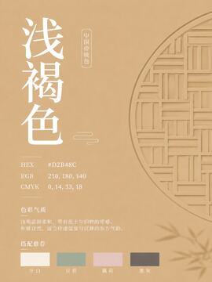</a>
  <a href="images/544-烟青.png">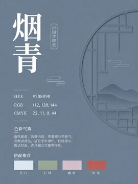</a>
  <a href="images/545-苍碧.png"></a>
  <a href="images/546-月华.png">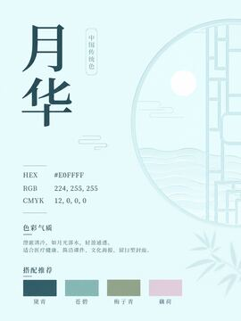</a>
</p>

<p align="center">
  <a href="images/547-绫素白.png">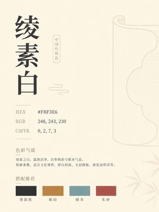</a>
  <a href="images/548-墨韵黑.png"></a>
  <a href="images/549-夜筵青.png"></a>
  <a href="images/550-霜白.png"></a>
</p>

<p align="center">
  <a href="images/551-秋香.png">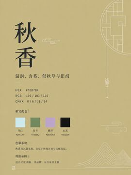</a>
  <a href="images/552-绯红.png">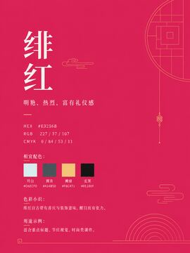</a>
  <a href="images/553-霞绯.png">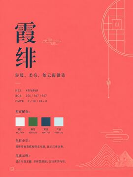</a>
  <a href="images/554-鸦青.png">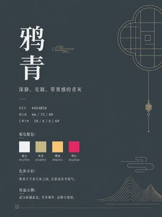</a>
</p>

<p align="center">
  <a href="images/555-玄黑.png"></a>
  <a href="images/556-黛青.png">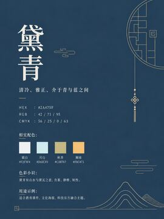</a>
  <a href="images/557-缃绮.png">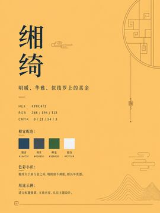</a>
  <a href="images/558-烟褐.png"></a>
</p>

<p align="center">
  <a href="images/559-柳苍.png">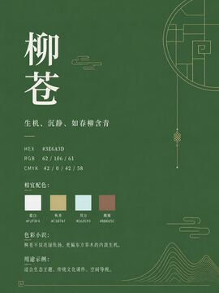</a>
  <a href="images/560-蟹壳青.png"></a>
  <a href="images/561-雪青.png">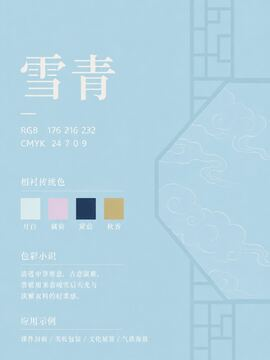</a>
  <a href="images/562-云蓝.png">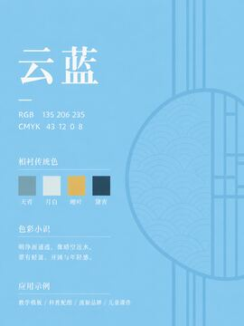</a>
</p>

<p align="center">
  <a href="images/563-梅红.png"></a>
  <a href="images/564-柳绿.png"></a>
  <a href="images/565-绀碧.png"></a>
  <a href="images/566-月蓝.png">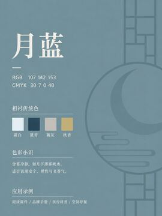</a>
</p>

<p align="center">
  <a href="images/567-霜蓝.png">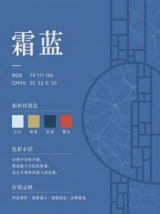</a>
  <a href="images/568-松墨.png">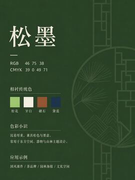</a>
  <a href="images/569-竹青.png">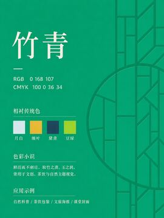</a>
  <a href="images/570-湖蓝.png"></a>
</p>

<p align="center">
  <a href="images/571-潆青.png"></a>
  <a href="images/572-霜青.png">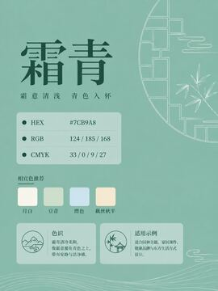</a>
  <a href="images/573-烟萦紫.png"></a>
  <a href="images/574-缥缃.png">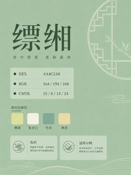</a>
</p>

<p align="center">
  <a href="images/575-露碧.png">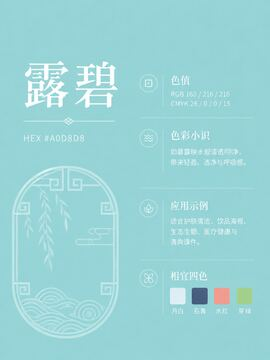</a>
  <a href="images/576-绀青.png"></a>
  <a href="images/577-柳黄.png"></a>
  <a href="images/578-槐黄.png">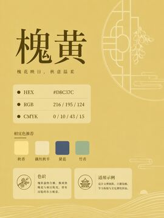</a>
</p>

<p align="center">
  <a href="images/579-缥色.png">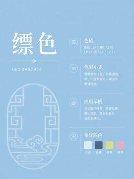</a>
  <a href="images/580-松花.png"></a>
  <a href="images/581-缥碧.png">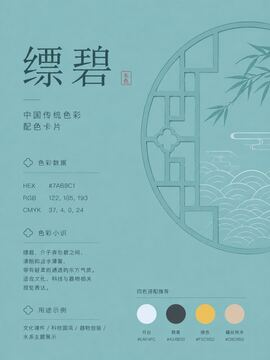</a>
  <a href="images/582-荷绿.png">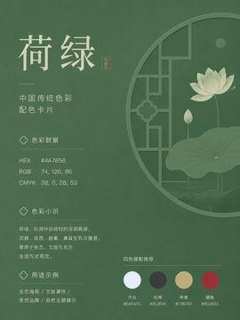</a>
</p>

<p align="center">
  <a href="images/583-檀褐.png"></a>
  <a href="images/584-月魄.png">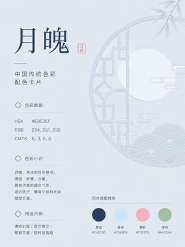</a>
  <a href="images/585-滢蓝.png">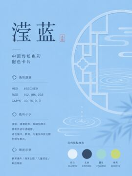</a>
  <a href="images/586-湖绿.png">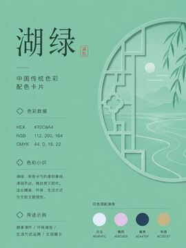</a>
</p>

<p align="center">
  <a href="images/587-枫丹.png"></a>
  <a href="images/588-雾绡.png"></a>
  <a href="images/589-樱粉.png"></a>
  <a href="images/590-霜紫.png">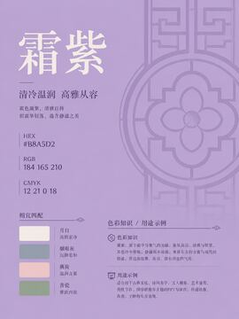</a>
</p>

<p align="center">
  <a href="images/591-缥青.png">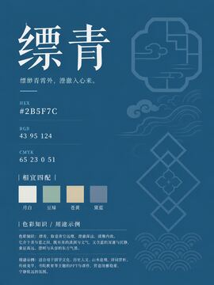</a>
  <a href="images/592-瑶碧.png"></a>
  <a href="images/593-墨玉.png"></a>
  <a href="images/594-莹翠.png">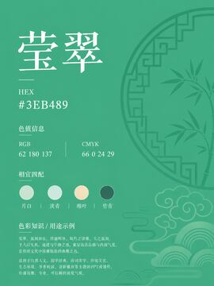</a>
</p>

<p align="center">
  <a href="images/595-茜色.png">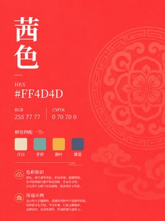</a>
  <a href="images/596-鹅黄.png">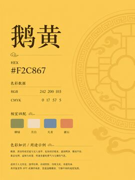</a>
  <a href="images/598-粉色.png">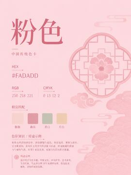</a>
  <a href="images/599-天青.png"></a>
</p>

<p align="center">
  <a href="images/601-檀色.png">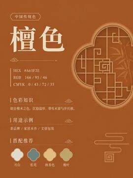</a>
  <a href="images/602-霜色.png">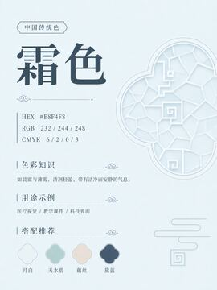</a>
  <a href="images/603-橙色.png">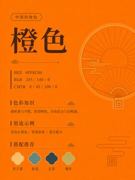</a>
  <a href="images/604-奶橙色.png">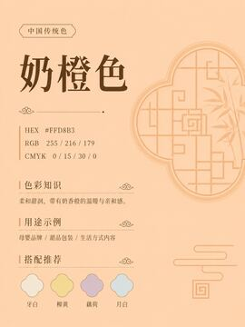</a>
</p>

<p align="center">
  <a href="images/605-黛绿.png"></a>
  <a href="images/606-勃艮第红.png"></a>
  <a href="images/607-朱砂红.png"></a>
  <a href="images/608-朱墙.png">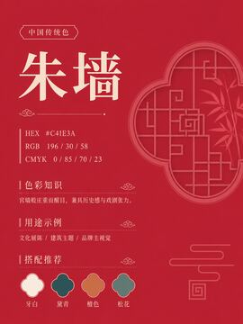</a>
</p>

<p align="center">
  <a href="images/609-东方既白.png">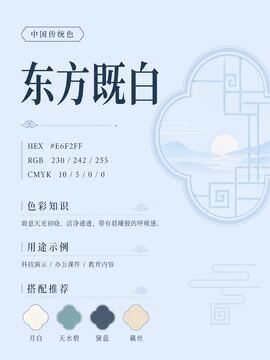</a>
  <a href="images/610-藕丝.png"></a>
  <a href="images/611-奶黄色.png">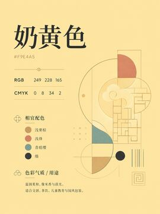</a>
  <a href="images/612-浅栗棕.png"></a>
</p>

<p align="center">
  <a href="images/613-浅绛.png"></a>
  <a href="images/614-缁.png">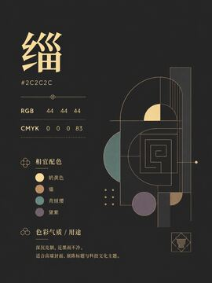</a>
  <a href="images/615-緅.png"></a>
  <a href="images/616-缊.png">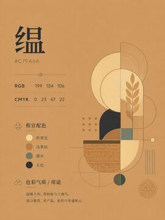</a>
</p>

<p align="center">
  <a href="images/617-青组缨.png">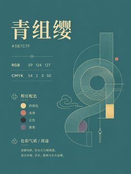</a>
  <a href="images/618-爵弁.png">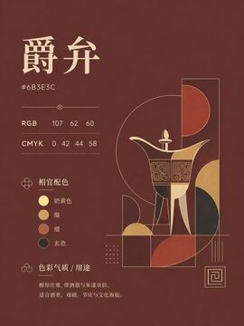</a>
  <a href="images/619-玄色.png"></a>
  <a href="images/620-黛紫.png"></a>
</p>

<p align="center">
  <a href="images/621-浅肤色.png">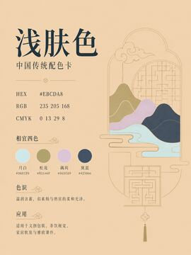</a>
  <a href="images/622-海棠.png">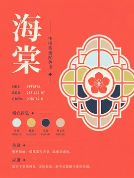</a>
  <a href="images/623-黛青山.png">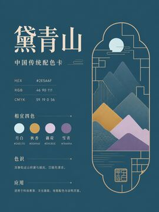</a>
  <a href="images/624-银红.png"></a>
</p>

<p align="center">
  <a href="images/625-蓝色.png">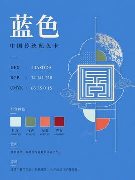</a>
  <a href="images/626-绛紫.png">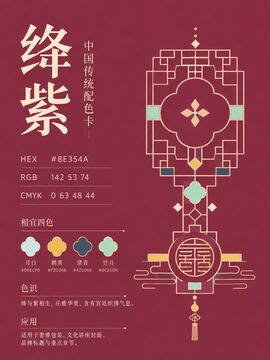</a>
  <a href="images/627-醋.png"></a>
  <a href="images/628-玄青.png"></a>
</p>

<p align="center">
  <a href="images/629-霜叶红.png"></a>
  <a href="images/630-竹月.png">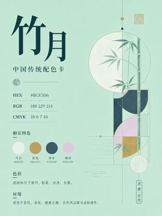</a>
  <a href="images/631-银褐.png"></a>
  <a href="images/632-荞麦.png"></a>
</p>

<p align="center">
  <a href="images/633-茶粉绿.png"></a>
  <a href="images/634-长春花蓝.png"></a>
  <a href="images/635-青骊.png"></a>
  <a href="images/636-荞麦棕.png"></a>
</p>

<p align="center">
  <a href="images/637-纯衣.png"></a>
  <a href="images/638-緇.png"></a>
  <a href="images/639-纁裳.png"></a>
  <a href="images/640-韎韐.png"></a>
</p>

<p align="center">
  <a href="images/641-纁屦.png"></a>
  <a href="images/642-皮弁.png"></a>
  <a href="images/643-素衣.png"></a>
  <a href="images/644-素积.png"></a>
</p>

<p align="center">
  <a href="images/645-缁带.png"></a>
  <a href="images/646-素鞸.png"></a>
  <a href="images/647-白屦.png"></a>
  <a href="images/648-缁絇繶纯.png"></a>
</p>

<p align="center">
  <a href="images/649-黄裳.png"></a>
  <a href="images/650-青絇繶纯.png"></a>
  <a href="images/651-浅灰蓝.png"></a>
  <a href="images/652-官绿.png"></a>
</p>

<p align="center">
  <a href="images/653-明黄.png"></a>
  <a href="images/654-玉青.png"></a>
  <a href="images/655-暖灰.png"></a>
  <a href="images/656-墨色.png"></a>
</p>

<p align="center">
  <a href="images/657-宝蓝.png"></a>
  <a href="images/658-帝王紫.png"></a>
  <a href="images/659-暗金.png"></a>
  <a href="images/660-灰橙色.png"></a>
</p>

<p align="center">
  <a href="images/661-茜红.png"></a>
  <a href="images/662-烟蓝.png"></a>
  <a href="images/663-落霞.png"></a>
  <a href="images/664-纁色.png"></a>
</p>

<p align="center">
  <a href="images/665-緅色.png"></a>
  <a href="images/666-雾霾蓝.png"></a>
  <a href="images/667-浅薄荷绿.png"></a>
  <a href="images/668-丁香紫.png"></a>
</p>

<p align="center">
  <a href="images/669-烟粉.png"></a>
  <a href="images/670-灰粉.png"></a>
  <a href="images/671-棉花糖白.png"></a>
  <a href="images/672-金棕.png"></a>
</p>

<p align="center">
  <a href="images/673-复方甘草.png"></a>
  <a href="images/674-天际灰.png"></a>
  <a href="images/675-藕粉.png"></a>
  <a href="images/676-紫藤萝.png"></a>
</p>

<p align="center">
  <a href="images/677-浅紫藤萝.png"></a>
  <a href="images/678-粉紫藤萝.png"></a>
  <a href="images/679-白雪藤.png"></a>
  <a href="images/680-凝脂莲青.png"></a>
</p>

<p align="center">
  <a href="images/681-焦绿.png"></a>
  <a href="images/682-奶油白.png"></a>
  <a href="images/683-浅豆绿.png"></a>
  <a href="images/684-茉莉白.png"></a>
</p>

<p align="center">
  <a href="images/685-芝麻黑.png"></a>
  <a href="images/686-流黄.png"></a>
  <a href="images/687-柠檬绿.png"></a>
  <a href="images/688-青绿.png"></a>
</p>

<p align="center">
  <a href="images/689-木色.png"></a>
  <a href="images/690-高级灰.png"></a>
  <a href="images/691-云峰灰.png"></a>
  <a href="images/692-檀香紫.png"></a>
</p>

<p align="center">
  <a href="images/693-松烟墨.png"></a>
  <a href="images/694-杏子.png"></a>
  <a href="images/695-霁蓝.png"></a>
  <a href="images/696-靛蓝.png"></a>
</p>

<p align="center">
  <a href="images/697-玫红色.png"></a>
  <a href="images/698-新绿.png"></a>
  <a href="images/699-杏子灰.png"></a>
  <a href="images/700-玉色.png"></a>
</p>

<p align="center">
  <a href="images/701-霜地.png"></a>
  <a href="images/702-黛绿色.png"></a>
  <a href="images/703-茜裙.png"></a>
  <a href="images/704-黛色.png"></a>
</p>

<p align="center">
  <a href="images/705-松花绿.png"></a>
  <a href="images/706-灰色.png"></a>
  <a href="images/707-白色.png"></a>
  <a href="images/708-马尔斯绿.png"></a>
</p>

<p align="center">
  <a href="images/709-藕丝秋半.png"></a>
  <a href="images/710-浅蓝.png"></a>
  <a href="images/711-湘蓝.png"></a>
  <a href="images/712-荔色.png"></a>
</p>

<p align="center">
  <a href="images/713-鸦青色.png"></a>
  <a href="images/714-杏粉.png"></a>
  <a href="images/715-浅杏粉.png"></a>
  <a href="images/716-米白.png"></a>
</p>

<p align="center">
  <a href="images/717-梨花白.png"></a>
  <a href="images/718-荠麦绿.png"></a>
  <a href="images/719-蓼蓝青.png"></a>
  <a href="images/720-胭脂泪.png"></a>
</p>

<p align="center">
  <a href="images/721-藕荷色.png"></a>
  <a href="images/722-杏子阴.png"></a>
  <a href="images/723-浅苋菜紫.png"></a>
  <a href="images/724-社红配.png"></a>
</p>

<p align="center">
  <a href="images/725-猩红.png"></a>
  <a href="images/726-莺儿.png"></a>
  <a href="images/727-青蓝.png"></a>
  <a href="images/728-苍筤.png"></a>
</p>

<p align="center">
  <a href="images/729-汉绣绿.png"></a>
  <a href="images/730-汉绣红.png"></a>
  <a href="images/731-藕丝秋.png"></a>
  <a href="images/732-墨绿.png"></a>
</p>

<p align="center">
  <a href="images/733-荼蘼白.png"></a>
  <a href="images/734-石青.png"></a>
  <a href="images/735-鎏金.png"></a>
  <a href="images/736-墨黑.png"></a>
</p>

<p align="center">
  <a href="images/737-藕丝秋色.png"></a>
  <a href="images/738-胭脂晕.png"></a>
  <a href="images/739-鸦黄.png"></a>
  <a href="images/740-翠青.png"></a>
</p>

<p align="center">
  <a href="images/741-青黛.png"></a>
  <a href="images/742-深绿.png"></a>
</p>

<!-- gallery:end -->

## 项目定位

中国传统色不只是一组漂亮色值，也连接着器物、织染、矿物颜料、诗词意象、节气物候和审美秩序。本项目希望把这些资料整理成一个可以直接浏览、下载、引用和二次开发的公共色彩资料馆。

适合用于：

- 设计灵感、品牌配色、界面主题和视觉实验。
- 传统文化、色彩教育、美术教学和内容创作。
- 前端项目、素材站、颜色工具和开放数据整理。
- 色名、色值、配色关系和视觉语气的持续校勘。

## 项目结构

```text
images/       高清 PNG 原图，共 738 张
thumbnails/   README 预览缩略图，共 738 张
docs/         README 使用的项目说明图片
assets/       静态站点样式、脚本和图片清单
scripts/      图片清单、README 和打包脚本
downloads/    本地生成的下载压缩包，不建议提交到 Git
```

## 快速开始

```bash
npm run manifest
npm run readme
npm run start
```

然后访问：

```text
http://localhost:5173
```

也可以直接部署到 GitHub Pages。为了让浏览器端 ZIP 打包正常读取图片，请通过本地服务器或线上静态站访问，不建议直接用 `file://` 打开。

## 更新图片清单

新增、删除或替换 `images/` 中的图片后，运行：

```bash
npm run manifest
npm run readme
```

这会重新生成 `assets/data/images.js` 和 README 预览图廊。新增图片时请同时补充对应 `thumbnails/` 缩略图。

## 支持作者

这个传统色图片合集会继续保持免费开源。如果它帮你节省了整理、参考和使用传统色卡的时间，也愿意支持后续维护，可以扫描下面的 Buy Me a Coffee 二维码请作者喝杯咖啡。完全自愿；反馈、Star 和 issue 同样有帮助。


## 联系作者

可以通过作者 X 主页联系：[@xiaoxiaodong01](https://x.com/xiaoxiaodong01)。

## 贡献

欢迎提交 Issue 或 Pull Request。新增色卡、修正色值、补充来源、优化页面和完善文档都很有价值。开始前请阅读 [CONTRIBUTING.md](CONTRIBUTING.md)。

## 许可

本项目使用 [MIT License](LICENSE) 开源。

请注意：传统色色值在不同资料、屏幕、印刷和材质中可能存在差异。本项目提供的是开放整理和学习资料，实际生产使用前应结合媒介校验。
