# 中国传统配色

一个用于展示、学习和复用中华传统色的开放图片项目。当前仓库收录 538 张传统色色卡图片，每张色卡包含色名、HEX、RGB、CMYK、配色推荐和气质关键词；README 使用轻量缩略图完整展示，点击任意缩略图可打开高清 PNG 原图。

## 快速入口

- [下载全部高清图片 ZIP](https://github.com/nevertoday/zhongguo-traditional-colors/releases/latest/download/zhongguo-traditional-colors-images.zip)
- [在线浏览色卡](https://nevertoday.github.io/zhongguo-traditional-colors/)
- [完整图片包 Release 下载](https://github.com/nevertoday/zhongguo-traditional-colors/releases/tag/v0.1.0)
- [原始 742 色清单](docs/chinese-color-master-list.md)
- [缺失颜色报告](docs/missing-colors.md)
- [作者 X 主页](https://x.com/xiaoxiaodong01)

> 原图约 708MB，ZIP 文件作为 GitHub Release 附件提供，不直接提交进仓库。单张高清图可点击下方任意缩略图打开。

## 预览

<!-- gallery:start -->
<p align="center">
  <a href="images/mue_oar_生成配色卡片_背景是这个用户给定的颜色_都是一些中国传统配色背景要是这个色然后整体扁平颜色名称和_cmy_01edea60-bb72-4b1c-8ac5-5e510b5bf2c4_10.png">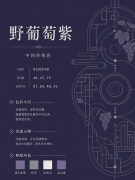</a>
  <a href="images/mue_oar_生成配色卡片_背景是这个用户给定的颜色_都是一些中国传统配色背景要是这个色然后整体扁平颜色名称和_cmy_152a5b31-b940-479c-ab90-2ee4d6fc8717_10.png">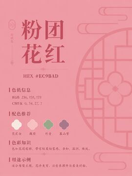</a>
  <a href="images/mue_oar_生成配色卡片_背景是这个用户给定的颜色_都是一些中国传统配色背景要是这个色然后整体扁平颜色名称和_cmy_17d093f1-16da-4992-bf36-1fdec8958cff_10.png">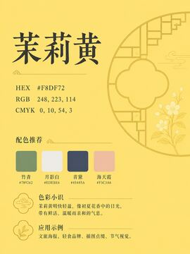</a>
  <a href="images/mue_oar_生成配色卡片_背景是这个用户给定的颜色_都是一些中国传统配色背景要是这个色然后整体扁平颜色名称和_cmy_36c60647-cd1d-4951-8262-fa1a56f6010d_10.png">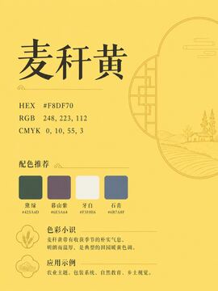</a>
</p>

<p align="center">
  <a href="images/mue_oar_生成配色卡片_背景是这个用户给定的颜色_都是一些中国传统配色背景要是这个色然后整体扁平颜色名称和_cmy_419c9668-cde6-4eff-b996-7a10857574ab_10.png">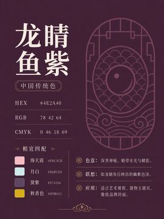</a>
  <a href="images/mue_oar_生成配色卡片_背景是这个用户给定的颜色_都是一些中国传统配色背景要是这个色然后整体扁平颜色名称和_cmy_609b2f6c-4ed7-4d1a-b790-522bafe44d44_10.png">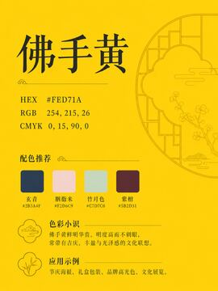</a>
  <a href="images/mue_oar_生成配色卡片_背景是这个用户给定的颜色_都是一些中国传统配色背景要是这个色然后整体扁平颜色名称和_cmy_91c1f96b-d988-4c37-b31b-41f183f47c78_10.png">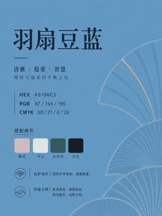</a>
  <a href="images/mue_oar_生成配色卡片_背景是这个用户给定的颜色_都是一些中国传统配色背景要是这个色然后整体扁平颜色名称和_cmy_a3f5d507-cb48-421a-a348-a30ff234c572_10.png">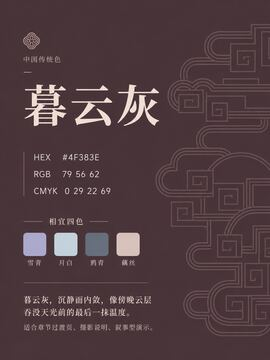</a>
</p>

<p align="center">
  <a href="images/mue_oar_生成配色卡片_背景是这个用户给定的颜色_都是一些中国传统配色背景要是这个色然后整体扁平颜色名称和_cmy_a5abed2b-f90f-41c0-b5e7-b7d2e4e45307_10.png">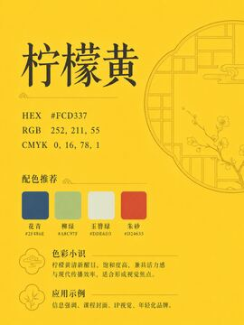</a>
  <a href="images/mue_oar_生成配色卡片_背景是这个用户给定的颜色_都是一些中国传统配色背景要是这个色然后整体扁平颜色名称和_cmy_d35e6ca5-a68b-4d81-95c5-c881846c6450_10.png">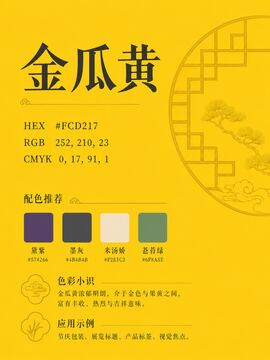</a>
  <a href="images/mue_oar_生成配色卡片_背景是这个用户给定的颜色_都是一些中国传统配色背景要是这个色然后整体扁平颜色名称和_cmy_df35e669-01a3-48e5-81a3-1d2108c99494_10.png">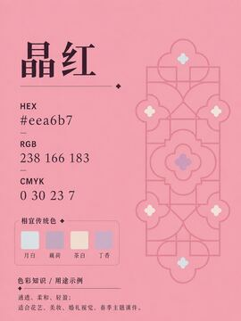</a>
  <a href="images/mue_oar_生成配色卡片_背景是这个用户给定的颜色_都是一些中国传统配色背景要是这个色然后整体扁平颜色名称和_cmy_efd2b4d5-7fcc-449e-ae7c-25d97737a38d_10.png">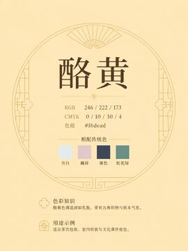</a>
</p>

<p align="center">
  <a href="images/mue_oar_生成配色卡片_背景是这个用户给定的颜色_都是一些中国传统配色背景要是这个色然后整体扁平颜色名称和_cmy_fb264d38-ee44-4a98-8732-2a191febda6b_10.png">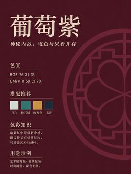</a>
  <a href="images/mue_oar_生成配色卡片_背景是这个用户给定的颜色_都是一些中国传统配色背景要是这个色然后整体扁平颜色名称和_cmyk_01edea60-bb72-4b1c-8ac5-5e510b5bf2c4_1.png">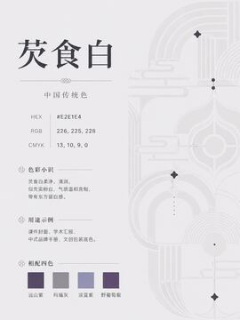</a>
  <a href="images/mue_oar_生成配色卡片_背景是这个用户给定的颜色_都是一些中国传统配色背景要是这个色然后整体扁平颜色名称和_cmyk_01edea60-bb72-4b1c-8ac5-5e510b5bf2c4_2.png">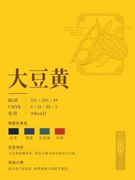</a>
  <a href="images/mue_oar_生成配色卡片_背景是这个用户给定的颜色_都是一些中国传统配色背景要是这个色然后整体扁平颜色名称和_cmyk_01edea60-bb72-4b1c-8ac5-5e510b5bf2c4_3.png">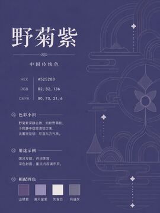</a>
</p>

<p align="center">
  <a href="images/mue_oar_生成配色卡片_背景是这个用户给定的颜色_都是一些中国传统配色背景要是这个色然后整体扁平颜色名称和_cmyk_01edea60-bb72-4b1c-8ac5-5e510b5bf2c4_4.png"></a>
  <a href="images/mue_oar_生成配色卡片_背景是这个用户给定的颜色_都是一些中国传统配色背景要是这个色然后整体扁平颜色名称和_cmyk_01edea60-bb72-4b1c-8ac5-5e510b5bf2c4_5.png">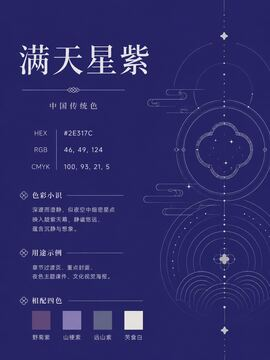</a>
  <a href="images/mue_oar_生成配色卡片_背景是这个用户给定的颜色_都是一些中国传统配色背景要是这个色然后整体扁平颜色名称和_cmyk_01edea60-bb72-4b1c-8ac5-5e510b5bf2c4_6.png">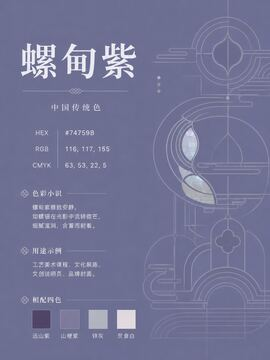</a>
  <a href="images/mue_oar_生成配色卡片_背景是这个用户给定的颜色_都是一些中国传统配色背景要是这个色然后整体扁平颜色名称和_cmyk_01edea60-bb72-4b1c-8ac5-5e510b5bf2c4_7.png">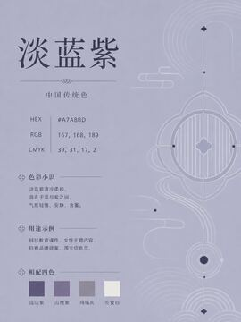</a>
</p>

<p align="center">
  <a href="images/mue_oar_生成配色卡片_背景是这个用户给定的颜色_都是一些中国传统配色背景要是这个色然后整体扁平颜色名称和_cmyk_01edea60-bb72-4b1c-8ac5-5e510b5bf2c4_8.png">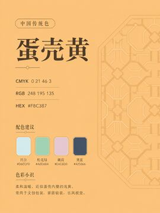</a>
  <a href="images/mue_oar_生成配色卡片_背景是这个用户给定的颜色_都是一些中国传统配色背景要是这个色然后整体扁平颜色名称和_cmyk_01edea60-bb72-4b1c-8ac5-5e510b5bf2c4_9.png">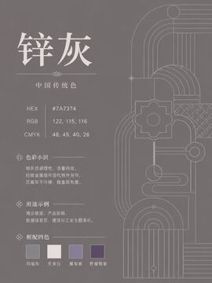</a>
  <a href="images/mue_oar_生成配色卡片_背景是这个用户给定的颜色_都是一些中国传统配色背景要是这个色然后整体扁平颜色名称和_cmyk_152a5b31-b940-479c-ab90-2ee4d6fc8717_1.png">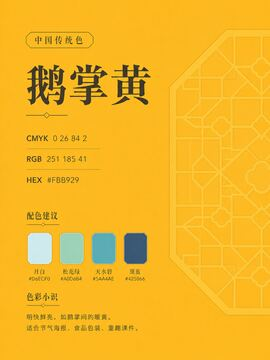</a>
  <a href="images/mue_oar_生成配色卡片_背景是这个用户给定的颜色_都是一些中国传统配色背景要是这个色然后整体扁平颜色名称和_cmyk_152a5b31-b940-479c-ab90-2ee4d6fc8717_2.png">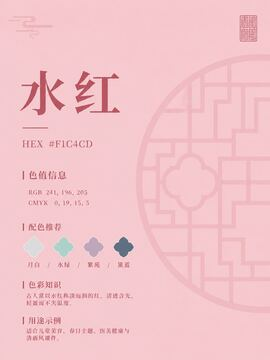</a>
</p>

<p align="center">
  <a href="images/mue_oar_生成配色卡片_背景是这个用户给定的颜色_都是一些中国传统配色背景要是这个色然后整体扁平颜色名称和_cmyk_152a5b31-b940-479c-ab90-2ee4d6fc8717_3.png">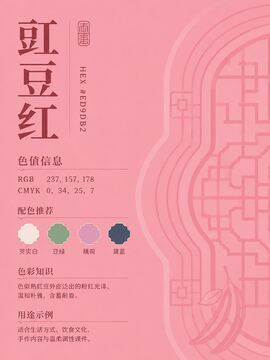</a>
  <a href="images/mue_oar_生成配色卡片_背景是这个用户给定的颜色_都是一些中国传统配色背景要是这个色然后整体扁平颜色名称和_cmyk_152a5b31-b940-479c-ab90-2ee4d6fc8717_4.png">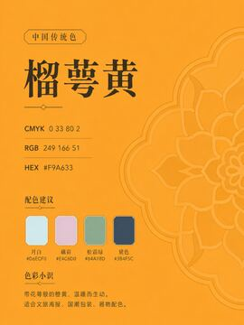</a>
  <a href="images/mue_oar_生成配色卡片_背景是这个用户给定的颜色_都是一些中国传统配色背景要是这个色然后整体扁平颜色名称和_cmyk_152a5b31-b940-479c-ab90-2ee4d6fc8717_5.png"></a>
  <a href="images/mue_oar_生成配色卡片_背景是这个用户给定的颜色_都是一些中国传统配色背景要是这个色然后整体扁平颜色名称和_cmyk_152a5b31-b940-479c-ab90-2ee4d6fc8717_6.png">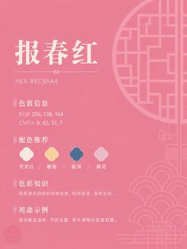</a>
</p>

<p align="center">
  <a href="images/mue_oar_生成配色卡片_背景是这个用户给定的颜色_都是一些中国传统配色背景要是这个色然后整体扁平颜色名称和_cmyk_152a5b31-b940-479c-ab90-2ee4d6fc8717_7.png">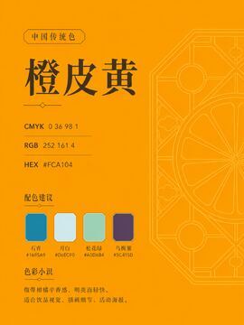</a>
  <a href="images/mue_oar_生成配色卡片_背景是这个用户给定的颜色_都是一些中国传统配色背景要是这个色然后整体扁平颜色名称和_cmyk_152a5b31-b940-479c-ab90-2ee4d6fc8717_8.png">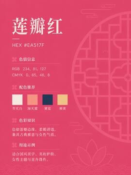</a>
  <a href="images/mue_oar_生成配色卡片_背景是这个用户给定的颜色_都是一些中国传统配色背景要是这个色然后整体扁平颜色名称和_cmyk_152a5b31-b940-479c-ab90-2ee4d6fc8717_9.png"></a>
  <a href="images/mue_oar_生成配色卡片_背景是这个用户给定的颜色_都是一些中国传统配色背景要是这个色然后整体扁平颜色名称和_cmyk_17d093f1-16da-4992-bf36-1fdec8958cff_1.png">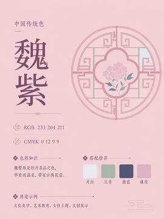</a>
</p>

<p align="center">
  <a href="images/mue_oar_生成配色卡片_背景是这个用户给定的颜色_都是一些中国传统配色背景要是这个色然后整体扁平颜色名称和_cmyk_17d093f1-16da-4992-bf36-1fdec8958cff_2.png">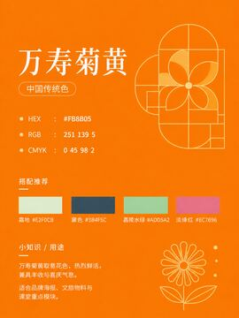</a>
  <a href="images/mue_oar_生成配色卡片_背景是这个用户给定的颜色_都是一些中国传统配色背景要是这个色然后整体扁平颜色名称和_cmyk_17d093f1-16da-4992-bf36-1fdec8958cff_3.png">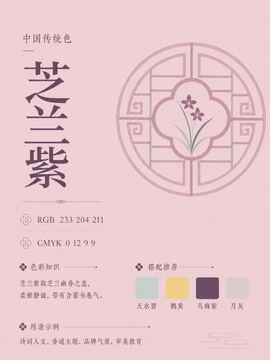</a>
  <a href="images/mue_oar_生成配色卡片_背景是这个用户给定的颜色_都是一些中国传统配色背景要是这个色然后整体扁平颜色名称和_cmyk_17d093f1-16da-4992-bf36-1fdec8958cff_4.png">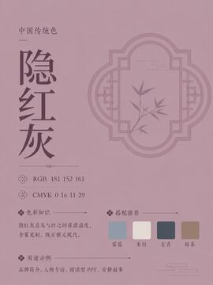</a>
  <a href="images/mue_oar_生成配色卡片_背景是这个用户给定的颜色_都是一些中国传统配色背景要是这个色然后整体扁平颜色名称和_cmyk_17d093f1-16da-4992-bf36-1fdec8958cff_5.png">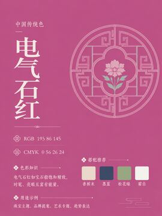</a>
</p>

<p align="center">
  <a href="images/mue_oar_生成配色卡片_背景是这个用户给定的颜色_都是一些中国传统配色背景要是这个色然后整体扁平颜色名称和_cmyk_17d093f1-16da-4992-bf36-1fdec8958cff_6.png">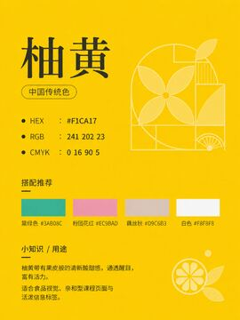</a>
  <a href="images/mue_oar_生成配色卡片_背景是这个用户给定的颜色_都是一些中国传统配色背景要是这个色然后整体扁平颜色名称和_cmyk_17d093f1-16da-4992-bf36-1fdec8958cff_7.png">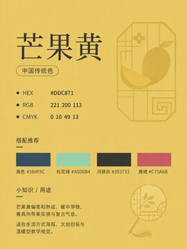</a>
  <a href="images/mue_oar_生成配色卡片_背景是这个用户给定的颜色_都是一些中国传统配色背景要是这个色然后整体扁平颜色名称和_cmyk_17d093f1-16da-4992-bf36-1fdec8958cff_8.png">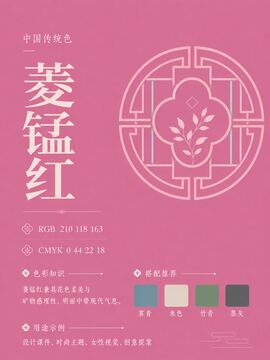</a>
  <a href="images/mue_oar_生成配色卡片_背景是这个用户给定的颜色_都是一些中国传统配色背景要是这个色然后整体扁平颜色名称和_cmyk_17d093f1-16da-4992-bf36-1fdec8958cff_9.png">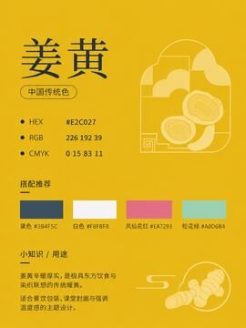</a>
</p>

<p align="center">
  <a href="images/mue_oar_生成配色卡片_背景是这个用户给定的颜色_都是一些中国传统配色背景要是这个色然后整体扁平颜色名称和_cmyk_36c60647-cd1d-4951-8262-fa1a56f6010d_1.png"></a>
  <a href="images/mue_oar_生成配色卡片_背景是这个用户给定的颜色_都是一些中国传统配色背景要是这个色然后整体扁平颜色名称和_cmyk_36c60647-cd1d-4951-8262-fa1a56f6010d_2.png">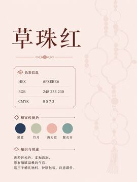</a>
  <a href="images/mue_oar_生成配色卡片_背景是这个用户给定的颜色_都是一些中国传统配色背景要是这个色然后整体扁平颜色名称和_cmyk_36c60647-cd1d-4951-8262-fa1a56f6010d_3.png">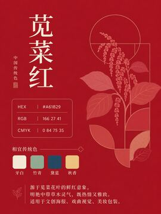</a>
  <a href="images/mue_oar_生成配色卡片_背景是这个用户给定的颜色_都是一些中国传统配色背景要是这个色然后整体扁平颜色名称和_cmyk_36c60647-cd1d-4951-8262-fa1a56f6010d_4.png">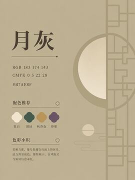</a>
</p>

<p align="center">
  <a href="images/mue_oar_生成配色卡片_背景是这个用户给定的颜色_都是一些中国传统配色背景要是这个色然后整体扁平颜色名称和_cmyk_36c60647-cd1d-4951-8262-fa1a56f6010d_5.png">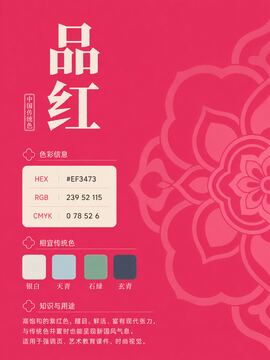</a>
  <a href="images/mue_oar_生成配色卡片_背景是这个用户给定的颜色_都是一些中国传统配色背景要是这个色然后整体扁平颜色名称和_cmyk_36c60647-cd1d-4951-8262-fa1a56f6010d_6.png">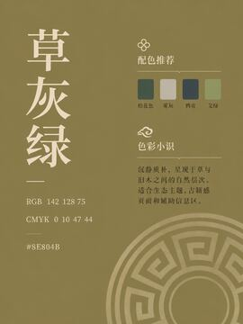</a>
  <a href="images/mue_oar_生成配色卡片_背景是这个用户给定的颜色_都是一些中国传统配色背景要是这个色然后整体扁平颜色名称和_cmyk_36c60647-cd1d-4951-8262-fa1a56f6010d_7.png">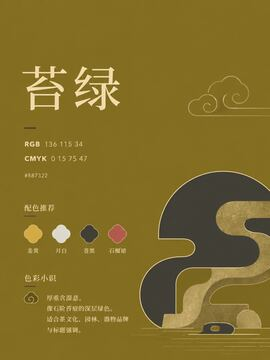</a>
  <a href="images/mue_oar_生成配色卡片_背景是这个用户给定的颜色_都是一些中国传统配色背景要是这个色然后整体扁平颜色名称和_cmyk_36c60647-cd1d-4951-8262-fa1a56f6010d_8.png"></a>
</p>

<p align="center">
  <a href="images/mue_oar_生成配色卡片_背景是这个用户给定的颜色_都是一些中国传统配色背景要是这个色然后整体扁平颜色名称和_cmyk_36c60647-cd1d-4951-8262-fa1a56f6010d_9.png">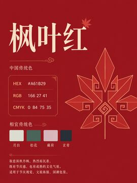</a>
  <a href="images/mue_oar_生成配色卡片_背景是这个用户给定的颜色_都是一些中国传统配色背景要是这个色然后整体扁平颜色名称和_cmyk_419c9668-cde6-4eff-b996-7a10857574ab_1.png">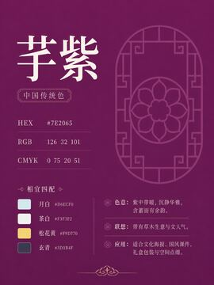</a>
  <a href="images/mue_oar_生成配色卡片_背景是这个用户给定的颜色_都是一些中国传统配色背景要是这个色然后整体扁平颜色名称和_cmyk_419c9668-cde6-4eff-b996-7a10857574ab_2.png">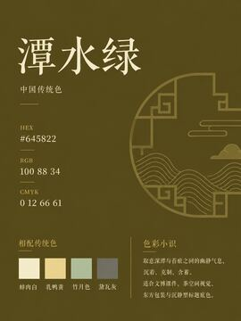</a>
  <a href="images/mue_oar_生成配色卡片_背景是这个用户给定的颜色_都是一些中国传统配色背景要是这个色然后整体扁平颜色名称和_cmyk_419c9668-cde6-4eff-b996-7a10857574ab_3.png">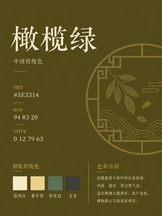</a>
</p>

<p align="center">
  <a href="images/mue_oar_生成配色卡片_背景是这个用户给定的颜色_都是一些中国传统配色背景要是这个色然后整体扁平颜色名称和_cmyk_419c9668-cde6-4eff-b996-7a10857574ab_4.png">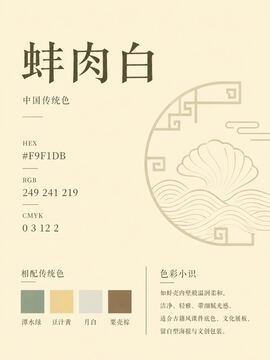</a>
  <a href="images/mue_oar_生成配色卡片_背景是这个用户给定的颜色_都是一些中国传统配色背景要是这个色然后整体扁平颜色名称和_cmyk_419c9668-cde6-4eff-b996-7a10857574ab_5.png">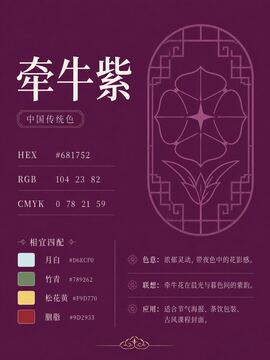</a>
  <a href="images/mue_oar_生成配色卡片_背景是这个用户给定的颜色_都是一些中国传统配色背景要是这个色然后整体扁平颜色名称和_cmyk_419c9668-cde6-4eff-b996-7a10857574ab_6.png">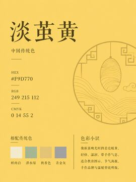</a>
  <a href="images/mue_oar_生成配色卡片_背景是这个用户给定的颜色_都是一些中国传统配色背景要是这个色然后整体扁平颜色名称和_cmyk_419c9668-cde6-4eff-b996-7a10857574ab_7.png"></a>
</p>

<p align="center">
  <a href="images/mue_oar_生成配色卡片_背景是这个用户给定的颜色_都是一些中国传统配色背景要是这个色然后整体扁平颜色名称和_cmyk_419c9668-cde6-4eff-b996-7a10857574ab_8.png"></a>
  <a href="images/mue_oar_生成配色卡片_背景是这个用户给定的颜色_都是一些中国传统配色背景要是这个色然后整体扁平颜色名称和_cmyk_419c9668-cde6-4eff-b996-7a10857574ab_9.png"></a>
  <a href="images/mue_oar_生成配色卡片_背景是这个用户给定的颜色_都是一些中国传统配色背景要是这个色然后整体扁平颜色名称和_cmyk_609b2f6c-4ed7-4d1a-b790-522bafe44d44_1.png"></a>
  <a href="images/mue_oar_生成配色卡片_背景是这个用户给定的颜色_都是一些中国传统配色背景要是这个色然后整体扁平颜色名称和_cmyk_609b2f6c-4ed7-4d1a-b790-522bafe44d44_2.png"></a>
</p>

<p align="center">
  <a href="images/mue_oar_生成配色卡片_背景是这个用户给定的颜色_都是一些中国传统配色背景要是这个色然后整体扁平颜色名称和_cmyk_609b2f6c-4ed7-4d1a-b790-522bafe44d44_3.png"></a>
  <a href="images/mue_oar_生成配色卡片_背景是这个用户给定的颜色_都是一些中国传统配色背景要是这个色然后整体扁平颜色名称和_cmyk_609b2f6c-4ed7-4d1a-b790-522bafe44d44_4.png"></a>
  <a href="images/mue_oar_生成配色卡片_背景是这个用户给定的颜色_都是一些中国传统配色背景要是这个色然后整体扁平颜色名称和_cmyk_609b2f6c-4ed7-4d1a-b790-522bafe44d44_5.png"></a>
  <a href="images/mue_oar_生成配色卡片_背景是这个用户给定的颜色_都是一些中国传统配色背景要是这个色然后整体扁平颜色名称和_cmyk_609b2f6c-4ed7-4d1a-b790-522bafe44d44_6.png"></a>
</p>

<p align="center">
  <a href="images/mue_oar_生成配色卡片_背景是这个用户给定的颜色_都是一些中国传统配色背景要是这个色然后整体扁平颜色名称和_cmyk_609b2f6c-4ed7-4d1a-b790-522bafe44d44_7.png"></a>
  <a href="images/mue_oar_生成配色卡片_背景是这个用户给定的颜色_都是一些中国传统配色背景要是这个色然后整体扁平颜色名称和_cmyk_609b2f6c-4ed7-4d1a-b790-522bafe44d44_8.png"></a>
  <a href="images/mue_oar_生成配色卡片_背景是这个用户给定的颜色_都是一些中国传统配色背景要是这个色然后整体扁平颜色名称和_cmyk_609b2f6c-4ed7-4d1a-b790-522bafe44d44_9.png"></a>
  <a href="images/mue_oar_生成配色卡片_背景是这个用户给定的颜色_都是一些中国传统配色背景要是这个色然后整体扁平颜色名称和_cmyk_91c1f96b-d988-4c37-b31b-41f183f47c78_1.png"></a>
</p>

<p align="center">
  <a href="images/mue_oar_生成配色卡片_背景是这个用户给定的颜色_都是一些中国传统配色背景要是这个色然后整体扁平颜色名称和_cmyk_91c1f96b-d988-4c37-b31b-41f183f47c78_2.png"></a>
  <a href="images/mue_oar_生成配色卡片_背景是这个用户给定的颜色_都是一些中国传统配色背景要是这个色然后整体扁平颜色名称和_cmyk_91c1f96b-d988-4c37-b31b-41f183f47c78_3.png"></a>
  <a href="images/mue_oar_生成配色卡片_背景是这个用户给定的颜色_都是一些中国传统配色背景要是这个色然后整体扁平颜色名称和_cmyk_91c1f96b-d988-4c37-b31b-41f183f47c78_4.png"></a>
  <a href="images/mue_oar_生成配色卡片_背景是这个用户给定的颜色_都是一些中国传统配色背景要是这个色然后整体扁平颜色名称和_cmyk_91c1f96b-d988-4c37-b31b-41f183f47c78_5.png"></a>
</p>

<p align="center">
  <a href="images/mue_oar_生成配色卡片_背景是这个用户给定的颜色_都是一些中国传统配色背景要是这个色然后整体扁平颜色名称和_cmyk_91c1f96b-d988-4c37-b31b-41f183f47c78_6.png"></a>
  <a href="images/mue_oar_生成配色卡片_背景是这个用户给定的颜色_都是一些中国传统配色背景要是这个色然后整体扁平颜色名称和_cmyk_91c1f96b-d988-4c37-b31b-41f183f47c78_7.png"></a>
  <a href="images/mue_oar_生成配色卡片_背景是这个用户给定的颜色_都是一些中国传统配色背景要是这个色然后整体扁平颜色名称和_cmyk_91c1f96b-d988-4c37-b31b-41f183f47c78_8.png"></a>
  <a href="images/mue_oar_生成配色卡片_背景是这个用户给定的颜色_都是一些中国传统配色背景要是这个色然后整体扁平颜色名称和_cmyk_91c1f96b-d988-4c37-b31b-41f183f47c78_9.png"></a>
</p>

<p align="center">
  <a href="images/mue_oar_生成配色卡片_背景是这个用户给定的颜色_都是一些中国传统配色背景要是这个色然后整体扁平颜色名称和_cmyk_a3f5d507-cb48-421a-a348-a30ff234c572_1.png"></a>
  <a href="images/mue_oar_生成配色卡片_背景是这个用户给定的颜色_都是一些中国传统配色背景要是这个色然后整体扁平颜色名称和_cmyk_a3f5d507-cb48-421a-a348-a30ff234c572_2.png"></a>
  <a href="images/mue_oar_生成配色卡片_背景是这个用户给定的颜色_都是一些中国传统配色背景要是这个色然后整体扁平颜色名称和_cmyk_a3f5d507-cb48-421a-a348-a30ff234c572_3.png"></a>
  <a href="images/mue_oar_生成配色卡片_背景是这个用户给定的颜色_都是一些中国传统配色背景要是这个色然后整体扁平颜色名称和_cmyk_a3f5d507-cb48-421a-a348-a30ff234c572_4.png"></a>
</p>

<p align="center">
  <a href="images/mue_oar_生成配色卡片_背景是这个用户给定的颜色_都是一些中国传统配色背景要是这个色然后整体扁平颜色名称和_cmyk_a3f5d507-cb48-421a-a348-a30ff234c572_5.png"></a>
  <a href="images/mue_oar_生成配色卡片_背景是这个用户给定的颜色_都是一些中国传统配色背景要是这个色然后整体扁平颜色名称和_cmyk_a3f5d507-cb48-421a-a348-a30ff234c572_6.png"></a>
  <a href="images/mue_oar_生成配色卡片_背景是这个用户给定的颜色_都是一些中国传统配色背景要是这个色然后整体扁平颜色名称和_cmyk_a3f5d507-cb48-421a-a348-a30ff234c572_7.png"></a>
  <a href="images/mue_oar_生成配色卡片_背景是这个用户给定的颜色_都是一些中国传统配色背景要是这个色然后整体扁平颜色名称和_cmyk_a3f5d507-cb48-421a-a348-a30ff234c572_8.png"></a>
</p>

<p align="center">
  <a href="images/mue_oar_生成配色卡片_背景是这个用户给定的颜色_都是一些中国传统配色背景要是这个色然后整体扁平颜色名称和_cmyk_a3f5d507-cb48-421a-a348-a30ff234c572_9.png"></a>
  <a href="images/mue_oar_生成配色卡片_背景是这个用户给定的颜色_都是一些中国传统配色背景要是这个色然后整体扁平颜色名称和_cmyk_a5abed2b-f90f-41c0-b5e7-b7d2e4e45307_1.png"></a>
  <a href="images/mue_oar_生成配色卡片_背景是这个用户给定的颜色_都是一些中国传统配色背景要是这个色然后整体扁平颜色名称和_cmyk_a5abed2b-f90f-41c0-b5e7-b7d2e4e45307_2.png"></a>
  <a href="images/mue_oar_生成配色卡片_背景是这个用户给定的颜色_都是一些中国传统配色背景要是这个色然后整体扁平颜色名称和_cmyk_a5abed2b-f90f-41c0-b5e7-b7d2e4e45307_3.png"></a>
</p>

<p align="center">
  <a href="images/mue_oar_生成配色卡片_背景是这个用户给定的颜色_都是一些中国传统配色背景要是这个色然后整体扁平颜色名称和_cmyk_a5abed2b-f90f-41c0-b5e7-b7d2e4e45307_4.png"></a>
  <a href="images/mue_oar_生成配色卡片_背景是这个用户给定的颜色_都是一些中国传统配色背景要是这个色然后整体扁平颜色名称和_cmyk_a5abed2b-f90f-41c0-b5e7-b7d2e4e45307_5.png"></a>
  <a href="images/mue_oar_生成配色卡片_背景是这个用户给定的颜色_都是一些中国传统配色背景要是这个色然后整体扁平颜色名称和_cmyk_a5abed2b-f90f-41c0-b5e7-b7d2e4e45307_6.png"></a>
  <a href="images/mue_oar_生成配色卡片_背景是这个用户给定的颜色_都是一些中国传统配色背景要是这个色然后整体扁平颜色名称和_cmyk_a5abed2b-f90f-41c0-b5e7-b7d2e4e45307_7.png"></a>
</p>

<p align="center">
  <a href="images/mue_oar_生成配色卡片_背景是这个用户给定的颜色_都是一些中国传统配色背景要是这个色然后整体扁平颜色名称和_cmyk_a5abed2b-f90f-41c0-b5e7-b7d2e4e45307_8.png"></a>
  <a href="images/mue_oar_生成配色卡片_背景是这个用户给定的颜色_都是一些中国传统配色背景要是这个色然后整体扁平颜色名称和_cmyk_a5abed2b-f90f-41c0-b5e7-b7d2e4e45307_9.png"></a>
  <a href="images/mue_oar_生成配色卡片_背景是这个用户给定的颜色_都是一些中国传统配色背景要是这个色然后整体扁平颜色名称和_cmyk_d35e6ca5-a68b-4d81-95c5-c881846c6450_1.png"></a>
  <a href="images/mue_oar_生成配色卡片_背景是这个用户给定的颜色_都是一些中国传统配色背景要是这个色然后整体扁平颜色名称和_cmyk_d35e6ca5-a68b-4d81-95c5-c881846c6450_2.png"></a>
</p>

<p align="center">
  <a href="images/mue_oar_生成配色卡片_背景是这个用户给定的颜色_都是一些中国传统配色背景要是这个色然后整体扁平颜色名称和_cmyk_d35e6ca5-a68b-4d81-95c5-c881846c6450_3.png"></a>
  <a href="images/mue_oar_生成配色卡片_背景是这个用户给定的颜色_都是一些中国传统配色背景要是这个色然后整体扁平颜色名称和_cmyk_d35e6ca5-a68b-4d81-95c5-c881846c6450_4.png"></a>
  <a href="images/mue_oar_生成配色卡片_背景是这个用户给定的颜色_都是一些中国传统配色背景要是这个色然后整体扁平颜色名称和_cmyk_d35e6ca5-a68b-4d81-95c5-c881846c6450_5.png"></a>
  <a href="images/mue_oar_生成配色卡片_背景是这个用户给定的颜色_都是一些中国传统配色背景要是这个色然后整体扁平颜色名称和_cmyk_d35e6ca5-a68b-4d81-95c5-c881846c6450_6.png"></a>
</p>

<p align="center">
  <a href="images/mue_oar_生成配色卡片_背景是这个用户给定的颜色_都是一些中国传统配色背景要是这个色然后整体扁平颜色名称和_cmyk_d35e6ca5-a68b-4d81-95c5-c881846c6450_7.png"></a>
  <a href="images/mue_oar_生成配色卡片_背景是这个用户给定的颜色_都是一些中国传统配色背景要是这个色然后整体扁平颜色名称和_cmyk_d35e6ca5-a68b-4d81-95c5-c881846c6450_8.png"></a>
  <a href="images/mue_oar_生成配色卡片_背景是这个用户给定的颜色_都是一些中国传统配色背景要是这个色然后整体扁平颜色名称和_cmyk_d35e6ca5-a68b-4d81-95c5-c881846c6450_9.png"></a>
  <a href="images/mue_oar_生成配色卡片_背景是这个用户给定的颜色_都是一些中国传统配色背景要是这个色然后整体扁平颜色名称和_cmyk_df35e669-01a3-48e5-81a3-1d2108c99494_1.png"></a>
</p>

<p align="center">
  <a href="images/mue_oar_生成配色卡片_背景是这个用户给定的颜色_都是一些中国传统配色背景要是这个色然后整体扁平颜色名称和_cmyk_df35e669-01a3-48e5-81a3-1d2108c99494_2.png"></a>
  <a href="images/mue_oar_生成配色卡片_背景是这个用户给定的颜色_都是一些中国传统配色背景要是这个色然后整体扁平颜色名称和_cmyk_df35e669-01a3-48e5-81a3-1d2108c99494_3.png"></a>
  <a href="images/mue_oar_生成配色卡片_背景是这个用户给定的颜色_都是一些中国传统配色背景要是这个色然后整体扁平颜色名称和_cmyk_df35e669-01a3-48e5-81a3-1d2108c99494_4.png"></a>
  <a href="images/mue_oar_生成配色卡片_背景是这个用户给定的颜色_都是一些中国传统配色背景要是这个色然后整体扁平颜色名称和_cmyk_df35e669-01a3-48e5-81a3-1d2108c99494_5.png"></a>
</p>

<p align="center">
  <a href="images/mue_oar_生成配色卡片_背景是这个用户给定的颜色_都是一些中国传统配色背景要是这个色然后整体扁平颜色名称和_cmyk_df35e669-01a3-48e5-81a3-1d2108c99494_6.png"></a>
  <a href="images/mue_oar_生成配色卡片_背景是这个用户给定的颜色_都是一些中国传统配色背景要是这个色然后整体扁平颜色名称和_cmyk_df35e669-01a3-48e5-81a3-1d2108c99494_7.png"></a>
  <a href="images/mue_oar_生成配色卡片_背景是这个用户给定的颜色_都是一些中国传统配色背景要是这个色然后整体扁平颜色名称和_cmyk_df35e669-01a3-48e5-81a3-1d2108c99494_8.png"></a>
  <a href="images/mue_oar_生成配色卡片_背景是这个用户给定的颜色_都是一些中国传统配色背景要是这个色然后整体扁平颜色名称和_cmyk_df35e669-01a3-48e5-81a3-1d2108c99494_9.png"></a>
</p>

<p align="center">
  <a href="images/mue_oar_生成配色卡片_背景是这个用户给定的颜色_都是一些中国传统配色背景要是这个色然后整体扁平颜色名称和_cmyk_efd2b4d5-7fcc-449e-ae7c-25d97737a38d_1.png"></a>
  <a href="images/mue_oar_生成配色卡片_背景是这个用户给定的颜色_都是一些中国传统配色背景要是这个色然后整体扁平颜色名称和_cmyk_efd2b4d5-7fcc-449e-ae7c-25d97737a38d_2.png"></a>
  <a href="images/mue_oar_生成配色卡片_背景是这个用户给定的颜色_都是一些中国传统配色背景要是这个色然后整体扁平颜色名称和_cmyk_efd2b4d5-7fcc-449e-ae7c-25d97737a38d_3.png"></a>
  <a href="images/mue_oar_生成配色卡片_背景是这个用户给定的颜色_都是一些中国传统配色背景要是这个色然后整体扁平颜色名称和_cmyk_efd2b4d5-7fcc-449e-ae7c-25d97737a38d_4.png"></a>
</p>

<p align="center">
  <a href="images/mue_oar_生成配色卡片_背景是这个用户给定的颜色_都是一些中国传统配色背景要是这个色然后整体扁平颜色名称和_cmyk_efd2b4d5-7fcc-449e-ae7c-25d97737a38d_5.png"></a>
  <a href="images/mue_oar_生成配色卡片_背景是这个用户给定的颜色_都是一些中国传统配色背景要是这个色然后整体扁平颜色名称和_cmyk_efd2b4d5-7fcc-449e-ae7c-25d97737a38d_6.png"></a>
  <a href="images/mue_oar_生成配色卡片_背景是这个用户给定的颜色_都是一些中国传统配色背景要是这个色然后整体扁平颜色名称和_cmyk_efd2b4d5-7fcc-449e-ae7c-25d97737a38d_7.png"></a>
  <a href="images/mue_oar_生成配色卡片_背景是这个用户给定的颜色_都是一些中国传统配色背景要是这个色然后整体扁平颜色名称和_cmyk_efd2b4d5-7fcc-449e-ae7c-25d97737a38d_8.png"></a>
</p>

<p align="center">
  <a href="images/mue_oar_生成配色卡片_背景是这个用户给定的颜色_都是一些中国传统配色背景要是这个色然后整体扁平颜色名称和_cmyk_efd2b4d5-7fcc-449e-ae7c-25d97737a38d_9.png"></a>
  <a href="images/mue_oar_生成配色卡片_背景是这个用户给定的颜色_都是一些中国传统配色背景要是这个色然后整体扁平颜色名称和_cmyk_fb264d38-ee44-4a98-8732-2a191febda6b_1.png"></a>
  <a href="images/mue_oar_生成配色卡片_背景是这个用户给定的颜色_都是一些中国传统配色背景要是这个色然后整体扁平颜色名称和_cmyk_fb264d38-ee44-4a98-8732-2a191febda6b_2.png"></a>
  <a href="images/mue_oar_生成配色卡片_背景是这个用户给定的颜色_都是一些中国传统配色背景要是这个色然后整体扁平颜色名称和_cmyk_fb264d38-ee44-4a98-8732-2a191febda6b_3.png"></a>
</p>

<p align="center">
  <a href="images/mue_oar_生成配色卡片_背景是这个用户给定的颜色_都是一些中国传统配色背景要是这个色然后整体扁平颜色名称和_cmyk_fb264d38-ee44-4a98-8732-2a191febda6b_4.png"></a>
  <a href="images/mue_oar_生成配色卡片_背景是这个用户给定的颜色_都是一些中国传统配色背景要是这个色然后整体扁平颜色名称和_cmyk_fb264d38-ee44-4a98-8732-2a191febda6b_5.png"></a>
  <a href="images/mue_oar_生成配色卡片_背景是这个用户给定的颜色_都是一些中国传统配色背景要是这个色然后整体扁平颜色名称和_cmyk_fb264d38-ee44-4a98-8732-2a191febda6b_6.png"></a>
  <a href="images/mue_oar_生成配色卡片_背景是这个用户给定的颜色_都是一些中国传统配色背景要是这个色然后整体扁平颜色名称和_cmyk_fb264d38-ee44-4a98-8732-2a191febda6b_7.png"></a>
</p>

<p align="center">
  <a href="images/mue_oar_生成配色卡片_背景是这个用户给定的颜色_都是一些中国传统配色背景要是这个色然后整体扁平颜色名称和_cmyk_fb264d38-ee44-4a98-8732-2a191febda6b_8.png"></a>
  <a href="images/mue_oar_生成配色卡片_背景是这个用户给定的颜色_都是一些中国传统配色背景要是这个色然后整体扁平颜色名称和_cmyk_fb264d38-ee44-4a98-8732-2a191febda6b_9.png"></a>
  <a href="images/qlr_zpo_生成配色卡片_背景是这个用户给定的颜色_都是一些中国传统配色背景要是这个色然后整体扁平颜色名称和_cmy_175dec3e-e4e2-4ef3-a045-e4f347dc738f_10.png"></a>
  <a href="images/qlr_zpo_生成配色卡片_背景是这个用户给定的颜色_都是一些中国传统配色背景要是这个色然后整体扁平颜色名称和_cmy_18db385b-a5bb-4c16-91e9-51e4b162fb20_10.png"></a>
</p>

<p align="center">
  <a href="images/qlr_zpo_生成配色卡片_背景是这个用户给定的颜色_都是一些中国传统配色背景要是这个色然后整体扁平颜色名称和_cmy_3a8669b7-5230-4047-8d9d-3903e21e3086_10.png"></a>
  <a href="images/qlr_zpo_生成配色卡片_背景是这个用户给定的颜色_都是一些中国传统配色背景要是这个色然后整体扁平颜色名称和_cmy_4b54a10d-2518-4ba6-896f-9edd21095f61_10.png"></a>
  <a href="images/qlr_zpo_生成配色卡片_背景是这个用户给定的颜色_都是一些中国传统配色背景要是这个色然后整体扁平颜色名称和_cmy_76f1350b-7e03-4efa-912f-ccb0dd87571e_10.png"></a>
  <a href="images/qlr_zpo_生成配色卡片_背景是这个用户给定的颜色_都是一些中国传统配色背景要是这个色然后整体扁平颜色名称和_cmy_9deadbbd-2341-42c3-b61c-67d507e8d481_10.png"></a>
</p>

<p align="center">
  <a href="images/qlr_zpo_生成配色卡片_背景是这个用户给定的颜色_都是一些中国传统配色背景要是这个色然后整体扁平颜色名称和_cmy_c5d340a0-9c41-4cc4-9125-b7b364eec62f_10.png"></a>
  <a href="images/qlr_zpo_生成配色卡片_背景是这个用户给定的颜色_都是一些中国传统配色背景要是这个色然后整体扁平颜色名称和_cmyk_175dec3e-e4e2-4ef3-a045-e4f347dc738f_1.png"></a>
  <a href="images/qlr_zpo_生成配色卡片_背景是这个用户给定的颜色_都是一些中国传统配色背景要是这个色然后整体扁平颜色名称和_cmyk_175dec3e-e4e2-4ef3-a045-e4f347dc738f_2.png"></a>
  <a href="images/qlr_zpo_生成配色卡片_背景是这个用户给定的颜色_都是一些中国传统配色背景要是这个色然后整体扁平颜色名称和_cmyk_175dec3e-e4e2-4ef3-a045-e4f347dc738f_3.png"></a>
</p>

<p align="center">
  <a href="images/qlr_zpo_生成配色卡片_背景是这个用户给定的颜色_都是一些中国传统配色背景要是这个色然后整体扁平颜色名称和_cmyk_175dec3e-e4e2-4ef3-a045-e4f347dc738f_4.png"></a>
  <a href="images/qlr_zpo_生成配色卡片_背景是这个用户给定的颜色_都是一些中国传统配色背景要是这个色然后整体扁平颜色名称和_cmyk_175dec3e-e4e2-4ef3-a045-e4f347dc738f_5.png"></a>
  <a href="images/qlr_zpo_生成配色卡片_背景是这个用户给定的颜色_都是一些中国传统配色背景要是这个色然后整体扁平颜色名称和_cmyk_175dec3e-e4e2-4ef3-a045-e4f347dc738f_6.png"></a>
  <a href="images/qlr_zpo_生成配色卡片_背景是这个用户给定的颜色_都是一些中国传统配色背景要是这个色然后整体扁平颜色名称和_cmyk_175dec3e-e4e2-4ef3-a045-e4f347dc738f_7.png"></a>
</p>

<p align="center">
  <a href="images/qlr_zpo_生成配色卡片_背景是这个用户给定的颜色_都是一些中国传统配色背景要是这个色然后整体扁平颜色名称和_cmyk_175dec3e-e4e2-4ef3-a045-e4f347dc738f_8.png"></a>
  <a href="images/qlr_zpo_生成配色卡片_背景是这个用户给定的颜色_都是一些中国传统配色背景要是这个色然后整体扁平颜色名称和_cmyk_175dec3e-e4e2-4ef3-a045-e4f347dc738f_9.png"></a>
  <a href="images/qlr_zpo_生成配色卡片_背景是这个用户给定的颜色_都是一些中国传统配色背景要是这个色然后整体扁平颜色名称和_cmyk_18db385b-a5bb-4c16-91e9-51e4b162fb20_1.png"></a>
  <a href="images/qlr_zpo_生成配色卡片_背景是这个用户给定的颜色_都是一些中国传统配色背景要是这个色然后整体扁平颜色名称和_cmyk_18db385b-a5bb-4c16-91e9-51e4b162fb20_2.png"></a>
</p>

<p align="center">
  <a href="images/qlr_zpo_生成配色卡片_背景是这个用户给定的颜色_都是一些中国传统配色背景要是这个色然后整体扁平颜色名称和_cmyk_18db385b-a5bb-4c16-91e9-51e4b162fb20_3.png"></a>
  <a href="images/qlr_zpo_生成配色卡片_背景是这个用户给定的颜色_都是一些中国传统配色背景要是这个色然后整体扁平颜色名称和_cmyk_18db385b-a5bb-4c16-91e9-51e4b162fb20_4.png"></a>
  <a href="images/qlr_zpo_生成配色卡片_背景是这个用户给定的颜色_都是一些中国传统配色背景要是这个色然后整体扁平颜色名称和_cmyk_18db385b-a5bb-4c16-91e9-51e4b162fb20_5.png"></a>
  <a href="images/qlr_zpo_生成配色卡片_背景是这个用户给定的颜色_都是一些中国传统配色背景要是这个色然后整体扁平颜色名称和_cmyk_18db385b-a5bb-4c16-91e9-51e4b162fb20_6.png"></a>
</p>

<p align="center">
  <a href="images/qlr_zpo_生成配色卡片_背景是这个用户给定的颜色_都是一些中国传统配色背景要是这个色然后整体扁平颜色名称和_cmyk_18db385b-a5bb-4c16-91e9-51e4b162fb20_7.png"></a>
  <a href="images/qlr_zpo_生成配色卡片_背景是这个用户给定的颜色_都是一些中国传统配色背景要是这个色然后整体扁平颜色名称和_cmyk_18db385b-a5bb-4c16-91e9-51e4b162fb20_8.png"></a>
  <a href="images/qlr_zpo_生成配色卡片_背景是这个用户给定的颜色_都是一些中国传统配色背景要是这个色然后整体扁平颜色名称和_cmyk_18db385b-a5bb-4c16-91e9-51e4b162fb20_9.png"></a>
  <a href="images/qlr_zpo_生成配色卡片_背景是这个用户给定的颜色_都是一些中国传统配色背景要是这个色然后整体扁平颜色名称和_cmyk_3a8669b7-5230-4047-8d9d-3903e21e3086_1.png"></a>
</p>

<p align="center">
  <a href="images/qlr_zpo_生成配色卡片_背景是这个用户给定的颜色_都是一些中国传统配色背景要是这个色然后整体扁平颜色名称和_cmyk_3a8669b7-5230-4047-8d9d-3903e21e3086_2.png"></a>
  <a href="images/qlr_zpo_生成配色卡片_背景是这个用户给定的颜色_都是一些中国传统配色背景要是这个色然后整体扁平颜色名称和_cmyk_3a8669b7-5230-4047-8d9d-3903e21e3086_3.png"></a>
  <a href="images/qlr_zpo_生成配色卡片_背景是这个用户给定的颜色_都是一些中国传统配色背景要是这个色然后整体扁平颜色名称和_cmyk_3a8669b7-5230-4047-8d9d-3903e21e3086_4.png"></a>
  <a href="images/qlr_zpo_生成配色卡片_背景是这个用户给定的颜色_都是一些中国传统配色背景要是这个色然后整体扁平颜色名称和_cmyk_3a8669b7-5230-4047-8d9d-3903e21e3086_5.png"></a>
</p>

<p align="center">
  <a href="images/qlr_zpo_生成配色卡片_背景是这个用户给定的颜色_都是一些中国传统配色背景要是这个色然后整体扁平颜色名称和_cmyk_3a8669b7-5230-4047-8d9d-3903e21e3086_6.png"></a>
  <a href="images/qlr_zpo_生成配色卡片_背景是这个用户给定的颜色_都是一些中国传统配色背景要是这个色然后整体扁平颜色名称和_cmyk_3a8669b7-5230-4047-8d9d-3903e21e3086_7.png"></a>
  <a href="images/qlr_zpo_生成配色卡片_背景是这个用户给定的颜色_都是一些中国传统配色背景要是这个色然后整体扁平颜色名称和_cmyk_3a8669b7-5230-4047-8d9d-3903e21e3086_8.png"></a>
  <a href="images/qlr_zpo_生成配色卡片_背景是这个用户给定的颜色_都是一些中国传统配色背景要是这个色然后整体扁平颜色名称和_cmyk_3a8669b7-5230-4047-8d9d-3903e21e3086_9.png"></a>
</p>

<p align="center">
  <a href="images/qlr_zpo_生成配色卡片_背景是这个用户给定的颜色_都是一些中国传统配色背景要是这个色然后整体扁平颜色名称和_cmyk_4b54a10d-2518-4ba6-896f-9edd21095f61_1.png"></a>
  <a href="images/qlr_zpo_生成配色卡片_背景是这个用户给定的颜色_都是一些中国传统配色背景要是这个色然后整体扁平颜色名称和_cmyk_4b54a10d-2518-4ba6-896f-9edd21095f61_2.png"></a>
  <a href="images/qlr_zpo_生成配色卡片_背景是这个用户给定的颜色_都是一些中国传统配色背景要是这个色然后整体扁平颜色名称和_cmyk_4b54a10d-2518-4ba6-896f-9edd21095f61_3.png"></a>
  <a href="images/qlr_zpo_生成配色卡片_背景是这个用户给定的颜色_都是一些中国传统配色背景要是这个色然后整体扁平颜色名称和_cmyk_4b54a10d-2518-4ba6-896f-9edd21095f61_4.png"></a>
</p>

<p align="center">
  <a href="images/qlr_zpo_生成配色卡片_背景是这个用户给定的颜色_都是一些中国传统配色背景要是这个色然后整体扁平颜色名称和_cmyk_4b54a10d-2518-4ba6-896f-9edd21095f61_5.png"></a>
  <a href="images/qlr_zpo_生成配色卡片_背景是这个用户给定的颜色_都是一些中国传统配色背景要是这个色然后整体扁平颜色名称和_cmyk_4b54a10d-2518-4ba6-896f-9edd21095f61_6.png"></a>
  <a href="images/qlr_zpo_生成配色卡片_背景是这个用户给定的颜色_都是一些中国传统配色背景要是这个色然后整体扁平颜色名称和_cmyk_4b54a10d-2518-4ba6-896f-9edd21095f61_7.png"></a>
  <a href="images/qlr_zpo_生成配色卡片_背景是这个用户给定的颜色_都是一些中国传统配色背景要是这个色然后整体扁平颜色名称和_cmyk_4b54a10d-2518-4ba6-896f-9edd21095f61_8.png"></a>
</p>

<p align="center">
  <a href="images/qlr_zpo_生成配色卡片_背景是这个用户给定的颜色_都是一些中国传统配色背景要是这个色然后整体扁平颜色名称和_cmyk_4b54a10d-2518-4ba6-896f-9edd21095f61_9.png"></a>
  <a href="images/qlr_zpo_生成配色卡片_背景是这个用户给定的颜色_都是一些中国传统配色背景要是这个色然后整体扁平颜色名称和_cmyk_76f1350b-7e03-4efa-912f-ccb0dd87571e_1.png"></a>
  <a href="images/qlr_zpo_生成配色卡片_背景是这个用户给定的颜色_都是一些中国传统配色背景要是这个色然后整体扁平颜色名称和_cmyk_76f1350b-7e03-4efa-912f-ccb0dd87571e_2.png"></a>
  <a href="images/qlr_zpo_生成配色卡片_背景是这个用户给定的颜色_都是一些中国传统配色背景要是这个色然后整体扁平颜色名称和_cmyk_76f1350b-7e03-4efa-912f-ccb0dd87571e_3.png"></a>
</p>

<p align="center">
  <a href="images/qlr_zpo_生成配色卡片_背景是这个用户给定的颜色_都是一些中国传统配色背景要是这个色然后整体扁平颜色名称和_cmyk_76f1350b-7e03-4efa-912f-ccb0dd87571e_4.png"></a>
  <a href="images/qlr_zpo_生成配色卡片_背景是这个用户给定的颜色_都是一些中国传统配色背景要是这个色然后整体扁平颜色名称和_cmyk_76f1350b-7e03-4efa-912f-ccb0dd87571e_5.png"></a>
  <a href="images/qlr_zpo_生成配色卡片_背景是这个用户给定的颜色_都是一些中国传统配色背景要是这个色然后整体扁平颜色名称和_cmyk_76f1350b-7e03-4efa-912f-ccb0dd87571e_6.png"></a>
  <a href="images/qlr_zpo_生成配色卡片_背景是这个用户给定的颜色_都是一些中国传统配色背景要是这个色然后整体扁平颜色名称和_cmyk_76f1350b-7e03-4efa-912f-ccb0dd87571e_7.png"></a>
</p>

<p align="center">
  <a href="images/qlr_zpo_生成配色卡片_背景是这个用户给定的颜色_都是一些中国传统配色背景要是这个色然后整体扁平颜色名称和_cmyk_76f1350b-7e03-4efa-912f-ccb0dd87571e_8.png"></a>
  <a href="images/qlr_zpo_生成配色卡片_背景是这个用户给定的颜色_都是一些中国传统配色背景要是这个色然后整体扁平颜色名称和_cmyk_76f1350b-7e03-4efa-912f-ccb0dd87571e_9.png"></a>
  <a href="images/qlr_zpo_生成配色卡片_背景是这个用户给定的颜色_都是一些中国传统配色背景要是这个色然后整体扁平颜色名称和_cmyk_9deadbbd-2341-42c3-b61c-67d507e8d481_1.png"></a>
  <a href="images/qlr_zpo_生成配色卡片_背景是这个用户给定的颜色_都是一些中国传统配色背景要是这个色然后整体扁平颜色名称和_cmyk_9deadbbd-2341-42c3-b61c-67d507e8d481_2.png"></a>
</p>

<p align="center">
  <a href="images/qlr_zpo_生成配色卡片_背景是这个用户给定的颜色_都是一些中国传统配色背景要是这个色然后整体扁平颜色名称和_cmyk_9deadbbd-2341-42c3-b61c-67d507e8d481_3.png"></a>
  <a href="images/qlr_zpo_生成配色卡片_背景是这个用户给定的颜色_都是一些中国传统配色背景要是这个色然后整体扁平颜色名称和_cmyk_9deadbbd-2341-42c3-b61c-67d507e8d481_4.png"></a>
  <a href="images/qlr_zpo_生成配色卡片_背景是这个用户给定的颜色_都是一些中国传统配色背景要是这个色然后整体扁平颜色名称和_cmyk_9deadbbd-2341-42c3-b61c-67d507e8d481_5.png"></a>
  <a href="images/qlr_zpo_生成配色卡片_背景是这个用户给定的颜色_都是一些中国传统配色背景要是这个色然后整体扁平颜色名称和_cmyk_9deadbbd-2341-42c3-b61c-67d507e8d481_6.png"></a>
</p>

<p align="center">
  <a href="images/qlr_zpo_生成配色卡片_背景是这个用户给定的颜色_都是一些中国传统配色背景要是这个色然后整体扁平颜色名称和_cmyk_9deadbbd-2341-42c3-b61c-67d507e8d481_7.png"></a>
  <a href="images/qlr_zpo_生成配色卡片_背景是这个用户给定的颜色_都是一些中国传统配色背景要是这个色然后整体扁平颜色名称和_cmyk_9deadbbd-2341-42c3-b61c-67d507e8d481_8.png"></a>
  <a href="images/qlr_zpo_生成配色卡片_背景是这个用户给定的颜色_都是一些中国传统配色背景要是这个色然后整体扁平颜色名称和_cmyk_9deadbbd-2341-42c3-b61c-67d507e8d481_9.png"></a>
  <a href="images/qlr_zpo_生成配色卡片_背景是这个用户给定的颜色_都是一些中国传统配色背景要是这个色然后整体扁平颜色名称和_cmyk_c4da3b90-a054-4c5d-b249-d94ec341e7ae_1.png"></a>
</p>

<p align="center">
  <a href="images/qlr_zpo_生成配色卡片_背景是这个用户给定的颜色_都是一些中国传统配色背景要是这个色然后整体扁平颜色名称和_cmyk_c4da3b90-a054-4c5d-b249-d94ec341e7ae_2.png"></a>
  <a href="images/qlr_zpo_生成配色卡片_背景是这个用户给定的颜色_都是一些中国传统配色背景要是这个色然后整体扁平颜色名称和_cmyk_c4da3b90-a054-4c5d-b249-d94ec341e7ae_3.png"></a>
  <a href="images/qlr_zpo_生成配色卡片_背景是这个用户给定的颜色_都是一些中国传统配色背景要是这个色然后整体扁平颜色名称和_cmyk_c4da3b90-a054-4c5d-b249-d94ec341e7ae_4.png"></a>
  <a href="images/qlr_zpo_生成配色卡片_背景是这个用户给定的颜色_都是一些中国传统配色背景要是这个色然后整体扁平颜色名称和_cmyk_c4da3b90-a054-4c5d-b249-d94ec341e7ae_5.png"></a>
</p>

<p align="center">
  <a href="images/qlr_zpo_生成配色卡片_背景是这个用户给定的颜色_都是一些中国传统配色背景要是这个色然后整体扁平颜色名称和_cmyk_c4da3b90-a054-4c5d-b249-d94ec341e7ae_6.png"></a>
  <a href="images/qlr_zpo_生成配色卡片_背景是这个用户给定的颜色_都是一些中国传统配色背景要是这个色然后整体扁平颜色名称和_cmyk_c4da3b90-a054-4c5d-b249-d94ec341e7ae_7.png"></a>
  <a href="images/qlr_zpo_生成配色卡片_背景是这个用户给定的颜色_都是一些中国传统配色背景要是这个色然后整体扁平颜色名称和_cmyk_c5d340a0-9c41-4cc4-9125-b7b364eec62f_1.png"></a>
  <a href="images/qlr_zpo_生成配色卡片_背景是这个用户给定的颜色_都是一些中国传统配色背景要是这个色然后整体扁平颜色名称和_cmyk_c5d340a0-9c41-4cc4-9125-b7b364eec62f_2.png"></a>
</p>

<p align="center">
  <a href="images/qlr_zpo_生成配色卡片_背景是这个用户给定的颜色_都是一些中国传统配色背景要是这个色然后整体扁平颜色名称和_cmyk_c5d340a0-9c41-4cc4-9125-b7b364eec62f_3.png"></a>
  <a href="images/qlr_zpo_生成配色卡片_背景是这个用户给定的颜色_都是一些中国传统配色背景要是这个色然后整体扁平颜色名称和_cmyk_c5d340a0-9c41-4cc4-9125-b7b364eec62f_4.png"></a>
  <a href="images/qlr_zpo_生成配色卡片_背景是这个用户给定的颜色_都是一些中国传统配色背景要是这个色然后整体扁平颜色名称和_cmyk_c5d340a0-9c41-4cc4-9125-b7b364eec62f_5.png"></a>
  <a href="images/qlr_zpo_生成配色卡片_背景是这个用户给定的颜色_都是一些中国传统配色背景要是这个色然后整体扁平颜色名称和_cmyk_c5d340a0-9c41-4cc4-9125-b7b364eec62f_6.png"></a>
</p>

<p align="center">
  <a href="images/qlr_zpo_生成配色卡片_背景是这个用户给定的颜色_都是一些中国传统配色背景要是这个色然后整体扁平颜色名称和_cmyk_c5d340a0-9c41-4cc4-9125-b7b364eec62f_7.png"></a>
  <a href="images/qlr_zpo_生成配色卡片_背景是这个用户给定的颜色_都是一些中国传统配色背景要是这个色然后整体扁平颜色名称和_cmyk_c5d340a0-9c41-4cc4-9125-b7b364eec62f_8.png"></a>
  <a href="images/qlr_zpo_生成配色卡片_背景是这个用户给定的颜色_都是一些中国传统配色背景要是这个色然后整体扁平颜色名称和_cmyk_c5d340a0-9c41-4cc4-9125-b7b364eec62f_9.png"></a>
  <a href="images/ykc_nez_生成配色卡片_背景是这个用户给定的颜色_都是一些中国传统配色背景要是这个色然后整体扁平颜色名称和_cmy_01fe676e-1ec2-477f-80b3-c1034a0d26fc_10.png"></a>
</p>

<p align="center">
  <a href="images/ykc_nez_生成配色卡片_背景是这个用户给定的颜色_都是一些中国传统配色背景要是这个色然后整体扁平颜色名称和_cmy_129d7945-b8a8-4ecd-8644-4d0d9f6d3a8e_10.png"></a>
  <a href="images/ykc_nez_生成配色卡片_背景是这个用户给定的颜色_都是一些中国传统配色背景要是这个色然后整体扁平颜色名称和_cmy_1fc32b4e-c6e6-4f1f-8465-5d25ca2c42f3_10.png"></a>
  <a href="images/ykc_nez_生成配色卡片_背景是这个用户给定的颜色_都是一些中国传统配色背景要是这个色然后整体扁平颜色名称和_cmy_282e4efb-8c5f-4431-a95a-58a80966be89_10.png"></a>
  <a href="images/ykc_nez_生成配色卡片_背景是这个用户给定的颜色_都是一些中国传统配色背景要是这个色然后整体扁平颜色名称和_cmy_29c41e43-7e9d-4882-a3c2-046b499090df_10.png"></a>
</p>

<p align="center">
  <a href="images/ykc_nez_生成配色卡片_背景是这个用户给定的颜色_都是一些中国传统配色背景要是这个色然后整体扁平颜色名称和_cmy_373c7faf-c5fc-46b7-b360-25716327c4f1_10.png"></a>
  <a href="images/ykc_nez_生成配色卡片_背景是这个用户给定的颜色_都是一些中国传统配色背景要是这个色然后整体扁平颜色名称和_cmy_4906fcb1-6383-42ea-a4cd-2e79475703cf_10.png"></a>
  <a href="images/ykc_nez_生成配色卡片_背景是这个用户给定的颜色_都是一些中国传统配色背景要是这个色然后整体扁平颜色名称和_cmy_50ec157f-34b1-4dc2-9209-59eec0923b97_10.png"></a>
  <a href="images/ykc_nez_生成配色卡片_背景是这个用户给定的颜色_都是一些中国传统配色背景要是这个色然后整体扁平颜色名称和_cmy_5da90bcc-2f6c-40e3-ae76-baca466c89e3_10.png"></a>
</p>

<p align="center">
  <a href="images/ykc_nez_生成配色卡片_背景是这个用户给定的颜色_都是一些中国传统配色背景要是这个色然后整体扁平颜色名称和_cmy_5feb320e-9fb6-47ed-b2cb-354da28b7a44_10.png"></a>
  <a href="images/ykc_nez_生成配色卡片_背景是这个用户给定的颜色_都是一些中国传统配色背景要是这个色然后整体扁平颜色名称和_cmy_631bb283-e8fa-458e-b87d-834e3ec90b27_10.png"></a>
  <a href="images/ykc_nez_生成配色卡片_背景是这个用户给定的颜色_都是一些中国传统配色背景要是这个色然后整体扁平颜色名称和_cmy_a844d570-17a1-46d2-9dd1-7aeaeef29816_10.png"></a>
  <a href="images/ykc_nez_生成配色卡片_背景是这个用户给定的颜色_都是一些中国传统配色背景要是这个色然后整体扁平颜色名称和_cmy_bc73cdbd-7e34-4acd-89c9-809176282bdc_10.png"></a>
</p>

<p align="center">
  <a href="images/ykc_nez_生成配色卡片_背景是这个用户给定的颜色_都是一些中国传统配色背景要是这个色然后整体扁平颜色名称和_cmy_c85f1254-f202-473c-a3ac-b33ce6583032_10.png"></a>
  <a href="images/ykc_nez_生成配色卡片_背景是这个用户给定的颜色_都是一些中国传统配色背景要是这个色然后整体扁平颜色名称和_cmy_c9045e36-7465-4b33-84a5-d52d9a6003bd_10.png"></a>
  <a href="images/ykc_nez_生成配色卡片_背景是这个用户给定的颜色_都是一些中国传统配色背景要是这个色然后整体扁平颜色名称和_cmy_c99d7c28-7866-48f4-ba23-10eca830b079_10.png"></a>
  <a href="images/ykc_nez_生成配色卡片_背景是这个用户给定的颜色_都是一些中国传统配色背景要是这个色然后整体扁平颜色名称和_cmy_de596389-4187-4d57-96a6-27840d810bee_10.png"></a>
</p>

<p align="center">
  <a href="images/ykc_nez_生成配色卡片_背景是这个用户给定的颜色_都是一些中国传统配色背景要是这个色然后整体扁平颜色名称和_cmy_f56c0781-f6ba-4cbf-9277-bdbca353bcb9_10.png"></a>
  <a href="images/ykc_nez_生成配色卡片_背景是这个用户给定的颜色_都是一些中国传统配色背景要是这个色然后整体扁平颜色名称和_cmyk_01fe676e-1ec2-477f-80b3-c1034a0d26fc_1.png"></a>
  <a href="images/ykc_nez_生成配色卡片_背景是这个用户给定的颜色_都是一些中国传统配色背景要是这个色然后整体扁平颜色名称和_cmyk_01fe676e-1ec2-477f-80b3-c1034a0d26fc_2.png"></a>
  <a href="images/ykc_nez_生成配色卡片_背景是这个用户给定的颜色_都是一些中国传统配色背景要是这个色然后整体扁平颜色名称和_cmyk_01fe676e-1ec2-477f-80b3-c1034a0d26fc_3.png"></a>
</p>

<p align="center">
  <a href="images/ykc_nez_生成配色卡片_背景是这个用户给定的颜色_都是一些中国传统配色背景要是这个色然后整体扁平颜色名称和_cmyk_01fe676e-1ec2-477f-80b3-c1034a0d26fc_4.png"></a>
  <a href="images/ykc_nez_生成配色卡片_背景是这个用户给定的颜色_都是一些中国传统配色背景要是这个色然后整体扁平颜色名称和_cmyk_01fe676e-1ec2-477f-80b3-c1034a0d26fc_5.png"></a>
  <a href="images/ykc_nez_生成配色卡片_背景是这个用户给定的颜色_都是一些中国传统配色背景要是这个色然后整体扁平颜色名称和_cmyk_01fe676e-1ec2-477f-80b3-c1034a0d26fc_6.png"></a>
  <a href="images/ykc_nez_生成配色卡片_背景是这个用户给定的颜色_都是一些中国传统配色背景要是这个色然后整体扁平颜色名称和_cmyk_01fe676e-1ec2-477f-80b3-c1034a0d26fc_7.png"></a>
</p>

<p align="center">
  <a href="images/ykc_nez_生成配色卡片_背景是这个用户给定的颜色_都是一些中国传统配色背景要是这个色然后整体扁平颜色名称和_cmyk_01fe676e-1ec2-477f-80b3-c1034a0d26fc_8.png"></a>
  <a href="images/ykc_nez_生成配色卡片_背景是这个用户给定的颜色_都是一些中国传统配色背景要是这个色然后整体扁平颜色名称和_cmyk_01fe676e-1ec2-477f-80b3-c1034a0d26fc_9.png"></a>
  <a href="images/ykc_nez_生成配色卡片_背景是这个用户给定的颜色_都是一些中国传统配色背景要是这个色然后整体扁平颜色名称和_cmyk_129d7945-b8a8-4ecd-8644-4d0d9f6d3a8e_1.png"></a>
  <a href="images/ykc_nez_生成配色卡片_背景是这个用户给定的颜色_都是一些中国传统配色背景要是这个色然后整体扁平颜色名称和_cmyk_129d7945-b8a8-4ecd-8644-4d0d9f6d3a8e_2.png"></a>
</p>

<p align="center">
  <a href="images/ykc_nez_生成配色卡片_背景是这个用户给定的颜色_都是一些中国传统配色背景要是这个色然后整体扁平颜色名称和_cmyk_129d7945-b8a8-4ecd-8644-4d0d9f6d3a8e_3.png"></a>
  <a href="images/ykc_nez_生成配色卡片_背景是这个用户给定的颜色_都是一些中国传统配色背景要是这个色然后整体扁平颜色名称和_cmyk_129d7945-b8a8-4ecd-8644-4d0d9f6d3a8e_4.png"></a>
  <a href="images/ykc_nez_生成配色卡片_背景是这个用户给定的颜色_都是一些中国传统配色背景要是这个色然后整体扁平颜色名称和_cmyk_129d7945-b8a8-4ecd-8644-4d0d9f6d3a8e_5.png"></a>
  <a href="images/ykc_nez_生成配色卡片_背景是这个用户给定的颜色_都是一些中国传统配色背景要是这个色然后整体扁平颜色名称和_cmyk_129d7945-b8a8-4ecd-8644-4d0d9f6d3a8e_6.png"></a>
</p>

<p align="center">
  <a href="images/ykc_nez_生成配色卡片_背景是这个用户给定的颜色_都是一些中国传统配色背景要是这个色然后整体扁平颜色名称和_cmyk_129d7945-b8a8-4ecd-8644-4d0d9f6d3a8e_7.png"></a>
  <a href="images/ykc_nez_生成配色卡片_背景是这个用户给定的颜色_都是一些中国传统配色背景要是这个色然后整体扁平颜色名称和_cmyk_129d7945-b8a8-4ecd-8644-4d0d9f6d3a8e_8.png"></a>
  <a href="images/ykc_nez_生成配色卡片_背景是这个用户给定的颜色_都是一些中国传统配色背景要是这个色然后整体扁平颜色名称和_cmyk_129d7945-b8a8-4ecd-8644-4d0d9f6d3a8e_9.png"></a>
  <a href="images/ykc_nez_生成配色卡片_背景是这个用户给定的颜色_都是一些中国传统配色背景要是这个色然后整体扁平颜色名称和_cmyk_1fc32b4e-c6e6-4f1f-8465-5d25ca2c42f3_1.png"></a>
</p>

<p align="center">
  <a href="images/ykc_nez_生成配色卡片_背景是这个用户给定的颜色_都是一些中国传统配色背景要是这个色然后整体扁平颜色名称和_cmyk_1fc32b4e-c6e6-4f1f-8465-5d25ca2c42f3_2.png"></a>
  <a href="images/ykc_nez_生成配色卡片_背景是这个用户给定的颜色_都是一些中国传统配色背景要是这个色然后整体扁平颜色名称和_cmyk_1fc32b4e-c6e6-4f1f-8465-5d25ca2c42f3_3.png"></a>
  <a href="images/ykc_nez_生成配色卡片_背景是这个用户给定的颜色_都是一些中国传统配色背景要是这个色然后整体扁平颜色名称和_cmyk_1fc32b4e-c6e6-4f1f-8465-5d25ca2c42f3_4.png"></a>
  <a href="images/ykc_nez_生成配色卡片_背景是这个用户给定的颜色_都是一些中国传统配色背景要是这个色然后整体扁平颜色名称和_cmyk_1fc32b4e-c6e6-4f1f-8465-5d25ca2c42f3_5.png"></a>
</p>

<p align="center">
  <a href="images/ykc_nez_生成配色卡片_背景是这个用户给定的颜色_都是一些中国传统配色背景要是这个色然后整体扁平颜色名称和_cmyk_1fc32b4e-c6e6-4f1f-8465-5d25ca2c42f3_6.png"></a>
  <a href="images/ykc_nez_生成配色卡片_背景是这个用户给定的颜色_都是一些中国传统配色背景要是这个色然后整体扁平颜色名称和_cmyk_1fc32b4e-c6e6-4f1f-8465-5d25ca2c42f3_7.png"></a>
  <a href="images/ykc_nez_生成配色卡片_背景是这个用户给定的颜色_都是一些中国传统配色背景要是这个色然后整体扁平颜色名称和_cmyk_1fc32b4e-c6e6-4f1f-8465-5d25ca2c42f3_8.png"></a>
  <a href="images/ykc_nez_生成配色卡片_背景是这个用户给定的颜色_都是一些中国传统配色背景要是这个色然后整体扁平颜色名称和_cmyk_1fc32b4e-c6e6-4f1f-8465-5d25ca2c42f3_9.png"></a>
</p>

<p align="center">
  <a href="images/ykc_nez_生成配色卡片_背景是这个用户给定的颜色_都是一些中国传统配色背景要是这个色然后整体扁平颜色名称和_cmyk_282e4efb-8c5f-4431-a95a-58a80966be89_1.png"></a>
  <a href="images/ykc_nez_生成配色卡片_背景是这个用户给定的颜色_都是一些中国传统配色背景要是这个色然后整体扁平颜色名称和_cmyk_282e4efb-8c5f-4431-a95a-58a80966be89_2.png"></a>
  <a href="images/ykc_nez_生成配色卡片_背景是这个用户给定的颜色_都是一些中国传统配色背景要是这个色然后整体扁平颜色名称和_cmyk_282e4efb-8c5f-4431-a95a-58a80966be89_3.png"></a>
  <a href="images/ykc_nez_生成配色卡片_背景是这个用户给定的颜色_都是一些中国传统配色背景要是这个色然后整体扁平颜色名称和_cmyk_282e4efb-8c5f-4431-a95a-58a80966be89_4.png"></a>
</p>

<p align="center">
  <a href="images/ykc_nez_生成配色卡片_背景是这个用户给定的颜色_都是一些中国传统配色背景要是这个色然后整体扁平颜色名称和_cmyk_282e4efb-8c5f-4431-a95a-58a80966be89_5.png"></a>
  <a href="images/ykc_nez_生成配色卡片_背景是这个用户给定的颜色_都是一些中国传统配色背景要是这个色然后整体扁平颜色名称和_cmyk_282e4efb-8c5f-4431-a95a-58a80966be89_6.png"></a>
  <a href="images/ykc_nez_生成配色卡片_背景是这个用户给定的颜色_都是一些中国传统配色背景要是这个色然后整体扁平颜色名称和_cmyk_282e4efb-8c5f-4431-a95a-58a80966be89_7.png"></a>
  <a href="images/ykc_nez_生成配色卡片_背景是这个用户给定的颜色_都是一些中国传统配色背景要是这个色然后整体扁平颜色名称和_cmyk_282e4efb-8c5f-4431-a95a-58a80966be89_8.png"></a>
</p>

<p align="center">
  <a href="images/ykc_nez_生成配色卡片_背景是这个用户给定的颜色_都是一些中国传统配色背景要是这个色然后整体扁平颜色名称和_cmyk_282e4efb-8c5f-4431-a95a-58a80966be89_9.png"></a>
  <a href="images/ykc_nez_生成配色卡片_背景是这个用户给定的颜色_都是一些中国传统配色背景要是这个色然后整体扁平颜色名称和_cmyk_29c41e43-7e9d-4882-a3c2-046b499090df_1.png"></a>
  <a href="images/ykc_nez_生成配色卡片_背景是这个用户给定的颜色_都是一些中国传统配色背景要是这个色然后整体扁平颜色名称和_cmyk_29c41e43-7e9d-4882-a3c2-046b499090df_2.png"></a>
  <a href="images/ykc_nez_生成配色卡片_背景是这个用户给定的颜色_都是一些中国传统配色背景要是这个色然后整体扁平颜色名称和_cmyk_29c41e43-7e9d-4882-a3c2-046b499090df_3.png"></a>
</p>

<p align="center">
  <a href="images/ykc_nez_生成配色卡片_背景是这个用户给定的颜色_都是一些中国传统配色背景要是这个色然后整体扁平颜色名称和_cmyk_29c41e43-7e9d-4882-a3c2-046b499090df_4.png"></a>
  <a href="images/ykc_nez_生成配色卡片_背景是这个用户给定的颜色_都是一些中国传统配色背景要是这个色然后整体扁平颜色名称和_cmyk_29c41e43-7e9d-4882-a3c2-046b499090df_5.png"></a>
  <a href="images/ykc_nez_生成配色卡片_背景是这个用户给定的颜色_都是一些中国传统配色背景要是这个色然后整体扁平颜色名称和_cmyk_29c41e43-7e9d-4882-a3c2-046b499090df_6.png"></a>
  <a href="images/ykc_nez_生成配色卡片_背景是这个用户给定的颜色_都是一些中国传统配色背景要是这个色然后整体扁平颜色名称和_cmyk_29c41e43-7e9d-4882-a3c2-046b499090df_7.png"></a>
</p>

<p align="center">
  <a href="images/ykc_nez_生成配色卡片_背景是这个用户给定的颜色_都是一些中国传统配色背景要是这个色然后整体扁平颜色名称和_cmyk_29c41e43-7e9d-4882-a3c2-046b499090df_8.png"></a>
  <a href="images/ykc_nez_生成配色卡片_背景是这个用户给定的颜色_都是一些中国传统配色背景要是这个色然后整体扁平颜色名称和_cmyk_29c41e43-7e9d-4882-a3c2-046b499090df_9.png"></a>
  <a href="images/ykc_nez_生成配色卡片_背景是这个用户给定的颜色_都是一些中国传统配色背景要是这个色然后整体扁平颜色名称和_cmyk_373c7faf-c5fc-46b7-b360-25716327c4f1_1.png"></a>
  <a href="images/ykc_nez_生成配色卡片_背景是这个用户给定的颜色_都是一些中国传统配色背景要是这个色然后整体扁平颜色名称和_cmyk_373c7faf-c5fc-46b7-b360-25716327c4f1_2.png"></a>
</p>

<p align="center">
  <a href="images/ykc_nez_生成配色卡片_背景是这个用户给定的颜色_都是一些中国传统配色背景要是这个色然后整体扁平颜色名称和_cmyk_373c7faf-c5fc-46b7-b360-25716327c4f1_3.png"></a>
  <a href="images/ykc_nez_生成配色卡片_背景是这个用户给定的颜色_都是一些中国传统配色背景要是这个色然后整体扁平颜色名称和_cmyk_373c7faf-c5fc-46b7-b360-25716327c4f1_4.png"></a>
  <a href="images/ykc_nez_生成配色卡片_背景是这个用户给定的颜色_都是一些中国传统配色背景要是这个色然后整体扁平颜色名称和_cmyk_373c7faf-c5fc-46b7-b360-25716327c4f1_5.png"></a>
  <a href="images/ykc_nez_生成配色卡片_背景是这个用户给定的颜色_都是一些中国传统配色背景要是这个色然后整体扁平颜色名称和_cmyk_373c7faf-c5fc-46b7-b360-25716327c4f1_6.png"></a>
</p>

<p align="center">
  <a href="images/ykc_nez_生成配色卡片_背景是这个用户给定的颜色_都是一些中国传统配色背景要是这个色然后整体扁平颜色名称和_cmyk_373c7faf-c5fc-46b7-b360-25716327c4f1_7.png"></a>
  <a href="images/ykc_nez_生成配色卡片_背景是这个用户给定的颜色_都是一些中国传统配色背景要是这个色然后整体扁平颜色名称和_cmyk_373c7faf-c5fc-46b7-b360-25716327c4f1_8.png"></a>
  <a href="images/ykc_nez_生成配色卡片_背景是这个用户给定的颜色_都是一些中国传统配色背景要是这个色然后整体扁平颜色名称和_cmyk_373c7faf-c5fc-46b7-b360-25716327c4f1_9.png"></a>
  <a href="images/ykc_nez_生成配色卡片_背景是这个用户给定的颜色_都是一些中国传统配色背景要是这个色然后整体扁平颜色名称和_cmyk_4906fcb1-6383-42ea-a4cd-2e79475703cf_1.png"></a>
</p>

<p align="center">
  <a href="images/ykc_nez_生成配色卡片_背景是这个用户给定的颜色_都是一些中国传统配色背景要是这个色然后整体扁平颜色名称和_cmyk_4906fcb1-6383-42ea-a4cd-2e79475703cf_2.png"></a>
  <a href="images/ykc_nez_生成配色卡片_背景是这个用户给定的颜色_都是一些中国传统配色背景要是这个色然后整体扁平颜色名称和_cmyk_4906fcb1-6383-42ea-a4cd-2e79475703cf_3.png"></a>
  <a href="images/ykc_nez_生成配色卡片_背景是这个用户给定的颜色_都是一些中国传统配色背景要是这个色然后整体扁平颜色名称和_cmyk_4906fcb1-6383-42ea-a4cd-2e79475703cf_4.png"></a>
  <a href="images/ykc_nez_生成配色卡片_背景是这个用户给定的颜色_都是一些中国传统配色背景要是这个色然后整体扁平颜色名称和_cmyk_4906fcb1-6383-42ea-a4cd-2e79475703cf_5.png"></a>
</p>

<p align="center">
  <a href="images/ykc_nez_生成配色卡片_背景是这个用户给定的颜色_都是一些中国传统配色背景要是这个色然后整体扁平颜色名称和_cmyk_4906fcb1-6383-42ea-a4cd-2e79475703cf_6.png"></a>
  <a href="images/ykc_nez_生成配色卡片_背景是这个用户给定的颜色_都是一些中国传统配色背景要是这个色然后整体扁平颜色名称和_cmyk_4906fcb1-6383-42ea-a4cd-2e79475703cf_7.png"></a>
  <a href="images/ykc_nez_生成配色卡片_背景是这个用户给定的颜色_都是一些中国传统配色背景要是这个色然后整体扁平颜色名称和_cmyk_4906fcb1-6383-42ea-a4cd-2e79475703cf_8.png"></a>
  <a href="images/ykc_nez_生成配色卡片_背景是这个用户给定的颜色_都是一些中国传统配色背景要是这个色然后整体扁平颜色名称和_cmyk_4906fcb1-6383-42ea-a4cd-2e79475703cf_9.png"></a>
</p>

<p align="center">
  <a href="images/ykc_nez_生成配色卡片_背景是这个用户给定的颜色_都是一些中国传统配色背景要是这个色然后整体扁平颜色名称和_cmyk_50ec157f-34b1-4dc2-9209-59eec0923b97_1.png"></a>
  <a href="images/ykc_nez_生成配色卡片_背景是这个用户给定的颜色_都是一些中国传统配色背景要是这个色然后整体扁平颜色名称和_cmyk_50ec157f-34b1-4dc2-9209-59eec0923b97_2.png"></a>
  <a href="images/ykc_nez_生成配色卡片_背景是这个用户给定的颜色_都是一些中国传统配色背景要是这个色然后整体扁平颜色名称和_cmyk_50ec157f-34b1-4dc2-9209-59eec0923b97_3.png"></a>
  <a href="images/ykc_nez_生成配色卡片_背景是这个用户给定的颜色_都是一些中国传统配色背景要是这个色然后整体扁平颜色名称和_cmyk_50ec157f-34b1-4dc2-9209-59eec0923b97_4.png"></a>
</p>

<p align="center">
  <a href="images/ykc_nez_生成配色卡片_背景是这个用户给定的颜色_都是一些中国传统配色背景要是这个色然后整体扁平颜色名称和_cmyk_50ec157f-34b1-4dc2-9209-59eec0923b97_5.png"></a>
  <a href="images/ykc_nez_生成配色卡片_背景是这个用户给定的颜色_都是一些中国传统配色背景要是这个色然后整体扁平颜色名称和_cmyk_50ec157f-34b1-4dc2-9209-59eec0923b97_6.png"></a>
  <a href="images/ykc_nez_生成配色卡片_背景是这个用户给定的颜色_都是一些中国传统配色背景要是这个色然后整体扁平颜色名称和_cmyk_50ec157f-34b1-4dc2-9209-59eec0923b97_7.png"></a>
  <a href="images/ykc_nez_生成配色卡片_背景是这个用户给定的颜色_都是一些中国传统配色背景要是这个色然后整体扁平颜色名称和_cmyk_50ec157f-34b1-4dc2-9209-59eec0923b97_8.png"></a>
</p>

<p align="center">
  <a href="images/ykc_nez_生成配色卡片_背景是这个用户给定的颜色_都是一些中国传统配色背景要是这个色然后整体扁平颜色名称和_cmyk_50ec157f-34b1-4dc2-9209-59eec0923b97_9.png"></a>
  <a href="images/ykc_nez_生成配色卡片_背景是这个用户给定的颜色_都是一些中国传统配色背景要是这个色然后整体扁平颜色名称和_cmyk_5da90bcc-2f6c-40e3-ae76-baca466c89e3_1.png"></a>
  <a href="images/ykc_nez_生成配色卡片_背景是这个用户给定的颜色_都是一些中国传统配色背景要是这个色然后整体扁平颜色名称和_cmyk_5da90bcc-2f6c-40e3-ae76-baca466c89e3_2.png"></a>
  <a href="images/ykc_nez_生成配色卡片_背景是这个用户给定的颜色_都是一些中国传统配色背景要是这个色然后整体扁平颜色名称和_cmyk_5da90bcc-2f6c-40e3-ae76-baca466c89e3_3.png"></a>
</p>

<p align="center">
  <a href="images/ykc_nez_生成配色卡片_背景是这个用户给定的颜色_都是一些中国传统配色背景要是这个色然后整体扁平颜色名称和_cmyk_5da90bcc-2f6c-40e3-ae76-baca466c89e3_4.png"></a>
  <a href="images/ykc_nez_生成配色卡片_背景是这个用户给定的颜色_都是一些中国传统配色背景要是这个色然后整体扁平颜色名称和_cmyk_5da90bcc-2f6c-40e3-ae76-baca466c89e3_5.png"></a>
  <a href="images/ykc_nez_生成配色卡片_背景是这个用户给定的颜色_都是一些中国传统配色背景要是这个色然后整体扁平颜色名称和_cmyk_5da90bcc-2f6c-40e3-ae76-baca466c89e3_6.png"></a>
  <a href="images/ykc_nez_生成配色卡片_背景是这个用户给定的颜色_都是一些中国传统配色背景要是这个色然后整体扁平颜色名称和_cmyk_5da90bcc-2f6c-40e3-ae76-baca466c89e3_7.png"></a>
</p>

<p align="center">
  <a href="images/ykc_nez_生成配色卡片_背景是这个用户给定的颜色_都是一些中国传统配色背景要是这个色然后整体扁平颜色名称和_cmyk_5da90bcc-2f6c-40e3-ae76-baca466c89e3_8.png"></a>
  <a href="images/ykc_nez_生成配色卡片_背景是这个用户给定的颜色_都是一些中国传统配色背景要是这个色然后整体扁平颜色名称和_cmyk_5da90bcc-2f6c-40e3-ae76-baca466c89e3_9.png"></a>
  <a href="images/ykc_nez_生成配色卡片_背景是这个用户给定的颜色_都是一些中国传统配色背景要是这个色然后整体扁平颜色名称和_cmyk_5feb320e-9fb6-47ed-b2cb-354da28b7a44_1.png"></a>
  <a href="images/ykc_nez_生成配色卡片_背景是这个用户给定的颜色_都是一些中国传统配色背景要是这个色然后整体扁平颜色名称和_cmyk_5feb320e-9fb6-47ed-b2cb-354da28b7a44_2.png"></a>
</p>

<p align="center">
  <a href="images/ykc_nez_生成配色卡片_背景是这个用户给定的颜色_都是一些中国传统配色背景要是这个色然后整体扁平颜色名称和_cmyk_5feb320e-9fb6-47ed-b2cb-354da28b7a44_3.png"></a>
  <a href="images/ykc_nez_生成配色卡片_背景是这个用户给定的颜色_都是一些中国传统配色背景要是这个色然后整体扁平颜色名称和_cmyk_5feb320e-9fb6-47ed-b2cb-354da28b7a44_4.png"></a>
  <a href="images/ykc_nez_生成配色卡片_背景是这个用户给定的颜色_都是一些中国传统配色背景要是这个色然后整体扁平颜色名称和_cmyk_5feb320e-9fb6-47ed-b2cb-354da28b7a44_5.png"></a>
  <a href="images/ykc_nez_生成配色卡片_背景是这个用户给定的颜色_都是一些中国传统配色背景要是这个色然后整体扁平颜色名称和_cmyk_5feb320e-9fb6-47ed-b2cb-354da28b7a44_6.png"></a>
</p>

<p align="center">
  <a href="images/ykc_nez_生成配色卡片_背景是这个用户给定的颜色_都是一些中国传统配色背景要是这个色然后整体扁平颜色名称和_cmyk_5feb320e-9fb6-47ed-b2cb-354da28b7a44_7.png"></a>
  <a href="images/ykc_nez_生成配色卡片_背景是这个用户给定的颜色_都是一些中国传统配色背景要是这个色然后整体扁平颜色名称和_cmyk_5feb320e-9fb6-47ed-b2cb-354da28b7a44_8.png"></a>
  <a href="images/ykc_nez_生成配色卡片_背景是这个用户给定的颜色_都是一些中国传统配色背景要是这个色然后整体扁平颜色名称和_cmyk_5feb320e-9fb6-47ed-b2cb-354da28b7a44_9.png"></a>
  <a href="images/ykc_nez_生成配色卡片_背景是这个用户给定的颜色_都是一些中国传统配色背景要是这个色然后整体扁平颜色名称和_cmyk_631bb283-e8fa-458e-b87d-834e3ec90b27_1.png"></a>
</p>

<p align="center">
  <a href="images/ykc_nez_生成配色卡片_背景是这个用户给定的颜色_都是一些中国传统配色背景要是这个色然后整体扁平颜色名称和_cmyk_631bb283-e8fa-458e-b87d-834e3ec90b27_2.png"></a>
  <a href="images/ykc_nez_生成配色卡片_背景是这个用户给定的颜色_都是一些中国传统配色背景要是这个色然后整体扁平颜色名称和_cmyk_631bb283-e8fa-458e-b87d-834e3ec90b27_3.png"></a>
  <a href="images/ykc_nez_生成配色卡片_背景是这个用户给定的颜色_都是一些中国传统配色背景要是这个色然后整体扁平颜色名称和_cmyk_631bb283-e8fa-458e-b87d-834e3ec90b27_4.png"></a>
  <a href="images/ykc_nez_生成配色卡片_背景是这个用户给定的颜色_都是一些中国传统配色背景要是这个色然后整体扁平颜色名称和_cmyk_631bb283-e8fa-458e-b87d-834e3ec90b27_5.png"></a>
</p>

<p align="center">
  <a href="images/ykc_nez_生成配色卡片_背景是这个用户给定的颜色_都是一些中国传统配色背景要是这个色然后整体扁平颜色名称和_cmyk_631bb283-e8fa-458e-b87d-834e3ec90b27_6.png"></a>
  <a href="images/ykc_nez_生成配色卡片_背景是这个用户给定的颜色_都是一些中国传统配色背景要是这个色然后整体扁平颜色名称和_cmyk_631bb283-e8fa-458e-b87d-834e3ec90b27_7.png"></a>
  <a href="images/ykc_nez_生成配色卡片_背景是这个用户给定的颜色_都是一些中国传统配色背景要是这个色然后整体扁平颜色名称和_cmyk_631bb283-e8fa-458e-b87d-834e3ec90b27_8.png"></a>
  <a href="images/ykc_nez_生成配色卡片_背景是这个用户给定的颜色_都是一些中国传统配色背景要是这个色然后整体扁平颜色名称和_cmyk_631bb283-e8fa-458e-b87d-834e3ec90b27_9.png"></a>
</p>

<p align="center">
  <a href="images/ykc_nez_生成配色卡片_背景是这个用户给定的颜色_都是一些中国传统配色背景要是这个色然后整体扁平颜色名称和_cmyk_a844d570-17a1-46d2-9dd1-7aeaeef29816_1.png"></a>
  <a href="images/ykc_nez_生成配色卡片_背景是这个用户给定的颜色_都是一些中国传统配色背景要是这个色然后整体扁平颜色名称和_cmyk_a844d570-17a1-46d2-9dd1-7aeaeef29816_2.png"></a>
  <a href="images/ykc_nez_生成配色卡片_背景是这个用户给定的颜色_都是一些中国传统配色背景要是这个色然后整体扁平颜色名称和_cmyk_a844d570-17a1-46d2-9dd1-7aeaeef29816_3.png"></a>
  <a href="images/ykc_nez_生成配色卡片_背景是这个用户给定的颜色_都是一些中国传统配色背景要是这个色然后整体扁平颜色名称和_cmyk_a844d570-17a1-46d2-9dd1-7aeaeef29816_4.png"></a>
</p>

<p align="center">
  <a href="images/ykc_nez_生成配色卡片_背景是这个用户给定的颜色_都是一些中国传统配色背景要是这个色然后整体扁平颜色名称和_cmyk_a844d570-17a1-46d2-9dd1-7aeaeef29816_5.png"></a>
  <a href="images/ykc_nez_生成配色卡片_背景是这个用户给定的颜色_都是一些中国传统配色背景要是这个色然后整体扁平颜色名称和_cmyk_a844d570-17a1-46d2-9dd1-7aeaeef29816_6.png"></a>
  <a href="images/ykc_nez_生成配色卡片_背景是这个用户给定的颜色_都是一些中国传统配色背景要是这个色然后整体扁平颜色名称和_cmyk_a844d570-17a1-46d2-9dd1-7aeaeef29816_7.png"></a>
  <a href="images/ykc_nez_生成配色卡片_背景是这个用户给定的颜色_都是一些中国传统配色背景要是这个色然后整体扁平颜色名称和_cmyk_a844d570-17a1-46d2-9dd1-7aeaeef29816_8.png"></a>
</p>

<p align="center">
  <a href="images/ykc_nez_生成配色卡片_背景是这个用户给定的颜色_都是一些中国传统配色背景要是这个色然后整体扁平颜色名称和_cmyk_a844d570-17a1-46d2-9dd1-7aeaeef29816_9.png"></a>
  <a href="images/ykc_nez_生成配色卡片_背景是这个用户给定的颜色_都是一些中国传统配色背景要是这个色然后整体扁平颜色名称和_cmyk_bc73cdbd-7e34-4acd-89c9-809176282bdc_1.png"></a>
  <a href="images/ykc_nez_生成配色卡片_背景是这个用户给定的颜色_都是一些中国传统配色背景要是这个色然后整体扁平颜色名称和_cmyk_bc73cdbd-7e34-4acd-89c9-809176282bdc_2.png"></a>
  <a href="images/ykc_nez_生成配色卡片_背景是这个用户给定的颜色_都是一些中国传统配色背景要是这个色然后整体扁平颜色名称和_cmyk_bc73cdbd-7e34-4acd-89c9-809176282bdc_3.png"></a>
</p>

<p align="center">
  <a href="images/ykc_nez_生成配色卡片_背景是这个用户给定的颜色_都是一些中国传统配色背景要是这个色然后整体扁平颜色名称和_cmyk_bc73cdbd-7e34-4acd-89c9-809176282bdc_4.png"></a>
  <a href="images/ykc_nez_生成配色卡片_背景是这个用户给定的颜色_都是一些中国传统配色背景要是这个色然后整体扁平颜色名称和_cmyk_bc73cdbd-7e34-4acd-89c9-809176282bdc_5.png"></a>
  <a href="images/ykc_nez_生成配色卡片_背景是这个用户给定的颜色_都是一些中国传统配色背景要是这个色然后整体扁平颜色名称和_cmyk_bc73cdbd-7e34-4acd-89c9-809176282bdc_6.png"></a>
  <a href="images/ykc_nez_生成配色卡片_背景是这个用户给定的颜色_都是一些中国传统配色背景要是这个色然后整体扁平颜色名称和_cmyk_bc73cdbd-7e34-4acd-89c9-809176282bdc_7.png"></a>
</p>

<p align="center">
  <a href="images/ykc_nez_生成配色卡片_背景是这个用户给定的颜色_都是一些中国传统配色背景要是这个色然后整体扁平颜色名称和_cmyk_bc73cdbd-7e34-4acd-89c9-809176282bdc_8.png"></a>
  <a href="images/ykc_nez_生成配色卡片_背景是这个用户给定的颜色_都是一些中国传统配色背景要是这个色然后整体扁平颜色名称和_cmyk_bc73cdbd-7e34-4acd-89c9-809176282bdc_9.png"></a>
  <a href="images/ykc_nez_生成配色卡片_背景是这个用户给定的颜色_都是一些中国传统配色背景要是这个色然后整体扁平颜色名称和_cmyk_c85f1254-f202-473c-a3ac-b33ce6583032_1.png"></a>
  <a href="images/ykc_nez_生成配色卡片_背景是这个用户给定的颜色_都是一些中国传统配色背景要是这个色然后整体扁平颜色名称和_cmyk_c85f1254-f202-473c-a3ac-b33ce6583032_2.png"></a>
</p>

<p align="center">
  <a href="images/ykc_nez_生成配色卡片_背景是这个用户给定的颜色_都是一些中国传统配色背景要是这个色然后整体扁平颜色名称和_cmyk_c85f1254-f202-473c-a3ac-b33ce6583032_3.png"></a>
  <a href="images/ykc_nez_生成配色卡片_背景是这个用户给定的颜色_都是一些中国传统配色背景要是这个色然后整体扁平颜色名称和_cmyk_c85f1254-f202-473c-a3ac-b33ce6583032_4.png"></a>
  <a href="images/ykc_nez_生成配色卡片_背景是这个用户给定的颜色_都是一些中国传统配色背景要是这个色然后整体扁平颜色名称和_cmyk_c85f1254-f202-473c-a3ac-b33ce6583032_5.png"></a>
  <a href="images/ykc_nez_生成配色卡片_背景是这个用户给定的颜色_都是一些中国传统配色背景要是这个色然后整体扁平颜色名称和_cmyk_c85f1254-f202-473c-a3ac-b33ce6583032_6.png"></a>
</p>

<p align="center">
  <a href="images/ykc_nez_生成配色卡片_背景是这个用户给定的颜色_都是一些中国传统配色背景要是这个色然后整体扁平颜色名称和_cmyk_c85f1254-f202-473c-a3ac-b33ce6583032_7.png"></a>
  <a href="images/ykc_nez_生成配色卡片_背景是这个用户给定的颜色_都是一些中国传统配色背景要是这个色然后整体扁平颜色名称和_cmyk_c85f1254-f202-473c-a3ac-b33ce6583032_8.png"></a>
  <a href="images/ykc_nez_生成配色卡片_背景是这个用户给定的颜色_都是一些中国传统配色背景要是这个色然后整体扁平颜色名称和_cmyk_c85f1254-f202-473c-a3ac-b33ce6583032_9.png"></a>
  <a href="images/ykc_nez_生成配色卡片_背景是这个用户给定的颜色_都是一些中国传统配色背景要是这个色然后整体扁平颜色名称和_cmyk_c9045e36-7465-4b33-84a5-d52d9a6003bd_1.png"></a>
</p>

<p align="center">
  <a href="images/ykc_nez_生成配色卡片_背景是这个用户给定的颜色_都是一些中国传统配色背景要是这个色然后整体扁平颜色名称和_cmyk_c9045e36-7465-4b33-84a5-d52d9a6003bd_2.png"></a>
  <a href="images/ykc_nez_生成配色卡片_背景是这个用户给定的颜色_都是一些中国传统配色背景要是这个色然后整体扁平颜色名称和_cmyk_c9045e36-7465-4b33-84a5-d52d9a6003bd_3.png"></a>
  <a href="images/ykc_nez_生成配色卡片_背景是这个用户给定的颜色_都是一些中国传统配色背景要是这个色然后整体扁平颜色名称和_cmyk_c9045e36-7465-4b33-84a5-d52d9a6003bd_4.png"></a>
  <a href="images/ykc_nez_生成配色卡片_背景是这个用户给定的颜色_都是一些中国传统配色背景要是这个色然后整体扁平颜色名称和_cmyk_c9045e36-7465-4b33-84a5-d52d9a6003bd_5.png"></a>
</p>

<p align="center">
  <a href="images/ykc_nez_生成配色卡片_背景是这个用户给定的颜色_都是一些中国传统配色背景要是这个色然后整体扁平颜色名称和_cmyk_c9045e36-7465-4b33-84a5-d52d9a6003bd_6.png"></a>
  <a href="images/ykc_nez_生成配色卡片_背景是这个用户给定的颜色_都是一些中国传统配色背景要是这个色然后整体扁平颜色名称和_cmyk_c9045e36-7465-4b33-84a5-d52d9a6003bd_7.png"></a>
  <a href="images/ykc_nez_生成配色卡片_背景是这个用户给定的颜色_都是一些中国传统配色背景要是这个色然后整体扁平颜色名称和_cmyk_c9045e36-7465-4b33-84a5-d52d9a6003bd_8.png"></a>
  <a href="images/ykc_nez_生成配色卡片_背景是这个用户给定的颜色_都是一些中国传统配色背景要是这个色然后整体扁平颜色名称和_cmyk_c9045e36-7465-4b33-84a5-d52d9a6003bd_9.png"></a>
</p>

<p align="center">
  <a href="images/ykc_nez_生成配色卡片_背景是这个用户给定的颜色_都是一些中国传统配色背景要是这个色然后整体扁平颜色名称和_cmyk_c99d7c28-7866-48f4-ba23-10eca830b079_1.png"></a>
  <a href="images/ykc_nez_生成配色卡片_背景是这个用户给定的颜色_都是一些中国传统配色背景要是这个色然后整体扁平颜色名称和_cmyk_c99d7c28-7866-48f4-ba23-10eca830b079_2.png"></a>
  <a href="images/ykc_nez_生成配色卡片_背景是这个用户给定的颜色_都是一些中国传统配色背景要是这个色然后整体扁平颜色名称和_cmyk_c99d7c28-7866-48f4-ba23-10eca830b079_3.png"></a>
  <a href="images/ykc_nez_生成配色卡片_背景是这个用户给定的颜色_都是一些中国传统配色背景要是这个色然后整体扁平颜色名称和_cmyk_c99d7c28-7866-48f4-ba23-10eca830b079_4.png"></a>
</p>

<p align="center">
  <a href="images/ykc_nez_生成配色卡片_背景是这个用户给定的颜色_都是一些中国传统配色背景要是这个色然后整体扁平颜色名称和_cmyk_c99d7c28-7866-48f4-ba23-10eca830b079_5.png"></a>
  <a href="images/ykc_nez_生成配色卡片_背景是这个用户给定的颜色_都是一些中国传统配色背景要是这个色然后整体扁平颜色名称和_cmyk_c99d7c28-7866-48f4-ba23-10eca830b079_6.png"></a>
  <a href="images/ykc_nez_生成配色卡片_背景是这个用户给定的颜色_都是一些中国传统配色背景要是这个色然后整体扁平颜色名称和_cmyk_c99d7c28-7866-48f4-ba23-10eca830b079_7.png"></a>
  <a href="images/ykc_nez_生成配色卡片_背景是这个用户给定的颜色_都是一些中国传统配色背景要是这个色然后整体扁平颜色名称和_cmyk_c99d7c28-7866-48f4-ba23-10eca830b079_8.png"></a>
</p>

<p align="center">
  <a href="images/ykc_nez_生成配色卡片_背景是这个用户给定的颜色_都是一些中国传统配色背景要是这个色然后整体扁平颜色名称和_cmyk_c99d7c28-7866-48f4-ba23-10eca830b079_9.png"></a>
  <a href="images/ykc_nez_生成配色卡片_背景是这个用户给定的颜色_都是一些中国传统配色背景要是这个色然后整体扁平颜色名称和_cmyk_de596389-4187-4d57-96a6-27840d810bee_1.png"></a>
  <a href="images/ykc_nez_生成配色卡片_背景是这个用户给定的颜色_都是一些中国传统配色背景要是这个色然后整体扁平颜色名称和_cmyk_de596389-4187-4d57-96a6-27840d810bee_2.png"></a>
  <a href="images/ykc_nez_生成配色卡片_背景是这个用户给定的颜色_都是一些中国传统配色背景要是这个色然后整体扁平颜色名称和_cmyk_de596389-4187-4d57-96a6-27840d810bee_3.png"></a>
</p>

<p align="center">
  <a href="images/ykc_nez_生成配色卡片_背景是这个用户给定的颜色_都是一些中国传统配色背景要是这个色然后整体扁平颜色名称和_cmyk_de596389-4187-4d57-96a6-27840d810bee_4.png"></a>
  <a href="images/ykc_nez_生成配色卡片_背景是这个用户给定的颜色_都是一些中国传统配色背景要是这个色然后整体扁平颜色名称和_cmyk_de596389-4187-4d57-96a6-27840d810bee_5.png"></a>
  <a href="images/ykc_nez_生成配色卡片_背景是这个用户给定的颜色_都是一些中国传统配色背景要是这个色然后整体扁平颜色名称和_cmyk_de596389-4187-4d57-96a6-27840d810bee_6.png"></a>
  <a href="images/ykc_nez_生成配色卡片_背景是这个用户给定的颜色_都是一些中国传统配色背景要是这个色然后整体扁平颜色名称和_cmyk_de596389-4187-4d57-96a6-27840d810bee_7.png"></a>
</p>

<p align="center">
  <a href="images/ykc_nez_生成配色卡片_背景是这个用户给定的颜色_都是一些中国传统配色背景要是这个色然后整体扁平颜色名称和_cmyk_de596389-4187-4d57-96a6-27840d810bee_8.png"></a>
  <a href="images/ykc_nez_生成配色卡片_背景是这个用户给定的颜色_都是一些中国传统配色背景要是这个色然后整体扁平颜色名称和_cmyk_de596389-4187-4d57-96a6-27840d810bee_9.png"></a>
  <a href="images/ykc_nez_生成配色卡片_背景是这个用户给定的颜色_都是一些中国传统配色背景要是这个色然后整体扁平颜色名称和_cmyk_f56c0781-f6ba-4cbf-9277-bdbca353bcb9_1.png"></a>
  <a href="images/ykc_nez_生成配色卡片_背景是这个用户给定的颜色_都是一些中国传统配色背景要是这个色然后整体扁平颜色名称和_cmyk_f56c0781-f6ba-4cbf-9277-bdbca353bcb9_2.png"></a>
</p>

<p align="center">
  <a href="images/ykc_nez_生成配色卡片_背景是这个用户给定的颜色_都是一些中国传统配色背景要是这个色然后整体扁平颜色名称和_cmyk_f56c0781-f6ba-4cbf-9277-bdbca353bcb9_3.png"></a>
  <a href="images/ykc_nez_生成配色卡片_背景是这个用户给定的颜色_都是一些中国传统配色背景要是这个色然后整体扁平颜色名称和_cmyk_f56c0781-f6ba-4cbf-9277-bdbca353bcb9_4.png"></a>
  <a href="images/ykc_nez_生成配色卡片_背景是这个用户给定的颜色_都是一些中国传统配色背景要是这个色然后整体扁平颜色名称和_cmyk_f56c0781-f6ba-4cbf-9277-bdbca353bcb9_5.png"></a>
  <a href="images/ykc_nez_生成配色卡片_背景是这个用户给定的颜色_都是一些中国传统配色背景要是这个色然后整体扁平颜色名称和_cmyk_f56c0781-f6ba-4cbf-9277-bdbca353bcb9_6.png"></a>
</p>

<p align="center">
  <a href="images/ykc_nez_生成配色卡片_背景是这个用户给定的颜色_都是一些中国传统配色背景要是这个色然后整体扁平颜色名称和_cmyk_f56c0781-f6ba-4cbf-9277-bdbca353bcb9_7.png"></a>
  <a href="images/ykc_nez_生成配色卡片_背景是这个用户给定的颜色_都是一些中国传统配色背景要是这个色然后整体扁平颜色名称和_cmyk_f56c0781-f6ba-4cbf-9277-bdbca353bcb9_8.png"></a>
  <a href="images/ykc_nez_生成配色卡片_背景是这个用户给定的颜色_都是一些中国传统配色背景要是这个色然后整体扁平颜色名称和_cmyk_f56c0781-f6ba-4cbf-9277-bdbca353bcb9_9.png"></a>
  <a href="images/ytrthger_生成配色卡片_背景是这个用户给定的颜色_都是一些中国传统配色背景要是这个色然后整体扁平颜色名称和_cm_02822893-52d6-4ffa-bb13-d321c78c6244_10.png"></a>
</p>

<p align="center">
  <a href="images/ytrthger_生成配色卡片_背景是这个用户给定的颜色_都是一些中国传统配色背景要是这个色然后整体扁平颜色名称和_cm_02e4ec34-4260-499c-9d1f-27c4b01f7ed3_10.png"></a>
  <a href="images/ytrthger_生成配色卡片_背景是这个用户给定的颜色_都是一些中国传统配色背景要是这个色然后整体扁平颜色名称和_cm_08a001d1-aa0e-4407-9793-270941feb780_10.png"></a>
  <a href="images/ytrthger_生成配色卡片_背景是这个用户给定的颜色_都是一些中国传统配色背景要是这个色然后整体扁平颜色名称和_cm_32658a7b-792c-44b6-ae34-dcfb37e81601_10.png"></a>
  <a href="images/ytrthger_生成配色卡片_背景是这个用户给定的颜色_都是一些中国传统配色背景要是这个色然后整体扁平颜色名称和_cm_3ae1adb1-2771-45ee-8a92-426fe79eb461_10.png"></a>
</p>

<p align="center">
  <a href="images/ytrthger_生成配色卡片_背景是这个用户给定的颜色_都是一些中国传统配色背景要是这个色然后整体扁平颜色名称和_cm_3ae1adb1-2771-45ee-8a92-426fe79eb461_11.png"></a>
  <a href="images/ytrthger_生成配色卡片_背景是这个用户给定的颜色_都是一些中国传统配色背景要是这个色然后整体扁平颜色名称和_cm_46c92a5b-2ca1-4405-974b-2ac7c78200d0_10.png"></a>
  <a href="images/ytrthger_生成配色卡片_背景是这个用户给定的颜色_都是一些中国传统配色背景要是这个色然后整体扁平颜色名称和_cm_5e123714-1ac1-475d-bc86-b91161ae97ab_10.png"></a>
  <a href="images/ytrthger_生成配色卡片_背景是这个用户给定的颜色_都是一些中国传统配色背景要是这个色然后整体扁平颜色名称和_cm_6f5bec29-6088-47b6-a386-5c0b9094397a_10.png"></a>
</p>

<p align="center">
  <a href="images/ytrthger_生成配色卡片_背景是这个用户给定的颜色_都是一些中国传统配色背景要是这个色然后整体扁平颜色名称和_cm_7555a2a3-2f73-4e86-a688-ef2cae055ba4_10.png"></a>
  <a href="images/ytrthger_生成配色卡片_背景是这个用户给定的颜色_都是一些中国传统配色背景要是这个色然后整体扁平颜色名称和_cm_85c3bb1a-4388-4d7b-95ea-da74b530fb91_10.png"></a>
  <a href="images/ytrthger_生成配色卡片_背景是这个用户给定的颜色_都是一些中国传统配色背景要是这个色然后整体扁平颜色名称和_cm_af3b8ec7-2a15-4510-9f8f-e43e01da19a8_10.png"></a>
  <a href="images/ytrthger_生成配色卡片_背景是这个用户给定的颜色_都是一些中国传统配色背景要是这个色然后整体扁平颜色名称和_cm_c5054862-03d7-4aed-98a2-bb7d684de0e0_10.png"></a>
</p>

<p align="center">
  <a href="images/ytrthger_生成配色卡片_背景是这个用户给定的颜色_都是一些中国传统配色背景要是这个色然后整体扁平颜色名称和_cm_ca37bf71-cadc-43a3-b13d-eea47318104c_10.png"></a>
  <a href="images/ytrthger_生成配色卡片_背景是这个用户给定的颜色_都是一些中国传统配色背景要是这个色然后整体扁平颜色名称和_cm_d71e2eef-4aa2-408b-a73c-94a49ea26690_10.png"></a>
  <a href="images/ytrthger_生成配色卡片_背景是这个用户给定的颜色_都是一些中国传统配色背景要是这个色然后整体扁平颜色名称和_cm_d763757d-8325-4cc0-8281-e3b8edd3c652_10.png"></a>
  <a href="images/ytrthger_生成配色卡片_背景是这个用户给定的颜色_都是一些中国传统配色背景要是这个色然后整体扁平颜色名称和_cmy_02822893-52d6-4ffa-bb13-d321c78c6244_1.png"></a>
</p>

<p align="center">
  <a href="images/ytrthger_生成配色卡片_背景是这个用户给定的颜色_都是一些中国传统配色背景要是这个色然后整体扁平颜色名称和_cmy_02822893-52d6-4ffa-bb13-d321c78c6244_2.png"></a>
  <a href="images/ytrthger_生成配色卡片_背景是这个用户给定的颜色_都是一些中国传统配色背景要是这个色然后整体扁平颜色名称和_cmy_02822893-52d6-4ffa-bb13-d321c78c6244_3.png"></a>
  <a href="images/ytrthger_生成配色卡片_背景是这个用户给定的颜色_都是一些中国传统配色背景要是这个色然后整体扁平颜色名称和_cmy_02822893-52d6-4ffa-bb13-d321c78c6244_4.png"></a>
  <a href="images/ytrthger_生成配色卡片_背景是这个用户给定的颜色_都是一些中国传统配色背景要是这个色然后整体扁平颜色名称和_cmy_02822893-52d6-4ffa-bb13-d321c78c6244_5.png"></a>
</p>

<p align="center">
  <a href="images/ytrthger_生成配色卡片_背景是这个用户给定的颜色_都是一些中国传统配色背景要是这个色然后整体扁平颜色名称和_cmy_02822893-52d6-4ffa-bb13-d321c78c6244_6.png"></a>
  <a href="images/ytrthger_生成配色卡片_背景是这个用户给定的颜色_都是一些中国传统配色背景要是这个色然后整体扁平颜色名称和_cmy_02822893-52d6-4ffa-bb13-d321c78c6244_7.png"></a>
  <a href="images/ytrthger_生成配色卡片_背景是这个用户给定的颜色_都是一些中国传统配色背景要是这个色然后整体扁平颜色名称和_cmy_02822893-52d6-4ffa-bb13-d321c78c6244_8.png"></a>
  <a href="images/ytrthger_生成配色卡片_背景是这个用户给定的颜色_都是一些中国传统配色背景要是这个色然后整体扁平颜色名称和_cmy_02822893-52d6-4ffa-bb13-d321c78c6244_9.png"></a>
</p>

<p align="center">
  <a href="images/ytrthger_生成配色卡片_背景是这个用户给定的颜色_都是一些中国传统配色背景要是这个色然后整体扁平颜色名称和_cmy_02e4ec34-4260-499c-9d1f-27c4b01f7ed3_1.png"></a>
  <a href="images/ytrthger_生成配色卡片_背景是这个用户给定的颜色_都是一些中国传统配色背景要是这个色然后整体扁平颜色名称和_cmy_02e4ec34-4260-499c-9d1f-27c4b01f7ed3_2.png"></a>
  <a href="images/ytrthger_生成配色卡片_背景是这个用户给定的颜色_都是一些中国传统配色背景要是这个色然后整体扁平颜色名称和_cmy_02e4ec34-4260-499c-9d1f-27c4b01f7ed3_3.png"></a>
  <a href="images/ytrthger_生成配色卡片_背景是这个用户给定的颜色_都是一些中国传统配色背景要是这个色然后整体扁平颜色名称和_cmy_02e4ec34-4260-499c-9d1f-27c4b01f7ed3_4.png"></a>
</p>

<p align="center">
  <a href="images/ytrthger_生成配色卡片_背景是这个用户给定的颜色_都是一些中国传统配色背景要是这个色然后整体扁平颜色名称和_cmy_02e4ec34-4260-499c-9d1f-27c4b01f7ed3_5.png"></a>
  <a href="images/ytrthger_生成配色卡片_背景是这个用户给定的颜色_都是一些中国传统配色背景要是这个色然后整体扁平颜色名称和_cmy_02e4ec34-4260-499c-9d1f-27c4b01f7ed3_6.png"></a>
  <a href="images/ytrthger_生成配色卡片_背景是这个用户给定的颜色_都是一些中国传统配色背景要是这个色然后整体扁平颜色名称和_cmy_02e4ec34-4260-499c-9d1f-27c4b01f7ed3_7.png"></a>
  <a href="images/ytrthger_生成配色卡片_背景是这个用户给定的颜色_都是一些中国传统配色背景要是这个色然后整体扁平颜色名称和_cmy_02e4ec34-4260-499c-9d1f-27c4b01f7ed3_8.png"></a>
</p>

<p align="center">
  <a href="images/ytrthger_生成配色卡片_背景是这个用户给定的颜色_都是一些中国传统配色背景要是这个色然后整体扁平颜色名称和_cmy_02e4ec34-4260-499c-9d1f-27c4b01f7ed3_9.png"></a>
  <a href="images/ytrthger_生成配色卡片_背景是这个用户给定的颜色_都是一些中国传统配色背景要是这个色然后整体扁平颜色名称和_cmy_08a001d1-aa0e-4407-9793-270941feb780_1.png"></a>
  <a href="images/ytrthger_生成配色卡片_背景是这个用户给定的颜色_都是一些中国传统配色背景要是这个色然后整体扁平颜色名称和_cmy_08a001d1-aa0e-4407-9793-270941feb780_2.png"></a>
  <a href="images/ytrthger_生成配色卡片_背景是这个用户给定的颜色_都是一些中国传统配色背景要是这个色然后整体扁平颜色名称和_cmy_08a001d1-aa0e-4407-9793-270941feb780_3.png"></a>
</p>

<p align="center">
  <a href="images/ytrthger_生成配色卡片_背景是这个用户给定的颜色_都是一些中国传统配色背景要是这个色然后整体扁平颜色名称和_cmy_08a001d1-aa0e-4407-9793-270941feb780_4.png"></a>
  <a href="images/ytrthger_生成配色卡片_背景是这个用户给定的颜色_都是一些中国传统配色背景要是这个色然后整体扁平颜色名称和_cmy_08a001d1-aa0e-4407-9793-270941feb780_5.png"></a>
  <a href="images/ytrthger_生成配色卡片_背景是这个用户给定的颜色_都是一些中国传统配色背景要是这个色然后整体扁平颜色名称和_cmy_08a001d1-aa0e-4407-9793-270941feb780_6.png"></a>
  <a href="images/ytrthger_生成配色卡片_背景是这个用户给定的颜色_都是一些中国传统配色背景要是这个色然后整体扁平颜色名称和_cmy_08a001d1-aa0e-4407-9793-270941feb780_7.png"></a>
</p>

<p align="center">
  <a href="images/ytrthger_生成配色卡片_背景是这个用户给定的颜色_都是一些中国传统配色背景要是这个色然后整体扁平颜色名称和_cmy_08a001d1-aa0e-4407-9793-270941feb780_8.png"></a>
  <a href="images/ytrthger_生成配色卡片_背景是这个用户给定的颜色_都是一些中国传统配色背景要是这个色然后整体扁平颜色名称和_cmy_08a001d1-aa0e-4407-9793-270941feb780_9.png"></a>
  <a href="images/ytrthger_生成配色卡片_背景是这个用户给定的颜色_都是一些中国传统配色背景要是这个色然后整体扁平颜色名称和_cmy_32658a7b-792c-44b6-ae34-dcfb37e81601_1.png"></a>
  <a href="images/ytrthger_生成配色卡片_背景是这个用户给定的颜色_都是一些中国传统配色背景要是这个色然后整体扁平颜色名称和_cmy_32658a7b-792c-44b6-ae34-dcfb37e81601_2.png"></a>
</p>

<p align="center">
  <a href="images/ytrthger_生成配色卡片_背景是这个用户给定的颜色_都是一些中国传统配色背景要是这个色然后整体扁平颜色名称和_cmy_32658a7b-792c-44b6-ae34-dcfb37e81601_3.png"></a>
  <a href="images/ytrthger_生成配色卡片_背景是这个用户给定的颜色_都是一些中国传统配色背景要是这个色然后整体扁平颜色名称和_cmy_32658a7b-792c-44b6-ae34-dcfb37e81601_4.png"></a>
  <a href="images/ytrthger_生成配色卡片_背景是这个用户给定的颜色_都是一些中国传统配色背景要是这个色然后整体扁平颜色名称和_cmy_32658a7b-792c-44b6-ae34-dcfb37e81601_5.png"></a>
  <a href="images/ytrthger_生成配色卡片_背景是这个用户给定的颜色_都是一些中国传统配色背景要是这个色然后整体扁平颜色名称和_cmy_32658a7b-792c-44b6-ae34-dcfb37e81601_6.png"></a>
</p>

<p align="center">
  <a href="images/ytrthger_生成配色卡片_背景是这个用户给定的颜色_都是一些中国传统配色背景要是这个色然后整体扁平颜色名称和_cmy_32658a7b-792c-44b6-ae34-dcfb37e81601_7.png"></a>
  <a href="images/ytrthger_生成配色卡片_背景是这个用户给定的颜色_都是一些中国传统配色背景要是这个色然后整体扁平颜色名称和_cmy_32658a7b-792c-44b6-ae34-dcfb37e81601_8.png"></a>
  <a href="images/ytrthger_生成配色卡片_背景是这个用户给定的颜色_都是一些中国传统配色背景要是这个色然后整体扁平颜色名称和_cmy_32658a7b-792c-44b6-ae34-dcfb37e81601_9.png"></a>
  <a href="images/ytrthger_生成配色卡片_背景是这个用户给定的颜色_都是一些中国传统配色背景要是这个色然后整体扁平颜色名称和_cmy_3ae1adb1-2771-45ee-8a92-426fe79eb461_1.png"></a>
</p>

<p align="center">
  <a href="images/ytrthger_生成配色卡片_背景是这个用户给定的颜色_都是一些中国传统配色背景要是这个色然后整体扁平颜色名称和_cmy_3ae1adb1-2771-45ee-8a92-426fe79eb461_2.png"></a>
  <a href="images/ytrthger_生成配色卡片_背景是这个用户给定的颜色_都是一些中国传统配色背景要是这个色然后整体扁平颜色名称和_cmy_3ae1adb1-2771-45ee-8a92-426fe79eb461_3.png"></a>
  <a href="images/ytrthger_生成配色卡片_背景是这个用户给定的颜色_都是一些中国传统配色背景要是这个色然后整体扁平颜色名称和_cmy_3ae1adb1-2771-45ee-8a92-426fe79eb461_4.png"></a>
  <a href="images/ytrthger_生成配色卡片_背景是这个用户给定的颜色_都是一些中国传统配色背景要是这个色然后整体扁平颜色名称和_cmy_3ae1adb1-2771-45ee-8a92-426fe79eb461_5.png"></a>
</p>

<p align="center">
  <a href="images/ytrthger_生成配色卡片_背景是这个用户给定的颜色_都是一些中国传统配色背景要是这个色然后整体扁平颜色名称和_cmy_3ae1adb1-2771-45ee-8a92-426fe79eb461_6.png"></a>
  <a href="images/ytrthger_生成配色卡片_背景是这个用户给定的颜色_都是一些中国传统配色背景要是这个色然后整体扁平颜色名称和_cmy_3ae1adb1-2771-45ee-8a92-426fe79eb461_7.png"></a>
  <a href="images/ytrthger_生成配色卡片_背景是这个用户给定的颜色_都是一些中国传统配色背景要是这个色然后整体扁平颜色名称和_cmy_3ae1adb1-2771-45ee-8a92-426fe79eb461_8.png"></a>
  <a href="images/ytrthger_生成配色卡片_背景是这个用户给定的颜色_都是一些中国传统配色背景要是这个色然后整体扁平颜色名称和_cmy_3ae1adb1-2771-45ee-8a92-426fe79eb461_9.png"></a>
</p>

<p align="center">
  <a href="images/ytrthger_生成配色卡片_背景是这个用户给定的颜色_都是一些中国传统配色背景要是这个色然后整体扁平颜色名称和_cmy_46c92a5b-2ca1-4405-974b-2ac7c78200d0_1.png"></a>
  <a href="images/ytrthger_生成配色卡片_背景是这个用户给定的颜色_都是一些中国传统配色背景要是这个色然后整体扁平颜色名称和_cmy_46c92a5b-2ca1-4405-974b-2ac7c78200d0_2.png"></a>
  <a href="images/ytrthger_生成配色卡片_背景是这个用户给定的颜色_都是一些中国传统配色背景要是这个色然后整体扁平颜色名称和_cmy_46c92a5b-2ca1-4405-974b-2ac7c78200d0_3.png"></a>
  <a href="images/ytrthger_生成配色卡片_背景是这个用户给定的颜色_都是一些中国传统配色背景要是这个色然后整体扁平颜色名称和_cmy_46c92a5b-2ca1-4405-974b-2ac7c78200d0_4.png"></a>
</p>

<p align="center">
  <a href="images/ytrthger_生成配色卡片_背景是这个用户给定的颜色_都是一些中国传统配色背景要是这个色然后整体扁平颜色名称和_cmy_46c92a5b-2ca1-4405-974b-2ac7c78200d0_5.png"></a>
  <a href="images/ytrthger_生成配色卡片_背景是这个用户给定的颜色_都是一些中国传统配色背景要是这个色然后整体扁平颜色名称和_cmy_46c92a5b-2ca1-4405-974b-2ac7c78200d0_6.png"></a>
  <a href="images/ytrthger_生成配色卡片_背景是这个用户给定的颜色_都是一些中国传统配色背景要是这个色然后整体扁平颜色名称和_cmy_46c92a5b-2ca1-4405-974b-2ac7c78200d0_7.png"></a>
  <a href="images/ytrthger_生成配色卡片_背景是这个用户给定的颜色_都是一些中国传统配色背景要是这个色然后整体扁平颜色名称和_cmy_46c92a5b-2ca1-4405-974b-2ac7c78200d0_8.png"></a>
</p>

<p align="center">
  <a href="images/ytrthger_生成配色卡片_背景是这个用户给定的颜色_都是一些中国传统配色背景要是这个色然后整体扁平颜色名称和_cmy_46c92a5b-2ca1-4405-974b-2ac7c78200d0_9.png"></a>
  <a href="images/ytrthger_生成配色卡片_背景是这个用户给定的颜色_都是一些中国传统配色背景要是这个色然后整体扁平颜色名称和_cmy_5e123714-1ac1-475d-bc86-b91161ae97ab_1.png"></a>
  <a href="images/ytrthger_生成配色卡片_背景是这个用户给定的颜色_都是一些中国传统配色背景要是这个色然后整体扁平颜色名称和_cmy_5e123714-1ac1-475d-bc86-b91161ae97ab_2.png"></a>
  <a href="images/ytrthger_生成配色卡片_背景是这个用户给定的颜色_都是一些中国传统配色背景要是这个色然后整体扁平颜色名称和_cmy_5e123714-1ac1-475d-bc86-b91161ae97ab_3.png"></a>
</p>

<p align="center">
  <a href="images/ytrthger_生成配色卡片_背景是这个用户给定的颜色_都是一些中国传统配色背景要是这个色然后整体扁平颜色名称和_cmy_5e123714-1ac1-475d-bc86-b91161ae97ab_4.png"></a>
  <a href="images/ytrthger_生成配色卡片_背景是这个用户给定的颜色_都是一些中国传统配色背景要是这个色然后整体扁平颜色名称和_cmy_5e123714-1ac1-475d-bc86-b91161ae97ab_5.png"></a>
  <a href="images/ytrthger_生成配色卡片_背景是这个用户给定的颜色_都是一些中国传统配色背景要是这个色然后整体扁平颜色名称和_cmy_5e123714-1ac1-475d-bc86-b91161ae97ab_6.png"></a>
  <a href="images/ytrthger_生成配色卡片_背景是这个用户给定的颜色_都是一些中国传统配色背景要是这个色然后整体扁平颜色名称和_cmy_5e123714-1ac1-475d-bc86-b91161ae97ab_7.png"></a>
</p>

<p align="center">
  <a href="images/ytrthger_生成配色卡片_背景是这个用户给定的颜色_都是一些中国传统配色背景要是这个色然后整体扁平颜色名称和_cmy_5e123714-1ac1-475d-bc86-b91161ae97ab_8.png"></a>
  <a href="images/ytrthger_生成配色卡片_背景是这个用户给定的颜色_都是一些中国传统配色背景要是这个色然后整体扁平颜色名称和_cmy_5e123714-1ac1-475d-bc86-b91161ae97ab_9.png"></a>
  <a href="images/ytrthger_生成配色卡片_背景是这个用户给定的颜色_都是一些中国传统配色背景要是这个色然后整体扁平颜色名称和_cmy_6f5bec29-6088-47b6-a386-5c0b9094397a_1.png"></a>
  <a href="images/ytrthger_生成配色卡片_背景是这个用户给定的颜色_都是一些中国传统配色背景要是这个色然后整体扁平颜色名称和_cmy_6f5bec29-6088-47b6-a386-5c0b9094397a_2.png"></a>
</p>

<p align="center">
  <a href="images/ytrthger_生成配色卡片_背景是这个用户给定的颜色_都是一些中国传统配色背景要是这个色然后整体扁平颜色名称和_cmy_6f5bec29-6088-47b6-a386-5c0b9094397a_3.png"></a>
  <a href="images/ytrthger_生成配色卡片_背景是这个用户给定的颜色_都是一些中国传统配色背景要是这个色然后整体扁平颜色名称和_cmy_6f5bec29-6088-47b6-a386-5c0b9094397a_4.png"></a>
  <a href="images/ytrthger_生成配色卡片_背景是这个用户给定的颜色_都是一些中国传统配色背景要是这个色然后整体扁平颜色名称和_cmy_6f5bec29-6088-47b6-a386-5c0b9094397a_5.png"></a>
  <a href="images/ytrthger_生成配色卡片_背景是这个用户给定的颜色_都是一些中国传统配色背景要是这个色然后整体扁平颜色名称和_cmy_6f5bec29-6088-47b6-a386-5c0b9094397a_6.png"></a>
</p>

<p align="center">
  <a href="images/ytrthger_生成配色卡片_背景是这个用户给定的颜色_都是一些中国传统配色背景要是这个色然后整体扁平颜色名称和_cmy_6f5bec29-6088-47b6-a386-5c0b9094397a_7.png"></a>
  <a href="images/ytrthger_生成配色卡片_背景是这个用户给定的颜色_都是一些中国传统配色背景要是这个色然后整体扁平颜色名称和_cmy_6f5bec29-6088-47b6-a386-5c0b9094397a_8.png"></a>
  <a href="images/ytrthger_生成配色卡片_背景是这个用户给定的颜色_都是一些中国传统配色背景要是这个色然后整体扁平颜色名称和_cmy_6f5bec29-6088-47b6-a386-5c0b9094397a_9.png"></a>
  <a href="images/ytrthger_生成配色卡片_背景是这个用户给定的颜色_都是一些中国传统配色背景要是这个色然后整体扁平颜色名称和_cmy_7555a2a3-2f73-4e86-a688-ef2cae055ba4_1.png"></a>
</p>

<p align="center">
  <a href="images/ytrthger_生成配色卡片_背景是这个用户给定的颜色_都是一些中国传统配色背景要是这个色然后整体扁平颜色名称和_cmy_7555a2a3-2f73-4e86-a688-ef2cae055ba4_2.png"></a>
  <a href="images/ytrthger_生成配色卡片_背景是这个用户给定的颜色_都是一些中国传统配色背景要是这个色然后整体扁平颜色名称和_cmy_7555a2a3-2f73-4e86-a688-ef2cae055ba4_3.png"></a>
  <a href="images/ytrthger_生成配色卡片_背景是这个用户给定的颜色_都是一些中国传统配色背景要是这个色然后整体扁平颜色名称和_cmy_7555a2a3-2f73-4e86-a688-ef2cae055ba4_4.png"></a>
  <a href="images/ytrthger_生成配色卡片_背景是这个用户给定的颜色_都是一些中国传统配色背景要是这个色然后整体扁平颜色名称和_cmy_7555a2a3-2f73-4e86-a688-ef2cae055ba4_5.png"></a>
</p>

<p align="center">
  <a href="images/ytrthger_生成配色卡片_背景是这个用户给定的颜色_都是一些中国传统配色背景要是这个色然后整体扁平颜色名称和_cmy_7555a2a3-2f73-4e86-a688-ef2cae055ba4_6.png"></a>
  <a href="images/ytrthger_生成配色卡片_背景是这个用户给定的颜色_都是一些中国传统配色背景要是这个色然后整体扁平颜色名称和_cmy_7555a2a3-2f73-4e86-a688-ef2cae055ba4_7.png"></a>
  <a href="images/ytrthger_生成配色卡片_背景是这个用户给定的颜色_都是一些中国传统配色背景要是这个色然后整体扁平颜色名称和_cmy_7555a2a3-2f73-4e86-a688-ef2cae055ba4_8.png"></a>
  <a href="images/ytrthger_生成配色卡片_背景是这个用户给定的颜色_都是一些中国传统配色背景要是这个色然后整体扁平颜色名称和_cmy_7555a2a3-2f73-4e86-a688-ef2cae055ba4_9.png"></a>
</p>

<p align="center">
  <a href="images/ytrthger_生成配色卡片_背景是这个用户给定的颜色_都是一些中国传统配色背景要是这个色然后整体扁平颜色名称和_cmy_85c3bb1a-4388-4d7b-95ea-da74b530fb91_1.png"></a>
  <a href="images/ytrthger_生成配色卡片_背景是这个用户给定的颜色_都是一些中国传统配色背景要是这个色然后整体扁平颜色名称和_cmy_85c3bb1a-4388-4d7b-95ea-da74b530fb91_2.png"></a>
  <a href="images/ytrthger_生成配色卡片_背景是这个用户给定的颜色_都是一些中国传统配色背景要是这个色然后整体扁平颜色名称和_cmy_85c3bb1a-4388-4d7b-95ea-da74b530fb91_3.png"></a>
  <a href="images/ytrthger_生成配色卡片_背景是这个用户给定的颜色_都是一些中国传统配色背景要是这个色然后整体扁平颜色名称和_cmy_85c3bb1a-4388-4d7b-95ea-da74b530fb91_4.png"></a>
</p>

<p align="center">
  <a href="images/ytrthger_生成配色卡片_背景是这个用户给定的颜色_都是一些中国传统配色背景要是这个色然后整体扁平颜色名称和_cmy_85c3bb1a-4388-4d7b-95ea-da74b530fb91_5.png"></a>
  <a href="images/ytrthger_生成配色卡片_背景是这个用户给定的颜色_都是一些中国传统配色背景要是这个色然后整体扁平颜色名称和_cmy_85c3bb1a-4388-4d7b-95ea-da74b530fb91_6.png"></a>
  <a href="images/ytrthger_生成配色卡片_背景是这个用户给定的颜色_都是一些中国传统配色背景要是这个色然后整体扁平颜色名称和_cmy_85c3bb1a-4388-4d7b-95ea-da74b530fb91_7.png"></a>
  <a href="images/ytrthger_生成配色卡片_背景是这个用户给定的颜色_都是一些中国传统配色背景要是这个色然后整体扁平颜色名称和_cmy_85c3bb1a-4388-4d7b-95ea-da74b530fb91_8.png"></a>
</p>

<p align="center">
  <a href="images/ytrthger_生成配色卡片_背景是这个用户给定的颜色_都是一些中国传统配色背景要是这个色然后整体扁平颜色名称和_cmy_85c3bb1a-4388-4d7b-95ea-da74b530fb91_9.png"></a>
  <a href="images/ytrthger_生成配色卡片_背景是这个用户给定的颜色_都是一些中国传统配色背景要是这个色然后整体扁平颜色名称和_cmy_af3b8ec7-2a15-4510-9f8f-e43e01da19a8_1.png"></a>
  <a href="images/ytrthger_生成配色卡片_背景是这个用户给定的颜色_都是一些中国传统配色背景要是这个色然后整体扁平颜色名称和_cmy_af3b8ec7-2a15-4510-9f8f-e43e01da19a8_2.png"></a>
  <a href="images/ytrthger_生成配色卡片_背景是这个用户给定的颜色_都是一些中国传统配色背景要是这个色然后整体扁平颜色名称和_cmy_af3b8ec7-2a15-4510-9f8f-e43e01da19a8_3.png"></a>
</p>

<p align="center">
  <a href="images/ytrthger_生成配色卡片_背景是这个用户给定的颜色_都是一些中国传统配色背景要是这个色然后整体扁平颜色名称和_cmy_af3b8ec7-2a15-4510-9f8f-e43e01da19a8_4.png"></a>
  <a href="images/ytrthger_生成配色卡片_背景是这个用户给定的颜色_都是一些中国传统配色背景要是这个色然后整体扁平颜色名称和_cmy_af3b8ec7-2a15-4510-9f8f-e43e01da19a8_5.png"></a>
  <a href="images/ytrthger_生成配色卡片_背景是这个用户给定的颜色_都是一些中国传统配色背景要是这个色然后整体扁平颜色名称和_cmy_af3b8ec7-2a15-4510-9f8f-e43e01da19a8_6.png"></a>
  <a href="images/ytrthger_生成配色卡片_背景是这个用户给定的颜色_都是一些中国传统配色背景要是这个色然后整体扁平颜色名称和_cmy_af3b8ec7-2a15-4510-9f8f-e43e01da19a8_7.png"></a>
</p>

<p align="center">
  <a href="images/ytrthger_生成配色卡片_背景是这个用户给定的颜色_都是一些中国传统配色背景要是这个色然后整体扁平颜色名称和_cmy_af3b8ec7-2a15-4510-9f8f-e43e01da19a8_8.png"></a>
  <a href="images/ytrthger_生成配色卡片_背景是这个用户给定的颜色_都是一些中国传统配色背景要是这个色然后整体扁平颜色名称和_cmy_af3b8ec7-2a15-4510-9f8f-e43e01da19a8_9.png"></a>
  <a href="images/ytrthger_生成配色卡片_背景是这个用户给定的颜色_都是一些中国传统配色背景要是这个色然后整体扁平颜色名称和_cmy_c5054862-03d7-4aed-98a2-bb7d684de0e0_1.png"></a>
  <a href="images/ytrthger_生成配色卡片_背景是这个用户给定的颜色_都是一些中国传统配色背景要是这个色然后整体扁平颜色名称和_cmy_c5054862-03d7-4aed-98a2-bb7d684de0e0_2.png"></a>
</p>

<p align="center">
  <a href="images/ytrthger_生成配色卡片_背景是这个用户给定的颜色_都是一些中国传统配色背景要是这个色然后整体扁平颜色名称和_cmy_c5054862-03d7-4aed-98a2-bb7d684de0e0_3.png"></a>
  <a href="images/ytrthger_生成配色卡片_背景是这个用户给定的颜色_都是一些中国传统配色背景要是这个色然后整体扁平颜色名称和_cmy_c5054862-03d7-4aed-98a2-bb7d684de0e0_4.png"></a>
  <a href="images/ytrthger_生成配色卡片_背景是这个用户给定的颜色_都是一些中国传统配色背景要是这个色然后整体扁平颜色名称和_cmy_c5054862-03d7-4aed-98a2-bb7d684de0e0_5.png"></a>
  <a href="images/ytrthger_生成配色卡片_背景是这个用户给定的颜色_都是一些中国传统配色背景要是这个色然后整体扁平颜色名称和_cmy_c5054862-03d7-4aed-98a2-bb7d684de0e0_6.png"></a>
</p>

<p align="center">
  <a href="images/ytrthger_生成配色卡片_背景是这个用户给定的颜色_都是一些中国传统配色背景要是这个色然后整体扁平颜色名称和_cmy_c5054862-03d7-4aed-98a2-bb7d684de0e0_7.png"></a>
  <a href="images/ytrthger_生成配色卡片_背景是这个用户给定的颜色_都是一些中国传统配色背景要是这个色然后整体扁平颜色名称和_cmy_c5054862-03d7-4aed-98a2-bb7d684de0e0_8.png"></a>
  <a href="images/ytrthger_生成配色卡片_背景是这个用户给定的颜色_都是一些中国传统配色背景要是这个色然后整体扁平颜色名称和_cmy_c5054862-03d7-4aed-98a2-bb7d684de0e0_9.png"></a>
  <a href="images/ytrthger_生成配色卡片_背景是这个用户给定的颜色_都是一些中国传统配色背景要是这个色然后整体扁平颜色名称和_cmy_ca37bf71-cadc-43a3-b13d-eea47318104c_1.png"></a>
</p>

<p align="center">
  <a href="images/ytrthger_生成配色卡片_背景是这个用户给定的颜色_都是一些中国传统配色背景要是这个色然后整体扁平颜色名称和_cmy_ca37bf71-cadc-43a3-b13d-eea47318104c_2.png"></a>
  <a href="images/ytrthger_生成配色卡片_背景是这个用户给定的颜色_都是一些中国传统配色背景要是这个色然后整体扁平颜色名称和_cmy_ca37bf71-cadc-43a3-b13d-eea47318104c_3.png"></a>
  <a href="images/ytrthger_生成配色卡片_背景是这个用户给定的颜色_都是一些中国传统配色背景要是这个色然后整体扁平颜色名称和_cmy_ca37bf71-cadc-43a3-b13d-eea47318104c_4.png"></a>
  <a href="images/ytrthger_生成配色卡片_背景是这个用户给定的颜色_都是一些中国传统配色背景要是这个色然后整体扁平颜色名称和_cmy_ca37bf71-cadc-43a3-b13d-eea47318104c_5.png"></a>
</p>

<p align="center">
  <a href="images/ytrthger_生成配色卡片_背景是这个用户给定的颜色_都是一些中国传统配色背景要是这个色然后整体扁平颜色名称和_cmy_ca37bf71-cadc-43a3-b13d-eea47318104c_6.png"></a>
  <a href="images/ytrthger_生成配色卡片_背景是这个用户给定的颜色_都是一些中国传统配色背景要是这个色然后整体扁平颜色名称和_cmy_ca37bf71-cadc-43a3-b13d-eea47318104c_7.png"></a>
  <a href="images/ytrthger_生成配色卡片_背景是这个用户给定的颜色_都是一些中国传统配色背景要是这个色然后整体扁平颜色名称和_cmy_ca37bf71-cadc-43a3-b13d-eea47318104c_8.png"></a>
  <a href="images/ytrthger_生成配色卡片_背景是这个用户给定的颜色_都是一些中国传统配色背景要是这个色然后整体扁平颜色名称和_cmy_ca37bf71-cadc-43a3-b13d-eea47318104c_9.png"></a>
</p>

<p align="center">
  <a href="images/ytrthger_生成配色卡片_背景是这个用户给定的颜色_都是一些中国传统配色背景要是这个色然后整体扁平颜色名称和_cmy_d71e2eef-4aa2-408b-a73c-94a49ea26690_1.png"></a>
  <a href="images/ytrthger_生成配色卡片_背景是这个用户给定的颜色_都是一些中国传统配色背景要是这个色然后整体扁平颜色名称和_cmy_d71e2eef-4aa2-408b-a73c-94a49ea26690_2.png"></a>
  <a href="images/ytrthger_生成配色卡片_背景是这个用户给定的颜色_都是一些中国传统配色背景要是这个色然后整体扁平颜色名称和_cmy_d71e2eef-4aa2-408b-a73c-94a49ea26690_3.png"></a>
  <a href="images/ytrthger_生成配色卡片_背景是这个用户给定的颜色_都是一些中国传统配色背景要是这个色然后整体扁平颜色名称和_cmy_d71e2eef-4aa2-408b-a73c-94a49ea26690_4.png"></a>
</p>

<p align="center">
  <a href="images/ytrthger_生成配色卡片_背景是这个用户给定的颜色_都是一些中国传统配色背景要是这个色然后整体扁平颜色名称和_cmy_d71e2eef-4aa2-408b-a73c-94a49ea26690_5.png"></a>
  <a href="images/ytrthger_生成配色卡片_背景是这个用户给定的颜色_都是一些中国传统配色背景要是这个色然后整体扁平颜色名称和_cmy_d71e2eef-4aa2-408b-a73c-94a49ea26690_6.png"></a>
  <a href="images/ytrthger_生成配色卡片_背景是这个用户给定的颜色_都是一些中国传统配色背景要是这个色然后整体扁平颜色名称和_cmy_d71e2eef-4aa2-408b-a73c-94a49ea26690_7.png"></a>
  <a href="images/ytrthger_生成配色卡片_背景是这个用户给定的颜色_都是一些中国传统配色背景要是这个色然后整体扁平颜色名称和_cmy_d71e2eef-4aa2-408b-a73c-94a49ea26690_8.png"></a>
</p>

<p align="center">
  <a href="images/ytrthger_生成配色卡片_背景是这个用户给定的颜色_都是一些中国传统配色背景要是这个色然后整体扁平颜色名称和_cmy_d71e2eef-4aa2-408b-a73c-94a49ea26690_9.png"></a>
  <a href="images/ytrthger_生成配色卡片_背景是这个用户给定的颜色_都是一些中国传统配色背景要是这个色然后整体扁平颜色名称和_cmy_d763757d-8325-4cc0-8281-e3b8edd3c652_1.png"></a>
  <a href="images/ytrthger_生成配色卡片_背景是这个用户给定的颜色_都是一些中国传统配色背景要是这个色然后整体扁平颜色名称和_cmy_d763757d-8325-4cc0-8281-e3b8edd3c652_2.png"></a>
  <a href="images/ytrthger_生成配色卡片_背景是这个用户给定的颜色_都是一些中国传统配色背景要是这个色然后整体扁平颜色名称和_cmy_d763757d-8325-4cc0-8281-e3b8edd3c652_3.png"></a>
</p>

<p align="center">
  <a href="images/ytrthger_生成配色卡片_背景是这个用户给定的颜色_都是一些中国传统配色背景要是这个色然后整体扁平颜色名称和_cmy_d763757d-8325-4cc0-8281-e3b8edd3c652_4.png"></a>
  <a href="images/ytrthger_生成配色卡片_背景是这个用户给定的颜色_都是一些中国传统配色背景要是这个色然后整体扁平颜色名称和_cmy_d763757d-8325-4cc0-8281-e3b8edd3c652_5.png"></a>
  <a href="images/ytrthger_生成配色卡片_背景是这个用户给定的颜色_都是一些中国传统配色背景要是这个色然后整体扁平颜色名称和_cmy_d763757d-8325-4cc0-8281-e3b8edd3c652_6.png"></a>
  <a href="images/ytrthger_生成配色卡片_背景是这个用户给定的颜色_都是一些中国传统配色背景要是这个色然后整体扁平颜色名称和_cmy_d763757d-8325-4cc0-8281-e3b8edd3c652_7.png"></a>
</p>

<p align="center">
  <a href="images/ytrthger_生成配色卡片_背景是这个用户给定的颜色_都是一些中国传统配色背景要是这个色然后整体扁平颜色名称和_cmy_d763757d-8325-4cc0-8281-e3b8edd3c652_8.png"></a>
  <a href="images/ytrthger_生成配色卡片_背景是这个用户给定的颜色_都是一些中国传统配色背景要是这个色然后整体扁平颜色名称和_cmy_d763757d-8325-4cc0-8281-e3b8edd3c652_9.png"></a>
</p>

<!-- gallery:end -->

## 项目定位

中国传统色不只是一组漂亮色值，也连接着器物、织染、矿物颜料、诗词意象、节气物候和审美秩序。本项目希望把这些资料整理成一个可以直接浏览、下载、引用和二次开发的公共色彩资料馆。

适合用于：

- 设计灵感、品牌配色、界面主题和视觉实验。
- 传统文化、色彩教育、美术教学和内容创作。
- 前端项目、素材站、颜色工具和开放数据整理。
- 色名、色值、配色关系和视觉语气的持续校勘。

## 项目结构

```text
images/       高清 PNG 原图，共 538 张
thumbnails/   README 预览缩略图，共 538 张
docs/         README 使用的项目说明图片
assets/       静态站点样式、脚本和图片清单
scripts/      图片清单、README 和打包脚本
downloads/    本地生成的下载压缩包，不建议提交到 Git
```

## 快速开始

```bash
npm run manifest
npm run readme
npm run start
```

然后访问：

```text
http://localhost:5173
```

也可以直接部署到 GitHub Pages。为了让浏览器端 ZIP 打包正常读取图片，请通过本地服务器或线上静态站访问，不建议直接用 `file://` 打开。

## 更新图片清单

新增、删除或替换 `images/` 中的图片后，运行：

```bash
npm run manifest
npm run readme
```

这会重新生成 `assets/data/images.js` 和 README 预览图廊。新增图片时请同时补充对应 `thumbnails/` 缩略图。

## 支持作者

这个传统色图片合集会继续保持免费开源。如果它帮你节省了整理、参考和使用传统色卡的时间，也愿意支持后续维护，可以扫描下面的 Buy Me a Coffee 二维码请作者喝杯咖啡。完全自愿；反馈、Star 和 issue 同样有帮助。


## 联系作者

可以通过作者 X 主页联系：[@xiaoxiaodong01](https://x.com/xiaoxiaodong01)。

## 贡献

欢迎提交 Issue 或 Pull Request。新增色卡、修正色值、补充来源、优化页面和完善文档都很有价值。开始前请阅读 [CONTRIBUTING.md](CONTRIBUTING.md)。

## 许可

本项目使用 [MIT License](LICENSE) 开源。

请注意：传统色色值在不同资料、屏幕、印刷和材质中可能存在差异。本项目提供的是开放整理和学习资料，实际生产使用前应结合媒介校验。
